# Open EPM

Open-source Enterprise Performance Management for Dynamics 365 Finance & Operations. Multi-entity consolidation, Excel-native budgeting, driver-based allocations, and scenario modeling — at a fraction of commercial CPM cost.

## Architecture

```mermaid
graph LR
    D365[D365 F&O<br/>OData] -->|Airbyte ELT| CH[(ClickHouse<br/>Columnar DW)]
    CH -->|dbt Core| Bronze[Bronze<br/>14 models]
    Bronze --> Silver[Silver<br/>8 models]
    Silver --> Gold[Gold<br/>22 models]
    Gold -->|Frappe API| Frappe[Frappe / Konsol<br/>Settings & Auth]
    Frappe -->|HTTP JSON| Excel[Excel VBA<br/>=EPM&#40;&#41; formulas]
    Frappe -->|Office.js| Taskpane[Excel Task Pane<br/>Pipeline Control]
```



### Data Flow (Medallion Architecture)

| Layer | Schema | Purpose | Materialization |
|-------|--------|---------|-----------------|
| **Raw** | `epm_bronze` (Airbyte) | OData entities as-is from D365 | Airbyte-managed |
| **Staging** | `epm_staging` | Field renames, joins, JSON parsing, rate scaling | Views |
| **Bronze** | `epm_bronze` | Type-cast, snake_case, dimension mapping | Tables |
| **Silver** | `epm_silver` | Deduplicated, standardized trial balance | Tables |
| **Gold** | `epm_gold` | Business logic: consolidation, allocations, variance | Tables |

### Components

| Component | Purpose | Port |
|-----------|---------|------|
| **ClickHouse** | Columnar analytical warehouse | 8123 (HTTP), 9000 (native) |
| **Airbyte** | D365 OData extraction (via abctl) | 8000 |
| **dbt Core** | SQL transformations (44 models, 26 tests) | CLI |
| **Frappe (Konsol)** | API layer, auth, pipeline control, EPM Settings | 8069 |
| **Excel VBA** | `=EPM()` formulas for financial reporting | — |
| **Excel Task Pane** | Office.js add-in for pipeline orchestration | — |

---

## Features

### Excel-Native Reporting

Five VBA worksheet functions query financial data directly from ClickHouse via the Frappe API:

```
=EPM("USMF", 2024, "Q1", "401100")                    ' Actuals — net amount
=EPM_BUDGET("USMF", 2025, "FY", "6100")               ' Budget — full year
=EPM_VARIANCE("USMF", 2025, 5, "6100")                ' Variance — actual vs budget
=EPM_DEBIT("USMF", 2024, 5, "1300")                   ' Period debits
=EPM_CREDIT("USMF", 2024, 5, "1300")                  ' Period credits
```

Period ranges (`Q1`–`Q4`, `H1`/`H2`, `FY`) aggregate across constituent months. A batch refresh (Ctrl+Shift+R) sends all formulas in a single HTTP request.

### Multi-Entity Consolidation

Full IFRS/GAAP consolidation pipeline:

- **Currency translation** — Balance sheet at closing rate, P&L at average rate
- **CTA calculation** — Automatic Currency Translation Adjustment
- **NCI split** — Group vs non-controlling interest based on ownership %
- **Intercompany elimination** — Rule-based IC receivable/payable and revenue/COGS netting
- **Top-side adjustments** — Manual consolidation journal entries
- **Fully consolidated TB** — 4-layer union: entity + IC eliminations + CTA + topside

### Driver-Based Cost Allocations

Multi-step cascading allocation engine:

1. **Step 1**: IT costs allocated by headcount
2. **Step 2**: Facility costs allocated by square meters (includes Step 1 cascade)
3. **Step 3**: Management fees allocated by revenue (includes Step 1+2 cascade)

### Budgeting & Variance

- Annual budgets spread to 12 periods using configurable profiles (even, seasonal)
- 5 variance measures: actual, budget, variance_abs, variance_pct, variance_favorable
- Revenue: favorable when actual > budget; Expense: favorable when actual < budget

---

## Quick Start

```bash
# 1. Start ClickHouse
cp .env.example .env
docker compose up -d

# 2. Build dbt models
cd dbt_project
pip install dbt-core dbt-clickhouse
dbt deps && dbt seed && dbt build

# 3. Start Frappe (in your bench directory)
bench start    # http://localhost:8069

# 4. Configure EPM Settings in Frappe Desk
# Setup → EPM Settings → ClickHouse: localhost:8123

# 5. Import VBA into Excel
# Alt+F11 → File → Import → excel/OpenEPM.bas
# Run EPM_SetServer → http://localhost:8069
# Run EPM_Login → enter Frappe credentials
# Type =EPM("USMF", 2024, 5, "401100") → Ctrl+Shift+R
```

See the [full setup guide](docs/getting-started/setup-guide.md) for D365 integration, Airbyte configuration, and production deployment.

---

## Documentation

Comprehensive documentation is available in the [`docs/`](docs/index.md) directory:

- **[Quickstart](docs/getting-started/quickstart.md)** — Zero to first `=EPM()` in 15 minutes
- **[Excel VBA Guide](docs/user-guide/excel-vba-guide.md)** — All formulas, macros, and report patterns
- **[API Reference](docs/api-reference/api-overview.md)** — 3 endpoints, batch queries, auth
- **[Data Dictionary](docs/data-dictionary/data-dictionary-overview.md)** — 44 models, 11 seeds
- **[Consolidation Guide](docs/user-guide/consolidation-guide.md)** — FX translation, NCI, IC elimination
- **[Developer Guide](docs/developer-guide/developer-overview.md)** — Extending models, macros, API
- **[Deployment Guide](docs/admin-guide/deployment-guide.md)** — Production setup
- **[Cost Comparison](docs/evaluation/cost-comparison-vs-commercial.md)** — vs Tagetik, OneStream, Anaplan

---

## Project Structure

```
open_epm/
├── dbt_project/
│   ├── models/               # 44 dbt models (staging → bronze → silver → gold)
│   ├── seeds/                # 11 CSV seeds (rules, groups, budgets, drivers)
│   ├── macros/               # Dimension helpers, allocation engine, adapters
│   └── tests/                # 26 data quality assertions
├── excel/
│   └── OpenEPM.bas           # VBA module (5 functions, 7 macros)
├── excel-addin/              # Office.js task pane (pipeline control)
├── clickhouse/               # Init SQL + config
├── docs/                     # Full documentation suite
└── docker-compose.yml        # ClickHouse container
```

Frappe app: `~/frappe-bench/apps/konsol/` (API, auth, EPM Settings, pipeline control)

---

## Roadmap

- **Excel Online Add-in** — Browser-based `=EPM.VALUE()` custom functions
- **Entra ID SSO** — Azure AD authentication via Frappe Social Login
- **Cash Flow Forecasting** — Direct/indirect method from GL data
- **Intercompany Matching** — Pre-elimination IC balance reconciliation
- **Audit Trail** — Full change tracking on consolidation adjustments
- **Budget Write-Back** — Submit budgets from Excel to staging tables
- **Rolling Forecasts** — Continuous forecast horizon

## License

MIT
