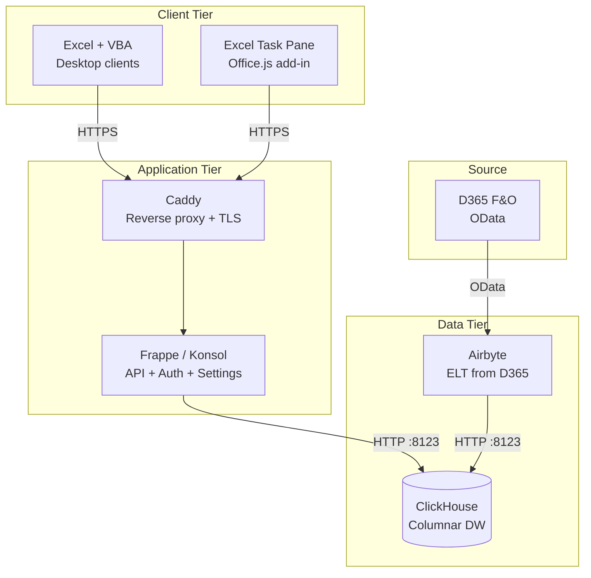

# Deployment Guide

Production deployment topology for Open EPM: ClickHouse, Frappe/Konsol, Airbyte, and Excel clients.

## Production Architecture



## Component Sizing

### ClickHouse

| Workload | Recommended | Notes |
|----------|-------------|-------|
| Small (1–5 entities, <1M GL rows) | 2 vCPU, 4 GB RAM | Dev/staging |
| Medium (10–50 entities, 1–10M rows) | 4 vCPU, 16 GB RAM | Typical production |
| Large (50+ entities, 10M+ rows) | 8 vCPU, 32 GB RAM | Large enterprises |

**Hosting options:**

| Option | Est. Monthly Cost | Notes |
|--------|------------------|-------|
| ClickHouse Cloud | $200–400 | Managed, auto-scaling |
| Azure VM (D4s_v5) | $150–250 | Self-managed |
| AWS EC2 (m6i.xlarge) | $150–250 | Self-managed |
| Aiven for ClickHouse | $300–500 | Managed |

### Frappe

| Component | Recommendation |
|-----------|---------------|
| CPU | 2+ vCPU |
| RAM | 4+ GB |
| Storage | 20 GB (app + MariaDB) |
| Workers | 2–4 Gunicorn workers |

### Airbyte

Follow [Airbyte's deployment guide](https://docs.airbyte.com/deploying-airbyte/) — typically 4 vCPU, 8 GB RAM minimum.

## ClickHouse Production Setup

### Docker (Recommended for Simple Deployments)

```yaml
# docker-compose.prod.yml
services:
  clickhouse:
    image: clickhouse/clickhouse-server:24.8-alpine
    container_name: open_epm_clickhouse
    ports:
      - "127.0.0.1:8123:8123"    # Only bind to localhost
      - "127.0.0.1:9000:9000"
    environment:
      CLICKHOUSE_USER: ${CLICKHOUSE_USER}
      CLICKHOUSE_PASSWORD: ${CLICKHOUSE_PASSWORD}
      CLICKHOUSE_DEFAULT_ACCESS_MANAGEMENT: 1
    volumes:
      - ./clickhouse/init-db.sql:/docker-entrypoint-initdb.d/init-db.sql:ro
      - clickhouse_data:/var/lib/clickhouse
      - clickhouse_logs:/var/log/clickhouse-server
    ulimits:
      nofile:
        soft: 262144
        hard: 262144
    healthcheck:
      test: ["CMD", "clickhouse-client", "--query", "SELECT 1"]
      interval: 10s
      timeout: 5s
      retries: 5
    restart: unless-stopped
```

**Security**: Bind ports to `127.0.0.1` only — Frappe connects locally, external access goes through the reverse proxy.

### ClickHouse Cloud

1. Create a service at [clickhouse.cloud](https://clickhouse.cloud)
2. Note the hostname, port, user, password
3. Run `clickhouse/init-db.sql` to create the 4 databases
4. Update Frappe EPM Settings with the cloud credentials

## Frappe Production Setup

Follow the [Frappe production deployment guide](https://frappeframework.com/docs/user/en/production-setup):

```bash
cd ~/frappe-bench
sudo bench setup production $USER
bench --site open-epm.local enable-scheduler
```

This configures:
- **Supervisor** for Gunicorn workers + background workers
- **Nginx** as the default reverse proxy (or use Caddy, see below)

### EPM Settings

Configure via Frappe Desk → Setup → EPM Settings:

| Setting | Production Value |
|---------|-----------------|
| ClickHouse Host | `localhost` (if co-located) or cloud hostname |
| ClickHouse Port | `8123` (HTTP) |
| ClickHouse User | Dedicated read user (not `default`) |
| ClickHouse Password | Strong password |

## TLS Configuration

### Option A: Caddy (Recommended)

```
# /etc/caddy/Caddyfile
epm.yourcompany.com {
    reverse_proxy localhost:8069
}
```

Caddy auto-provisions Let's Encrypt certificates.

### Option B: Nginx + Certbot

```bash
sudo certbot --nginx -d epm.yourcompany.com
```

### CORS for Office.js Add-in

If using the Excel task pane add-in from Office Online, add CORS headers for `*.officeapps.live.com`:

```
# Caddy
epm.yourcompany.com {
    header Access-Control-Allow-Origin "https://*.officeapps.live.com"
    header Access-Control-Allow-Credentials "true"
    reverse_proxy localhost:8069
}
```

## Airbyte Production

### Self-Hosted (abctl)

```bash
abctl local install
```

### Cloud

Use [Airbyte Cloud](https://cloud.airbyte.com/) for managed deployment. Configure the D365 source and ClickHouse destination as described in [D365 Integration](d365-integration.md).

## dbt Scheduling

dbt runs are triggered either:
1. **Manually** via the Excel task pane (Pipeline Run trigger)
2. **Scheduled** via cron or Frappe's scheduler

### Cron Example

```cron
# Run dbt build every day at 2 AM
0 2 * * * cd /path/to/open_epm/dbt_project && dbt build --profiles-dir /home/deploy/.dbt >> /var/log/dbt-build.log 2>&1
```

## Backup Strategy

| Component | What to Back Up | Method |
|-----------|----------------|--------|
| ClickHouse | All databases | `clickhouse-backup` or volume snapshots |
| Frappe/MariaDB | Site database | `bench backup` (daily) |
| Seeds/Config | CSV files, `.env` | Git (already tracked) |
| dbt Artifacts | `target/` directory | Optional — regenerated on build |

## Firewall Rules

| Source | Destination | Port | Protocol |
|--------|------------|------|----------|
| Internet | Caddy/Nginx | 443 | HTTPS |
| Caddy | Frappe | 8069 | HTTP |
| Frappe | ClickHouse | 8123 | HTTP |
| Airbyte | ClickHouse | 8123 | HTTP |
| Airbyte | D365 | 443 | HTTPS |

Block all other inbound traffic. ClickHouse should not be directly accessible from the internet.

## Next Steps

- [Operations Runbook](operations-runbook.md) — Monthly close, maintenance
- [Monitoring](monitoring.md) — Health checks and alerts
- [D365 Integration](d365-integration.md) — Airbyte + Azure AD setup
- [Security Architecture](../evaluation/security-architecture.md) — RBAC, TLS, rate limiting
