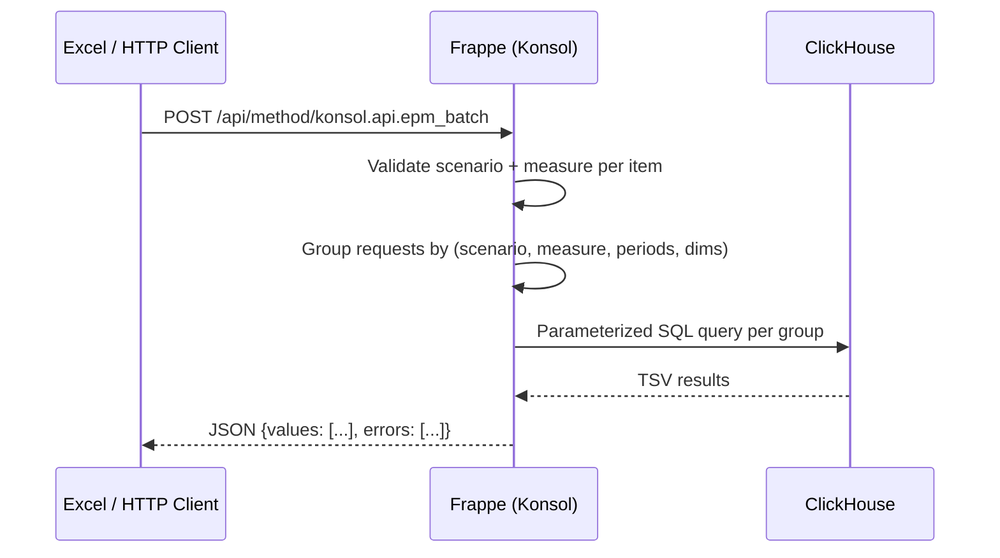

# API Overview

Open EPM exposes a REST API through the Frappe/Konsol web framework. The API is consumed primarily by the Excel VBA module but can be called from any HTTP client.

## Base URL

```
http://localhost:8069/api/method/konsol.api.{endpoint}
```

In production, replace with your Frappe server URL (e.g., `https://epm.yourcompany.com`).

## Authentication

The API uses **Frappe session-based authentication** (cookies).

### Login

```bash
curl -X POST http://localhost:8069/api/method/login \
  -H "Content-Type: application/json" \
  -d '{"usr": "admin@example.com", "pwd": "your_password"}'
```

The response sets `Set-Cookie` headers. Include these cookies in subsequent requests.

### Session Check

```bash
curl http://localhost:8069/api/method/frappe.auth.get_logged_user \
  -b "cookies.txt"
```

### Guest Access

Only the [health endpoint](api-health.md) allows guest access (`allow_guest=True`). All other endpoints require authentication.

## Request Flow



## Endpoints

| Method | Endpoint | Auth | Description |
|--------|----------|------|-------------|
| GET | [`konsol.api.health`](api-health.md) | Guest | Health check |
| GET | [`konsol.api.epm_value`](api-epm-value.md) | Session | Single value query |
| POST | [`konsol.api.epm_batch`](api-epm-batch.md) | Session | Batch query (up to 2000 items) |

## Error Handling

All errors return a JSON object with `exc_type` and `message`:

```json
{
  "exc_type": "ValidationError",
  "_server_messages": "[\"Invalid scenario: forecast. Allowed: actuals, budget, variance\"]"
}
```

### Validation Errors

| Error | Cause |
|-------|-------|
| `Invalid scenario: {x}` | Scenario not in `actuals`, `budget`, `variance` |
| `Measure {x} not allowed for scenario {y}` | Measure not in the allowed set for that scenario |
| `Batch size {n} exceeds maximum of 2000` | Too many items in a single batch request |

### ClickHouse Errors

| Error | Cause |
|-------|-------|
| `ClickHouse query timeout` | Query took > 30 seconds |
| `ClickHouse connection failed` | ClickHouse is unreachable |

## Batch Size Limit

`MAX_BATCH_SIZE = 2000`

The batch endpoint rejects requests exceeding 2000 items. The VBA module sends all EPM formulas on a sheet in a single batch, so this limit applies per-sheet refresh.

## Scenario → Table Mapping

| Scenario | ClickHouse Table |
|----------|-----------------|
| `actuals` | `epm_gold.gold_trial_balance` |
| `budget` | `epm_gold.gold_spread_budget` |
| `variance` | `epm_gold.gold_variance_analysis` |

## Query Optimization

The batch endpoint groups requests by `(scenario, measure, period_tuple, has_cost_center, has_department)` and issues one SQL query per group. This means 500 requests for the same scenario/measure/period combination become a single ClickHouse query with an `IN` clause.

## Next Steps

- [GET epm_value](api-epm-value.md) — Single value endpoint
- [POST epm_batch](api-epm-batch.md) — Batch endpoint
- [GET health](api-health.md) — Health check
