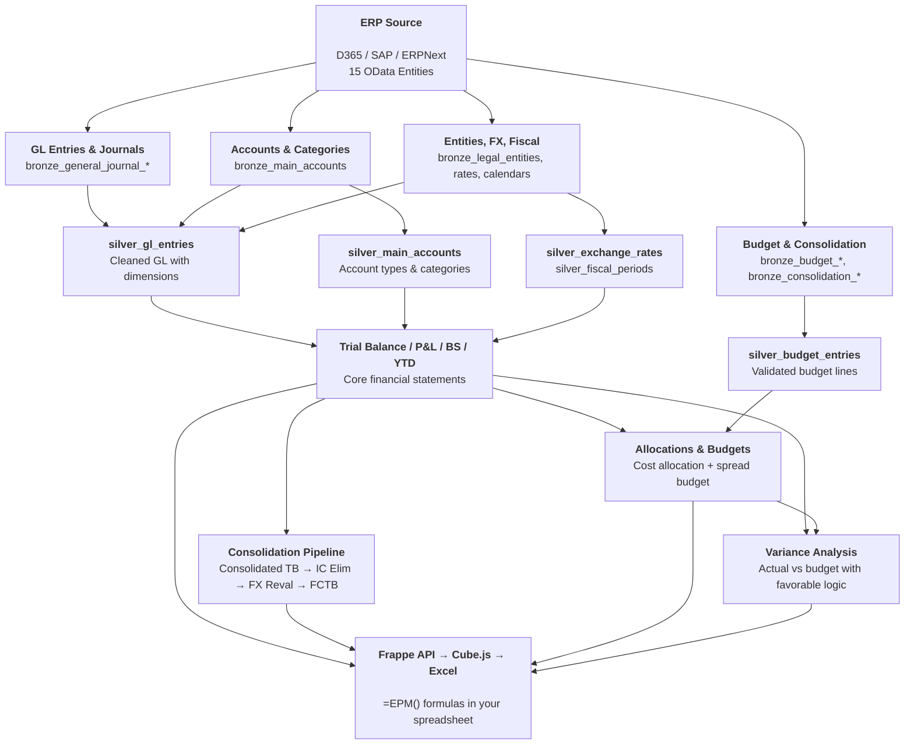

# Data Dictionary Overview

Konsolidat uses a **medallion architecture** with 44 dbt models organized in four layers, plus 11 seed tables for reference data.

## Model Counts

| Layer | Schema | Models | Materialization |
|-------|--------|--------|----------------|
| Staging | `epm_staging` | ~14 | Views |
| Bronze | `epm_bronze` | 14 | Tables |
| Silver | `epm_silver` | 8 | Tables |
| Gold | `epm_gold` | 22 | Tables |
| Seeds | `epm_gold` | 11 | Tables |

## Data Lineage

### Key Lineage Paths

| Path | Flow |
|------|------|
| **Reporting** | GL Entries → silver_gl_entries → gold_trial_balance → P&L, BS, YTD |
| **Consolidation** | Trial Balance + FX Rates → Consolidated TB → IC Elimination → FX Reval → Fully Consolidated TB |
| **Budgeting** | Budget Entries → silver_budget_entries → gold_spread_budget |
| **Variance** | Trial Balance + Spread Budget → gold_variance_analysis |
| **Allocations** | Trial Balance + Allocation Rules (seed) → gold_allocation_results |

## Layer Descriptions

### Bronze
Raw D365 OData data, type-cast to ClickHouse types and renamed to snake_case. No business logic. See [Bronze Models](bronze-models.md).

### Silver
Cleaned, deduplicated, and joined data. Key transformations: GL entries joined with journal headers, exchange rates normalized (D365 rate ÷ 100), account types mapped to readable labels. See [Silver Models](silver-models.md).

### Gold
Business-ready models consumed by the API and Excel reports. Includes trial balance, P&L, balance sheet, consolidation, allocation, budgeting, and variance analysis. See [Gold Models](gold-models.md).

### Seeds
CSV-managed reference data: allocation rules, consolidation groups, budget inputs, spread profiles, IC elimination rules, and scenario definitions. See [Seeds Reference](seeds-reference.md).

## ClickHouse Staging Tables

Write-back tables in `epm_staging` for budget submissions and other user inputs. See [Staging Tables](staging-tables.md).

## Dimension System

All Gold models carry three dimension columns, controlled by `var('dimensions')` in `dbt_project.yml`:

| Column | Source (D365) | In Budget | Allocation Role |
|--------|--------------|-----------|-----------------|
| `dim_cost_center` | `CostCenter` | Yes | `cost_center` |
| `dim_department` | `Department` | Yes | — |
| `dim_business_unit` | `BusinessUnit` | No | — |

Dimensions auto-propagate through models via the `dim_select()`, `dim_group_by()`, `dim_join_on()` family of macros. See [Adding Dimensions](../developer-guide/adding-dimensions.md).
