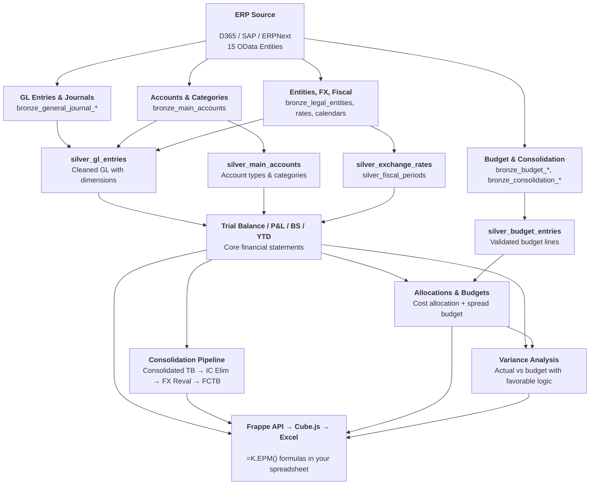

# Data Dictionary Overview

Konsolidat uses a **medallion architecture** with 103 dbt models organized in five layers. There are no seeds: reference data comes from konsol doctypes (see [Configuration Data](seeds-reference.md)).

## Model Counts

| Layer | Schema | Models | Materialization |
|-------|--------|--------|----------------|
| Staging | `epm_staging` | 30 (7 canonical, 16 D365 F&O, 7 ERPNext) | Views |
| Bronze | `epm_bronze` | 16 | Tables |
| Silver | `epm_silver` | 9 | Tables |
| Allocated | `epm_allocated` | 2 | Tables |
| Gold | `epm_gold` | 46 | Tables |

## Data Lineage

### Key Lineage Paths

| Path | Flow |
|------|------|
| **Reporting** | GL Entries → silver_gl_entries → gold_trial_balance → P&L, BS, YTD |
| **Consolidation** | Trial Balance + FX Rates → Consolidated TB → IC Elimination → FX Reval → Fully Consolidated TB |
| **Budgeting** | Budget Entries → silver_budget_entries → gold_spread_budget |
| **Variance** | Trial Balance + Spread Budget → gold_variance_analysis |
| **Allocations** | Trial Balance + Allocation Rules and Drivers (konsol) → gold_allocation_results |

## Layer Descriptions

### Bronze
Raw D365 OData data, type-cast to ClickHouse types and renamed to snake_case. No business logic. See [Bronze Models](bronze-models.md).

### Silver
Cleaned, deduplicated, and joined data. Key transformations: GL entries joined with journal headers, exchange rates held as true rates (scaling resolved once in the source adapter, #138), account types mapped to readable labels. See [Silver Models](silver-models.md).

### Gold
Business-ready models consumed by the API and Excel reports. Includes trial balance, P&L, balance sheet, consolidation, allocation, budgeting, and variance analysis. See [Gold Models](gold-models.md).

### Configuration Data
Reference data (consolidation groups and ownership, exchange rates, intercompany accounts, adjustments, allocation rules and drivers, budget inputs, spread profiles, scenarios) is entered in konsol doctypes and written through to `epm_staging` and `epm_gold` tables that dbt reads as sources. The CSV seeds that used to hold it were deleted. See [Configuration Data](seeds-reference.md).

## ClickHouse Staging Tables

Write-back tables in `epm_staging` for budget submissions and other user inputs. See [Staging Tables](staging-tables.md).

## Dimension System

All Gold models carry three dimension columns, controlled by `var('dimensions')` in `dbt_project.yml`:

| Column | Source (D365) | In Budget | Allocation Role |
|--------|--------------|-----------|-----------------|
| `dim_cost_center` | `CostCenter` | Yes | `cost_center` |
| `dim_department` | `Department` | Yes | — |
| `dim_business_unit` | `BusinessUnit` | No | — |

Dimensions auto-propagate through models via the `dim_select()`, `dim_group_by()`, `dim_join_on()` family of macros. See [Adding Dimensions](../developer-guide/adding-dimensions.md).
