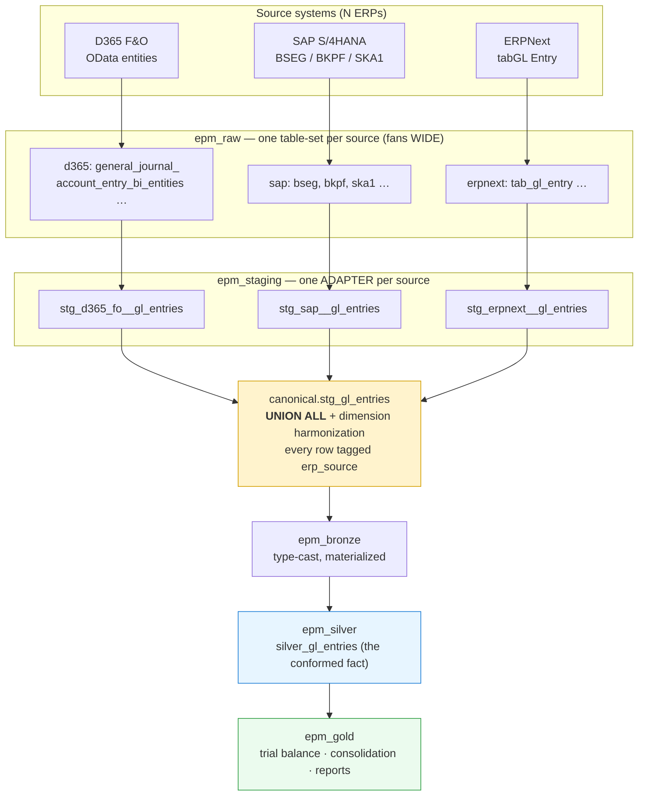
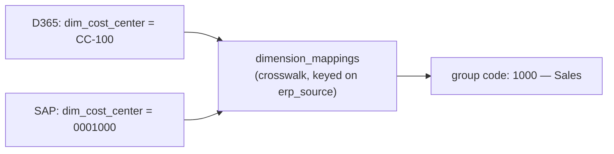

# Multi-ERP Consolidation: From Many Sources to One Set of Numbers

How data from several ERPs — D365 F&O, SAP, ERPNext, and others — converges
into a single silver and gold layer, producing **one trial balance and one
consolidation** regardless of how many source systems feed it.

This document tells the end-to-end story. For the precise column contract every
source adapter must satisfy, see
[Canonical Staging Schema & Adapter Interface](canonical-staging-schema.md).

---

## The core principle

A real group rarely runs on one ERP. After acquisitions you inherit SAP in one
subsidiary, D365 in another, ERPNext in a third. The warehouse is built so that
this heterogeneity is absorbed **at the edges** and never leaks upward:

> **Fan out at the bottom, converge in the middle, stay source-agnostic at the top.**

- **Raw + staging adapters** are *per source* — they grow each time you add an ERP.
- **Canonical staging** is the convergence point — every source becomes one shape here.
- **Silver and gold** are *source-agnostic* — they consume the canonical models and
  neither know nor care how many ERPs exist upstream.

The only trace of origin that survives upward is a single lineage column,
`erp_source`, carried on every row for audit and drill-down.

## The shape, end to end



## Layer by layer

### `epm_raw` — landing (per source, native shape)

Each connector lands its source system's **native schema**, untouched. These look
nothing alike: D365 exposes OData entities like `GeneralJournalAccountEntryBiEntities`;
SAP exposes line-item table `BSEG` joined to header `BKPF`; ERPNext exposes `tabGL Entry`.
Tables are namespaced per source so they never collide.

### `epm_staging` adapters — translate native → canonical (per source)

This is where the **real per-source work** happens. Each source gets an adapter model
per canonical entity, e.g. `stg_d365_fo__gl_entries`, `stg_sap__gl_entries`,
`stg_erpnext__gl_entries`. Every adapter for a given entity **must emit the identical
column set** — the canonical contract. The adapter's job is purely mechanical
reshaping: rename fields, fix debit/credit sign conventions, flatten composite
accounts, normalise dates.

!!! note "The adapter contract is the whole game"
    The comment at the top of `canonical/stg_gl_entries.sql` says it plainly:
    *"Every ERP adapter must produce the same column set."* Get the adapter right and
    everything above it works unchanged. The exact columns are specified in
    [Canonical Staging Schema](canonical-staging-schema.md).

### `canonical.stg_gl_entries` — the convergence point

One model per business entity (`stg_gl_entries`, `stg_trial_balance`, `stg_accounts`,
`stg_legal_entities`, `stg_exchange_rates`, `stg_budget_entries`, `stg_fiscal_periods`)
`UNION ALL`s every active source adapter, driven by a single dbt variable:

```sql


with unioned as (
    
    select erp_source, record_id, entity_id, posting_date,
           main_account, amount, dim_cost_center, /* … canonical columns … */
    from {{ ref('stg_' ~ erp ~ '__gl_entries') }}
    union all
    
)
```

Two things happen here that make multi-ERP actually work:

1. **Tagging.** Every row gains `erp_source` (`d365_fo`, `sap_s4`, `erpnext`, …),
   the lineage stamp that follows it all the way to gold.
2. **Dimension harmonization.** Master-data codes are translated to group standards
   via the crosswalk (next section), so downstream layers see one coherent vocabulary.

### `epm_bronze` → `epm_silver` → `epm_gold` — source-agnostic

From bronze up, **nothing is ERP-specific**. Bronze type-casts and materializes the
canonical output. `silver_gl_entries` is the single conformed GL fact. Gold builds the
trial balance, balance sheet, P&L, and the full consolidation
(`gold_consolidated_trial_balance`, `gold_ic_eliminations`, `gold_nci_movement_schedule`,
FX/CTA, …) on top of silver. **These models are byte-identical whether one ERP or five
feed them** — adding a source never edits a silver or gold model.

## The three hard parts

Adding a source is not just "plug in a connector." The genuine effort lives in three
places, all of them at or below the canonical layer.

### 1. The adapter contract

Each source's native model must be reshaped to the exact canonical column set —
identical names, types, and semantics. SAP's document-level postings, sign
conventions, and multi-segment accounts all have to be massaged to match what D365's
adapter already produces. This is mechanical but meticulous, and it is the bulk of
onboarding a new ERP.

### 2. Dimension & account harmonization (the crosswalk)

The genuinely hard problem. The *same* cost center is `CC-100` in D365 and `0001000`
in SAP. The *same* expense rolls up to different local account numbers. If you don't
reconcile these, your consolidated numbers are nonsense.

The `dimension_mappings` crosswalk — keyed on `erp_source` — maps each system's native
codes to **group-standard codes**, applied centrally in canonical via the
`dim_harmonize_*` macros (`macros/dimension_helpers.sql`). Unmapped values pass through
unchanged and surface in `gold_unmapped_dimension_values` so gaps are visible, not silent.



The same idea applies to the **chart of accounts**: every source's local accounts must
map to one group CoA before a meaningful trial balance can be summed across entities.

### 3. Entity identity & cross-source intercompany

- **Entity identity.** Each `entity_id` must resolve to exactly one legal entity in the
  consolidation hierarchy, even if two systems hold overlapping company codes.
- **Intercompany across sources.** Once entities span ERPs, an intercompany pair can be a
  D365 entity selling to a SAP entity. The IC matching and elimination
  (`gold_ic_eliminations`, `gold_ic_reconciliation`) must pair transactions **across
  source systems**, not just within one. The `erp_source` tag plus harmonized partner
  codes are what make that join possible.

## Worked example: two GL lines, one trial balance

A revenue posting in D365 and the equivalent in SAP arrive in completely different
shapes and converge into one number.

| Stage | D365 row | SAP row |
|-------|----------|---------|
| **Raw** | `GeneralJournalAccountEntryBiEntities`: `LedgerAccount=4000-CC100`, `AccountingCurrencyAmount=-1000`, `IsCredit=1` | `BSEG`: `HKONT=800000`, `KOSTL=0001000`, `DMBTR=1000`, `SHKZG=H` |
| **Adapter** | `stg_d365_fo__gl_entries`: `main_account=4000`, `amount=-1000`, `dim_cost_center=CC-100` | `stg_sap__gl_entries`: `main_account=800000`, `amount=-1000`, `dim_cost_center=0001000` |
| **Canonical** | `erp_source=d365_fo`, `main_account → 4000 (group)`, `dim_cost_center → 1000` | `erp_source=sap_s4`, `main_account → 4000 (group)`, `dim_cost_center → 1000` |
| **Gold** | Both land on group account **4000 / cost center 1000** and sum into one trial-balance line | ← same line |

The trial balance shows **one** revenue figure for group account 4000; drilling down
splits it back out by `erp_source` for audit.

## The control plane

Multi-ERP is configuration, not code-forking, end to end:

- **konsol `Connector` doctype** — each source is one connector with its own `erp_type`
  (`d365_fo`, `erpnext`, `sap_s4`, …), credentials, and Airbyte source + connection.
  `dimension_mappings` rows hang off the connector for that source's crosswalk.
- **`erp_sources` dbt var** — the list of active sources the canonical models union.
- **Connector registry & per-ERP specs** — see the
  [Connector Registry PRD](../../prd/PRD-CONNECTOR-REGISTRY.md) and the per-ERP PRDs
  (SAP S/4HANA, ECC, B1, D365 BC, ERPNext) for the roadmap.

## Adding a new ERP — the checklist

```text
1. Build the connector          → source-<erp>/ (Airbyte source), register + provision
2. Land raw data                → epm_raw.<erp>_* (native schema)
3. Write the staging adapters    → models/staging/<erp>/stg_<erp>__*.sql
                                   (must emit the canonical column set)
4. Add crosswalk rows            → dimension_mappings keyed on erp_source
                                   (cost centers, departments, accounts → group codes)
5. Map the chart of accounts     → local CoA → group CoA
6. Resolve entities & IC         → entity_id → hierarchy; partner codes for cross-source IC
7. Flip the switch               → add '<erp>' to erp_sources in dbt_project.yml
8. dbt build                     → canonical auto-unions the new source;
                                   silver & gold rebuild unchanged
```

Steps 1–6 are real work, concentrated at the edges. Steps 7–8 are a one-line change and
a rebuild — because everything from canonical up was designed to be source-agnostic from
day one.

## Summary

- **Per-source at the edges** (`epm_raw`, staging adapters), **one canonical model in the
  middle**, **fully source-agnostic analytics above** (`epm_silver`, `epm_gold`).
- The hard work is the **adapter contract** and **dimension/account harmonization**, not
  the consolidation logic — which never changes.
- `erp_source` is the lineage thread: harmonized away for the numbers, preserved for the
  drill-down.

## See also

- [Canonical Staging Schema & Adapter Interface](canonical-staging-schema.md) — the exact column contract
- [Silver Models](../../data-dictionary/silver-models.md) — the conformed layer
- [Gold Models](../../data-dictionary/gold-models.md) — consolidation outputs
- [Adding Dimensions](../adding-dimensions.md) — extending the dimension set
