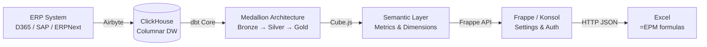

# Developer Overview

Repository structure, technology stack, and conventions for contributing to Konsolidat.

## Repository Structure

```
konsolidat/
├── dbt_project/
│   ├── models/
│   │   ├── staging/          # Views — field renames, joins
│   │   ├── bronze/           # Tables — type-cast, snake_case
│   │   ├── silver/           # Tables — deduplicated, standardized
│   │   └── gold/             # Tables — business logic
│   ├── macros/               # Reusable Jinja-SQL
│   ├── seeds/                # CSV reference data
│   ├── tests/                # Data quality assertions
│   └── dbt_project.yml       # Project config and vars
├── excel/
│   └── OpenEPM.bas           # VBA module (5 functions, 7 macros)
├── excel-addin/
│   ├── manifest.xml           # Office.js add-in manifest
│   └── src/                   # Task pane HTML/JS
├── clickhouse/
│   ├── init-db.sql            # Database creation script
│   └── postgres_compat.xml    # PostgreSQL wire protocol config
├── docker-compose.yml         # ClickHouse container
├── docs/                      # This documentation
└── .env.example               # Environment template
```

The Frappe/Konsol app lives in a separate repository, typically at `~/frappe-bench/apps/konsol/`.

## Architecture



## Technology Stack

| Layer | Technology | Version |
|-------|-----------|---------|
| Data Warehouse | ClickHouse | 24.8 |
| Transformations | dbt Core + dbt-clickhouse | Latest |
| API / Auth | Frappe Framework | v15 |
| ELT | Airbyte (abctl) | Latest |
| Excel Integration | VBA + Office.js | Excel 2016+ |
| Source ERP | D365 Finance & Operations | Any |

## Conventions

### dbt Model Naming

```
{layer}_{domain}[_{qualifier}]
```

Examples:
- `bronze_general_journal_account_entries` — Bronze, GL domain
- `silver_gl_entries` — Silver, GL domain (abbreviated)
- `gold_trial_balance` — Gold, trial balance
- `gold_pnl_quarterly` — Gold, P&L, quarterly aggregation
- `gold_consolidated_ytd` — Gold, consolidation, YTD

### Schema Layout

| Layer | Schema | ClickHouse Database |
|-------|--------|-------------------|
| Staging | `staging` | `epm_staging` |
| Bronze | `bronze` | `epm_bronze` |
| Silver | `silver` | `epm_silver` |
| Gold | `gold` | `epm_gold` |

### SQL Style

- Use **lowercase** for SQL keywords (`select`, `from`, `where`)
- Use **snake_case** for column and table names
- Prefix dimensions with `dim_` (e.g., `dim_cost_center`)
- Use ClickHouse-specific functions via `db_adapter.sql` macros (e.g., `cast_to_string()` instead of raw `toString()`)
- Use dimension helper macros instead of hardcoding dimension columns

### Materialization

| Layer | Materialization | Engine |
|-------|----------------|--------|
| Staging | `view` | — |
| Bronze | `table` | MergeTree |
| Silver | `table` | MergeTree |
| Gold | `table` | MergeTree |

The `epm_config()` macro provides engine and `order_by` settings for ClickHouse tables.

### Testing

Every Gold model should have at least one test. Tests follow the naming convention:

```
assert_{what_is_being_tested}
```

Examples: `assert_trial_balance_balances`, `assert_spread_sums_to_annual`.

## Key Patterns

### Dimension Auto-Propagation

Dimensions are defined once in `dbt_project.yml` and propagated through models via macros:

```sql
select
    data_area_id,
    {{ dim_select('gl.') }},    -- Generates: gl.dim_cost_center, gl.dim_department, ...
    {{ measure_select() }}       -- Generates: sum(debit_amount) as period_debit, ...
from {{ ref('silver_gl_entries') }} as gl
group by
    data_area_id,
    {{ dim_group_by('gl.') }}
```

### ClickHouse Adapter Macros

Always use adapter macros for type casting:

```sql
-- Good
{{ cast_to_string(column) }}      -- toString(assumeNotNull(column))
{{ cast_to_uint16(column) }}      -- toUInt16(assumeNotNull(column))

-- Bad (non-portable, no null safety)
toString(column)
```

### Seed-Driven Configuration

Reference data (allocation rules, consolidation groups, etc.) lives in CSV seeds, not in SQL. This makes it editable by non-developers and version-controlled in Git.

## Next Steps

- [Macro Reference](macro-reference.md) — All macros with signatures
- [Extending dbt Models](extending-dbt-models.md) — Adding a new Gold model
- [Testing Guide](testing-guide.md) — Writing and running tests
- [Adding Dimensions](adding-dimensions.md) — The dimension auto-propagation system
- [Extending the API](extending-api.md) — Adding Frappe endpoints
- [Contributing](contributing.md) — Git workflow and PR process
