# Open EPM Documentation

**Open-source Corporate Performance Management for Dynamics 365 Finance & Operations**

Multi-entity consolidation, Excel-native budgeting, driver-based allocations, and scenario modeling — at a fraction of commercial CPM cost.

> **New here?** Read **[Why Konsolidat?](why-konsolidat.md)** — the case for open-source CPM in 5 minutes.

## Architecture

```mermaid
graph LR
    D365[D365 F&O<br/>OData] -->|Airbyte ELT| CH[(ClickHouse<br/>Columnar DW)]
    CH -->|dbt Core| Bronze[Bronze<br/>14 models]
    Bronze --> Silver[Silver<br/>8 models]
    Silver --> Gold[Gold<br/>22 models]
    Gold -->|Frappe API| Frappe[Frappe / Konsol<br/>Settings & Auth]
    Frappe -->|HTTP JSON| Excel[Excel VBA<br/>=EPM&#40;&#41; formulas]
    Frappe -->|Office.js| Taskpane[Excel Task Pane<br/>Pipeline Control]
```

## Choose Your Path

### Finance Users

Build reports in Excel using familiar formulas. No SQL, no code — just `=EPM()`.

- [Quickstart: First EPM() value in 15 minutes](getting-started/quickstart.md)
- [Excel VBA Guide](user-guide/excel-vba-guide.md)
- [Report Catalog](user-guide/report-catalog.md)
- [Consolidation Guide](user-guide/consolidation-guide.md)
- [Budgeting Guide](user-guide/budgeting-guide.md)
- [Variance Analysis Guide](user-guide/variance-analysis-guide.md)

### IT Administrators

Deploy, configure, and maintain the platform.

- [Setup Guide](getting-started/setup-guide.md)
- [Configuration Reference](getting-started/configuration-reference.md)
- [Deployment Guide](admin-guide/deployment-guide.md)
- [Operations Runbook](admin-guide/operations-runbook.md)
- [Monitoring](admin-guide/monitoring.md)
- [D365 Integration](admin-guide/d365-integration.md)

### Developers

Extend the dbt models, add API endpoints, or contribute.

- [Developer Overview](developer-guide/developer-overview.md)
- [Macro Reference](developer-guide/macro-reference.md)
- [Extending dbt Models](developer-guide/extending-dbt-models.md)
- [Testing Guide](developer-guide/testing-guide.md)
- [Adding Dimensions](developer-guide/adding-dimensions.md)
- [Extending the API](developer-guide/extending-api.md)
- [Contributing](developer-guide/contributing.md)

### Decision Makers

Evaluate Open EPM for your organization.

- [Why Konsolidat?](why-konsolidat.md) — The case for open-source CPM
- [Cost Comparison vs Commercial CPM](evaluation/cost-comparison-vs-commercial.md)
- [Security Architecture](evaluation/security-architecture.md)
- [Roadmap](reference/roadmap.md)

## Reference

- [API Reference](api-reference/api-overview.md) — 3 endpoints, batch queries, auth
- [Data Dictionary](data-dictionary/data-dictionary-overview.md) — 44 dbt models, 11 seeds
- [Glossary](reference/glossary.md) — EPM, finance, and technical terms
- [Troubleshooting](troubleshooting/troubleshooting.md)
- [FAQ](troubleshooting/faq.md)

## Stack

| Component | Purpose | Default Port |
|-----------|---------|-------------|
| ClickHouse | Columnar data warehouse | 8123 (HTTP), 9000 (native) |
| Airbyte (abctl) | D365 OData extraction | 8000 |
| dbt Core | SQL transformations (Bronze → Silver → Gold) | CLI |
| Frappe (Konsol) | API layer, auth, pipeline control, settings | 8069 |
| Excel + VBA | Reporting via `=EPM()` formulas | — |
| Excel Task Pane | Pipeline orchestration (Office.js) | — |
