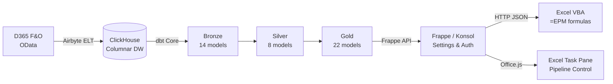

---
hide:
  - toc
---

<div class="ic-hero" markdown>

# Open EPM

<p class="ic-tagline">Open-source Enterprise Performance Management for Dynamics 365 Finance & Operations</p>

<div class="ic-stats">
  <div class="ic-stat">
    <span class="ic-stat-num">44</span>
    <span class="ic-stat-label">dbt Models</span>
  </div>
  <div class="ic-stat">
    <span class="ic-stat-num">26</span>
    <span class="ic-stat-label">Data Tests</span>
  </div>
  <div class="ic-stat">
    <span class="ic-stat-num">5</span>
    <span class="ic-stat-label">Excel Functions</span>
  </div>
  <div class="ic-stat">
    <span class="ic-stat-num">3</span>
    <span class="ic-stat-label">API Endpoints</span>
  </div>
</div>

</div>

<div class="ic-pitch" markdown>

Multi-entity consolidation, Excel-native budgeting, driver-based allocations, and variance analysis — at a fraction of commercial CPM cost. Built on proven open-source infrastructure.

<div class="ic-pills">
  <span class="ic-pill">Consolidation</span>
  <span class="ic-pill">FX Translation</span>
  <span class="ic-pill">Allocations</span>
  <span class="ic-pill">Budgeting</span>
  <span class="ic-pill">Variance</span>
  <span class="ic-pill">Excel Native</span>
  <span class="ic-pill">IFRS / GAAP</span>
  <span class="ic-pill">MIT License</span>
</div>

</div>

## How It Works

<div class="ic-scenarios" markdown>

<div class="ic-scenario" markdown>
<div class="ic-scenario-header">
  <span class="ic-badge ic-badge--finance">REPORTING</span>
  <h3>Excel-Native Financials</h3>
</div>

```
=EPM("USMF", 2024, "Q1", "401100")          → Revenue
=EPM_BUDGET("USMF", 2025, "FY", "6100")     → Full-year budget
=EPM_VARIANCE("USMF", 2025, 5, "6100")      → Actual vs budget
Ctrl+Shift+R                                  → Batch refresh
```

</div>

<div class="ic-scenario" markdown>
<div class="ic-scenario-header">
  <span class="ic-badge ic-badge--consolidation">CONSOLIDATION</span>
  <h3>Multi-Entity IFRS Close</h3>
</div>

```
Entity trial balances
  → FX translation (closing / average rate)
  → CTA calculation
  → NCI split (ownership %)
  → IC elimination
  → Top-side adjustments
  → Consolidated TB
```

</div>

<div class="ic-scenario" markdown>
<div class="ic-scenario-header">
  <span class="ic-badge ic-badge--allocation">ALLOCATION</span>
  <h3>Driver-Based Cost Allocation</h3>
</div>

```
Step 1: IT costs     → by headcount
Step 2: Facilities   → by sqm (+ Step 1 cascade)
Step 3: Management   → by revenue (+ Step 1+2 cascade)
```

</div>

<div class="ic-scenario" markdown>
<div class="ic-scenario-header">
  <span class="ic-badge ic-badge--budget">BUDGET</span>
  <h3>Budget Spreading & Variance</h3>
</div>

```
Annual budget input
  → Spread profiles (even, seasonal)
  → 12 monthly periods
  → 5 variance measures
  → Favorable/unfavorable logic
```

</div>

</div>

<div class="ic-arch" markdown>

## Architecture



</div>

<div class="ic-stack">
  <code>D365 F&O</code>
  <code>Airbyte</code>
  <code>ClickHouse</code>
  <code>dbt Core</code>
  <code>Frappe</code>
  <code>Excel VBA</code>
  <code>Office.js</code>
</div>

## Explore the Docs

<div class="ic-nav-grid">

<a class="ic-nav-card" href="features/">
  <strong>Features</strong>
  <span>Everything Open EPM does — consolidation, allocations, budgeting, reporting</span>
</a>

<a class="ic-nav-card" href="getting-started/quickstart/">
  <strong>Quickstart</strong>
  <span>Zero to first =EPM() value in 15 minutes</span>
</a>

<a class="ic-nav-card" href="getting-started/setup-guide/">
  <strong>Setup Guide</strong>
  <span>Full deployment with D365, Airbyte, dbt, Frappe</span>
</a>

<a class="ic-nav-card" href="getting-started/configuration-reference/">
  <strong>Configuration</strong>
  <span>All settings, env vars, dbt variables</span>
</a>

<a class="ic-nav-card" href="user-guide/excel-vba-guide/">
  <strong>Excel VBA Guide</strong>
  <span>5 formula functions, macros, report patterns</span>
</a>

<a class="ic-nav-card" href="user-guide/consolidation-guide/">
  <strong>Consolidation</strong>
  <span>FX translation, CTA, NCI, IC elimination</span>
</a>

<a class="ic-nav-card" href="api-reference/api-overview/">
  <strong>API Reference</strong>
  <span>3 endpoints — epm_value, epm_batch, health</span>
</a>

<a class="ic-nav-card" href="data-dictionary/data-dictionary-overview/">
  <strong>Data Dictionary</strong>
  <span>44 dbt models, 11 seeds, full lineage</span>
</a>

<a class="ic-nav-card" href="developer-guide/developer-overview/">
  <strong>Developer Guide</strong>
  <span>Extending models, macros, API, contributing</span>
</a>

<a class="ic-nav-card" href="admin-guide/deployment-guide/">
  <strong>Deployment</strong>
  <span>Production setup, monitoring, operations</span>
</a>

<a class="ic-nav-card" href="evaluation/cost-comparison-vs-commercial/">
  <strong>Cost Comparison</strong>
  <span>vs Tagetik, OneStream, Anaplan</span>
</a>

<a class="ic-nav-card" href="evaluation/security-architecture/">
  <strong>Security</strong>
  <span>Architecture, auth, data protection</span>
</a>

</div>
