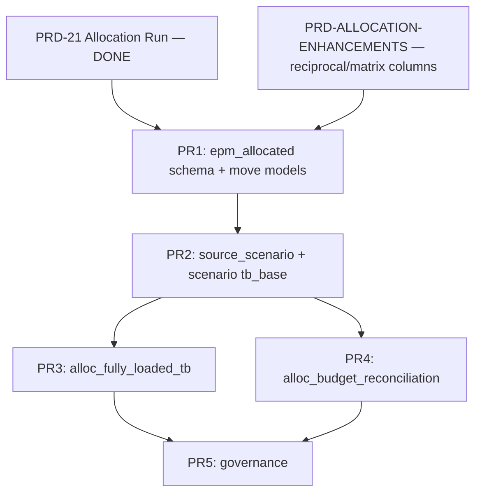

# Design Addendum: Allocated Layer (PRD-ALLOCATED-LAYER)

**Status:** Draft — decisions required before PR 1  
**Parent:** [PRD-ALLOCATED-LAYER.md](PRD-ALLOCATED-LAYER.md)  
**Date:** 2026-06-21

This addendum closes the gaps flagged in review. Each section ends with a **recommended default** and alternatives with pros/cons.

---

## AD-1: Boundary — Allocated Layer vs Fully Consolidated TB

### Context

`gold_fully_consolidated_tb` unions **statutory / group-close** layers:

| Layer | `adjustment_type` | Purpose |
|-------|-------------------|---------|
| 1 | `entity` | Translated legal-entity balances |
| 2 | `ic_elimination` | Intercompany netting |
| 3 | `cta` | FX translation adjustment |
| 4 | `topside` / etc. | Group journals |
| 5 | `equity_method` | Associates |
| 6 | `acquisition_disposal` | M&A |

Allocation is **management accounting** (cost-center overhead distribution within entities). It is not an IFRS group-close adjustment.

### Options

| Option | Description |
|--------|-------------|
| **A — Parallel overlay (recommended)** | `epm_allocated` stays separate. `alloc_fully_loaded_tb` is the management view. FCTB unchanged. |
| **B — Optional FCTB layer 7** | Add `adjustment_type = 'allocation'` to FCTB for group reporting that includes loaded costs. |
| **C — Hierarchy-only** | No `alloc_fully_loaded_tb`; reporting hierarchy rollups consume `alloc_results` directly at query time. |

### Pros / cons

| Option | Pros | Cons |
|--------|------|------|
| **A** | Clean separation of statutory vs management; matches how controllers work; no close-process risk | Excel/Cube need a second “view” for loaded P&L |
| **B** | Single consolidated query surface | Mixes entity-internal reallocations with group eliminations; double-count risk if alloc already in entity GL; breaks `adjustment_type` semantics |
| **C** | Fewer models | Pushes join logic to every consumer; hard for `=K.EPM()` and Cube to stay consistent |

### Recommendation

**Option A.** Document explicitly in the parent PRD:

> Allocated layer feeds **management reporting, variance, and hierarchy** — not statutory `gold_fully_consolidated_tb`.

### Build-domain tag

| Option | Tag | Pros | Cons |
|--------|-----|------|------|
| **A** | `tag:allocated` only; separate PBR scope `allocated` | Clear build boundaries; IC rule change doesn’t rebuild alloc | Extra PBR type to operate |
| **B** | Keep `domain:consolidation` (current PRD) | One “close” build runs everything | Conflates statutory + management; slower rebuilds |
| **C** | `domain:scenarios` for budget alloc, `domain:actuals` for actuals alloc | Scenario-aligned | Splits one engine across two scopes awkwardly |

**Recommendation:** **New scope `allocated`** with `tag:allocated`. Consolidation PBR may *optionally* include `+tag:allocated` as a dependency, but allocated models are not FCTB layers.

### Close assertion suite

| Option | Behavior |
|--------|----------|
| **A** | Allocation `assert_*` tests stay in Close Run (current) |
| **B** | New “Management Close” run for allocated-only assertions |
| **C** | Alloc assertions only on allocated PBR `dbt test` |

**Recommendation:** **A for v1** (no new DocType). Revisit **B** if controllers want to sign off actuals alloc separately from statutory close.

---

## AD-2: `alloc_fully_loaded_tb` — Grain & Join Logic

### Problem

Parent PRD pseudocode (`UNION ALL` base + allocated rows) hides a grain mismatch:

| Source | Grain |
|--------|-------|
| `gold_trial_balance` | `scenario-implicit ACTUAL` · `data_area_id` · `fiscal_year/period` · `main_account` · budget dims (e.g. `dim_cost_center`) |
| `alloc_results` | `scenario_id` · `allocation_rule_id` · `step_order` · `data_area_id` · `source/target_cost_center` · `source/target_account` · `allocated_amount` |

A row in alloc results is a **distribution leg** (source pool → target CC), not a TB line.

### Worked example (Alpine demo, period 2024-1)

**Source pool (TB base)** — ALLOC_001 step 1:

```
AMUS · 6010 · SALES · period_net = 170,519  (overhead to allocate out)
```

**Allocation output (3 target rows, illustrative weights):**

```
ALLOC_001 · AMUS · 6010/SALES → FINANCE  +85,260
ALLOC_001 · AMUS · 6010/SALES → HQ      +42,630
ALLOC_001 · AMUS · 6010/SALES → MFG     +42,629
                                        ─────────
                                        170,519  ✓ sums to pool
```

**Fully loaded semantics we want:**

| CC | Base (6010) | Allocated in | Allocated out | Fully loaded |
|----|-------------|--------------|---------------|--------------|
| SALES | 170,519 | 0 | −170,519 | **0** (pool zeroed) |
| FINANCE | 12,000 | +85,260 | 0 | **97,260** |
| HQ | 8,000 | +42,630 | 0 | **50,630** |
| MFG | 15,000 | +42,629 | 0 | **57,629** |

Entity total 6010 unchanged: base + net alloc = original TB total (alloc is a **reclassification within the entity**, not new economic cost).

### Options for model design

#### Option 1 — Net pivot at TB grain (recommended)

```sql
-- Pseudologic
base AS (
  SELECT 'ACTUAL' AS scenario_id, *, amount AS base_amount
  FROM gold_trial_balance
),
alloc_in AS (
  SELECT scenario_id, data_area_id, fiscal_year, fiscal_period,
         target_account AS main_account,
         target_cost_center AS cost_center,
         SUM(allocated_amount) AS alloc_in
  FROM alloc_results GROUP BY 1,2,3,4,5,6
),
alloc_out AS (
  SELECT scenario_id, data_area_id, fiscal_year, fiscal_period,
         source_account AS main_account,
         source_cost_center AS cost_center,
         -SUM(allocated_amount) AS alloc_out
  FROM alloc_results GROUP BY 1,2,3,4,5,6
)
SELECT
  b.*,
  b.base_amount,
  coalesce(i.alloc_in, 0) + coalesce(o.alloc_out, 0) AS alloc_net,
  b.base_amount + alloc_net AS fully_loaded_amount
FROM base b
LEFT JOIN alloc_in i  USING (...)
LEFT JOIN alloc_out o USING (...)
```

| Pros | Cons |
|------|------|
| Queryable at TB grain; works with `=K.EPM()` and Cube; `base` vs `fully_loaded` is one filter | Must align `cost_center` dim name via `get_allocation_cost_center_dim()`; multi-account steps need care |

#### Option 2 — Long format (`amount_type` enum)

Emit three row types per TB key: `base`, `alloc_in`, `alloc_out` (or `base` + `allocated` signed).

| Pros | Cons |
|------|------|
| Matches parent PRD sketch; easy to audit legs | 3× row volume; consumers must `SUM` with case; error-prone in Excel |

#### Option 3 — Materialized view over `alloc_results` only (no TB join)

Expose alloc legs; consumers join to TB in Cube/EPM.

| Pros | Cons |
|------|------|
| Thin dbt layer | Join logic duplicated in Cube, EPM API, and reports; violates “one semantic layer” |

### Recommendation

**Option 1 (net pivot)** for `alloc_fully_loaded_tb`. Columns:

| Column | Description |
|--------|-------------|
| `scenario_id` | Always explicit |
| `data_area_id`, `fiscal_year`, `fiscal_period`, `main_account` | TB keys |
| `dim_cost_center` (and other budget dims) | From TB |
| `base_amount` | From gold TB / scenario TB |
| `alloc_net` | Sum of ins + outs at this CC/account |
| `fully_loaded_amount` | `base_amount + alloc_net` |
| `amount_type` | Optional filter: derived, not stored as duplicate rows |

**Acceptance test (add to parent PRD):**

> For each `(scenario_id, data_area_id, fiscal_year, fiscal_period, main_account)`,  
> `SUM(base_amount) = SUM(fully_loaded_amount)` — allocation preserves entity account totals.

---

## AD-3: Allocation Run Semantics

### Problem

Layer contract says allocated data is “wipe-and-reload per allocation run,” but today:

- dbt rebuilds the **full** results table on PBR
- `Allocation Run` is **audit metadata** joined by period, not row-level versioning

### Options

| Option | How it works |
|--------|--------------|
| **A — dbt-deterministic + run as audit (recommended v1)** | `alloc_results` = output of latest successful allocated PBR. Run doc records who/when. Audit trail joins run ↔ results by `(fiscal_year, fiscal_period, scenario_id)`. Reversal = cancel run doc + rebuild. |
| **B — Run-scoped rows** | Add `allocation_run_id` to every `alloc_results` row. Table holds history; “active” = latest non-reversed run per period/scenario. |
| **C — Staging wipe per run** | Finance triggers run → sync only that run’s output to `epm_staging.alloc_results_snapshot` → dbt reads snapshot. |

### Pros / cons

| Option | Pros | Cons |
|--------|------|------|
| **A** | Matches PRD-21 today; minimal schema change; simple dbt | No point-in-time replay without rebuild; contract wording must change |
| **B** | True audit history; supports “compare run 1 vs run 2” | Table growth; queries need “active run” logic; more complex reversal |
| **C** | Closest to “wipe-reload per run” | New staging pipeline; race conditions if two runs overlap |

### Recommendation

**Option A for v1.** Revise layer contract row:

| Property | epm_allocated (revised) |
|----------|-------------------------|
| Mutability | Rebuilt on allocated PBR; **Allocation Run** = audit envelope, not row-level SCD |

Add **Option B as Phase 2** if customers need run diff / history without rebuild.

### Mixed-scenario runs (closes open question #1)

| Option | Rule |
|--------|------|
| **A — Single-scenario only (recommended)** | `run_allocation(scenario_id)` or infer from rules; **reject** submit if rules span >1 `source_scenario` |
| **B — Dominant scenario** | Run doc gets mode of rule scenarios; audit trail ambiguous |
| **C — Multi-scenario run** | `scenario_id` on each result row only; run doc has no single scenario |

**Recommendation:** **A.** Extend API:

```python
run_allocation(fiscal_year, fiscal_period, scenario_id="ACTUAL")
```

Validate all active rules for that execution share the same `source_scenario`.

---

## AD-4: Budget Reconciliation — Entity Mapping

### Problem

`alloc_budget_reconciliation` compares `target_cost_center` to `gold_spread_budget` by `data_area_id`. In the demo, targets are **cost centers** (SALES, FINANCE), while budget may be keyed by **entity / BU** (AMUS, SERVICES node).

### Options

| Option | Mapping |
|--------|---------|
| **A — Explicit mapping table (recommended)** | New seed / DocType `allocation_target_mapping`: `target_cost_center` → `budget_entity_key` (or hierarchy node) |
| **B — Same grain assumption** | Require budget entered at cost-center grain; reconciliation at CC level |
| **C — Hierarchy bridge** | Join via `gold_reporting_hierarchy` / `dimension_mappings` to roll CC → management node |

### Pros / cons

| Option | Pros | Cons |
|--------|------|------|
| **A** | Explicit, testable, CFO-readable | Extra config surface |
| **B** | Simplest SQL | Breaks when budget is top-down by region/BU |
| **C** | Reuses harmonization work | Depends on hierarchy published; harder to debug gaps |

### Reconciliation grain

| Option | Grain | Pros | Cons |
|--------|-------|------|------|
| **Annual entity-year (parent PRD)** | `data_area_id × fiscal_year × mapped_entity` | Matches top-down budget cycles | Hides period phasing mismatches |
| **Period-level** | Add `fiscal_period` | Catches timing gaps | Top-down often annual-only |
| **Both models** | `alloc_budget_reconciliation_annual` + `_period` | Best of both | Two models to maintain |

### Recommendation

- **Mapping: Option A** (lightweight CSV/DocType, 10–20 rows typical).
- **Grain: Annual v1** + `alloc_budget_reconciliation_period` as PR 4b if budget is periodized.

---

## AD-5: Build Order & PRD Dependencies

### Dependency graph



### Options for sequencing

| Sequence | Order | Pros | Cons |
|----------|-------|------|------|
| **A (recommended)** | (1) Freeze `alloc_results` column contract incl. enhancements → (2) PR1 move to `epm_allocated` → (3) PR2 scenario → (4) PR3/4 reporting | One migration; no rename churn | Delays allocated layer until enhancement columns are agreed |
| **B** | Move to `epm_allocated` first with current columns → add enhancements after | Faster schema separation | Second migration for reciprocal columns; test churn |
| **C** | PR2 scenario before PR1 move | Scenario logic in gold first | Still have to move later; two touch points on macros |

### Recommendation

**Sequence A:**

1. **Design spike (1–2 days):** Finalize `alloc_results` column list merging PRD-21 + enhancements + `scenario_id` + `allocation_run_id` (nullable for v1).
2. **PR1:** `epm_allocated` + move + gold deprecation views + regression gate (test #7 in parent PRD).
3. **PR2:** `source_scenario` + `tb_base` from `gold_scenario_trial_balance`.
4. **PR3 / PR4** in parallel.
5. **PR5** governance last.

---

## AD-6: Frappe / Ops Checklist (add to parent PRD)

| Item | Action |
|------|--------|
| Bootstrap | Extend `sync_allocation_config_to_clickhouse()` for `source_scenario` column (same gap we hit on alloc rules) |
| PBR scope | Register `allocated` in Build Domain fixtures |
| Cube | Point `allocation_results` cube at `epm_allocated.alloc_results`; add `scenario_id`, `fully_loaded_amount` measure |
| EPM API | `=K.EPM()` optional flag `loaded=1` → query `alloc_fully_loaded_tb` vs `gold_trial_balance` (Phase 2) |
| Docs | Update consolidation guide: allocated ≠ FCTB layer |

---

## Decision log (fill before PR 1)

| # | Decision | Options | **Recommended** |
|---|----------|---------|-----------------|
| D1 | FCTB inclusion | A parallel / B layer 7 / C hierarchy-only | **A — parallel overlay** |
| D2 | Build scope tag | `allocated` / `consolidation` / split by scenario | **`allocated` scope** |
| D3 | Fully loaded model | Net pivot / long format / consumer join | **Net pivot (AD-2 Option 1)** |
| D4 | Run mutability | dbt-deterministic / run-scoped rows / staging snapshot | **dbt-deterministic v1** |
| D5 | Mixed scenarios | single-only / dominant / multi | **Single-scenario only** |
| D6 | Budget recon mapping | explicit table / same grain / hierarchy | **Explicit mapping table** |
| D7 | Build order | A freeze→move / B move first / C scenario first | **A freeze column contract first** |

---

## Suggested implementation path (summary)

1. **Week 1 — Design lock:** Sign decision log; add acceptance test for entity-total preservation on `alloc_fully_loaded_tb`.
2. **Week 2 — PR1:** `CREATE DATABASE epm_allocated`; relocate models; deprecation views; fix bootstrap sync for new columns.
3. **Week 3 — PR2:** `source_scenario` on rule + macro `tb_base` change; extend `run_allocation(..., scenario_id)`.
4. **Week 4 — PR3+4:** Net-pivot fully loaded TB; annual budget recon with mapping table.
5. **Verify:** Regression on Alpine demo (AMUS 6010/SALES pool → loaded CCs); Close Run stays green; optional new assert `assert_fully_loaded_preserves_entity_total`.