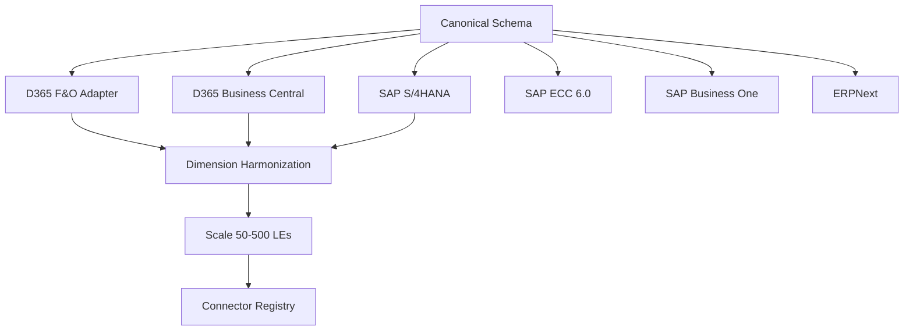

# Konsolidat — Roadmap

*Last updated: 2026-06-13*

See [../prd/README.md](../prd/README.md) for the per-feature PRD index.

## Status Summary

| Area | Status |
|---|---|
| Data pipeline (Bronze → Silver → Gold) | **Done** — 77 dbt models, 144 tests |
| Consolidation (FX, IC elimination, CTA, NCI) | **Done** — IFRS/GAAP compliant |
| Hierarchy, equity method, acquisition/disposal | **Done** |
| Allocations (multi-step cascade, reciprocal, tiered) | **Done** — dynamic N-step engine |
| Budget write-back (Excel → CH) | **Done** — EPMSAVE() from Excel + Frappe API |
| Budget write-back (CH → ERP) | **Not started** — push approved budget to D365 BudgetRegisterEntries |
| Scenario management | **Done** — budget/forecast/whatif via API |
| Variance analysis | **Done** — actual vs budget with favorable logic |
| Excel VBA integration | **Done** — =EPM() + 5 functions, ODBC + REST |
| Frappe app (konsol) | **Done** — DocTypes, ClickHouse sync, background jobs |
| Docs site (MkDocs Material) | **Done** — konsolid.at, 40+ pages |
| Custom domain | **Done** — konsolid.at on GitHub Pages |
| One-click deploy | **Done** — `git clone && ./deploy.sh`, 9 Docker services |
| Multi-ERP canonical staging + D365 F&O adapter | **Done** — 7 canonical models, 16 D365 F&O adapter models (PR #10) |
| Multi-ERP connectors (SAP, D365 BC, ERPNext) | **Not started** |
| FastAPI / Streamlit / Dagster | **Retired** — replaced by Frappe konsol app |
| Dynamic schema (dimensions, measures, facts) | **In progress** — Dimension + Measure registries done, API + Fact registry remaining |
| Security / Entra ID SSO | **Not started** |
| Excel Online Add-in (Office.js) | **Done** — Task pane add-in, pipeline orchestration, Frappe session auth |
| Cash flow statement | **Not started** |
| Multi-GAAP | **Not started** |
| Rolling forecasts | **Not started** |
| Consolidation enhancements (goodwill CTA, NCI in combos, disposal recycling) | **Not started** |
| Allocation enhancements (circular, reciprocal) | **Not started** |
| Planning enhancements (driver-based, recurring journals) | **Not started** |
| Reporting enhancements (waterfall, trend, commentary) | **Not started** |

---

## Phase 1: One-Click Deploy ~~(~3 days)~~ DONE

Full docker-compose stack + single deploy script. Completed in PRs #7 and #9.

- [x] 9 Docker services: Frappe backend/worker/scheduler, MariaDB, Redis (cache + queue), ClickHouse, Cube.js, Caddy
- [x] 2 one-shot init containers: configurator (site setup), dbt_init (seed + build)
- [x] `deploy.sh` — generates secrets, clones konsol, runs compose up, health checks
- [x] Caddy reverse proxy with auto-SSL
- [x] Static assets via gunicorn SharedDataMiddleware (PR #9)
- [x] Initial Setup Guide documentation
- [x] Subcommands: `./deploy.sh backup`, `restore`, `status`, `logs`, `down`

---

## Phase 2: Dynamic Schema — Dimensions, Measures & Facts ~~(~5 days)~~ IN PROGRESS

Make the data model fully registry-driven from Frappe. Adding a dimension, measure, or fact table should be a UI operation in Frappe Desk, not a code change across 6 files.

### What's done

The dbt layer is fully dynamic — Dimension and Measure registries in Frappe drive dbt_project.yml vars, and macros (`dim_select()`, `dim_group_by()`, `measure_select()`) generate SQL from those vars. Gold models like `gold_trial_balance` already use them. Source-layer abstraction is complete (`dim_select_from_source()` maps ERP source columns to canonical dimension names).

### What remains

The Frappe API, ClickHouse DDL, and Budget Input form are still hardcoded to specific dimensions/measures, so adding a new dimension still requires code changes in `api.py` and manual ClickHouse schema updates.

### 2.1 Dimension Registry ~~(1 day)~~ DONE

- [x] Frappe `Dimension` doctype — on save, auto-generates `dbt_project.yml` `vars.dimensions` via `dbt_config.py`
- [x] Fields: `dimension_name`, `source_column`, `label`, `cube_type`, `in_budget`, `allocation_role`
- [x] Allocation engine uses `allocation_role` from dimension config
- [ ] ClickHouse `ALTER TABLE ADD COLUMN` on dimension save (currently requires dbt rebuild)
- [ ] Budget Input doctype field generation (dynamic via Frappe custom fields API)

### 2.2 Measure Registry ~~(1 day)~~ DONE

- [x] Frappe `Measure` doctype — on save, auto-generates `dbt_project.yml` `vars.base_measures` via `dbt_config.py`
- [x] Fields: `measure_name`, `expression`, `label`, `cube_type`
- [x] Default measures pre-seeded: `period_debit`, `period_credit`, `period_net_amount`, `transaction_count`
- [x] dbt macros (`measure_select()`, `measure_passthrough()`) consume measures dynamically
- [ ] API response validates `measure` param against active Measure registry (currently hardcoded `ALLOWED_MEASURES` dict)
- [ ] ClickHouse gold table columns auto-generated on measure save

### 2.3 Fact Registry (1.5 days)

PRD: [Fact Registry](../prd/PRD-FACT-REGISTRY.md)

- [ ] Frappe `Fact Table` doctype: `name`, `source_type` (ERP GL / Budget / Statistical / Sub-ledger), `grain` description, `refresh_frequency`
- [ ] Core facts (pre-seeded, always present):
  - **GL Journal Entries** — debits/credits by account/period/entity (the universal financial fact)
  - **Budget Input** — budget submissions per cell
  - **Allocation Results** — derived output from allocation engine
- [ ] Statistical facts (customer-configurable):
  - **Headcount** — employees per cost center per period (for allocation drivers)
  - **Area (sqm)** — square metres per cost center (for facilities allocation)
  - **Revenue by Product** — for revenue-based allocation
- [ ] Sub-ledger facts (for detailed reporting):
  - **Accounts Payable** — invoice-level detail for cash flow
  - **Fixed Assets** — asset register for depreciation / investing cash flow
  - **Accounts Receivable** — aging for working capital analysis
- [ ] Each Fact Table defines: required dimensions, required measures, ClickHouse table name, dbt model name
- [ ] On save: generates ClickHouse staging table DDL + dbt source definition
- [ ] Statistical facts replace the current `allocation_drivers` seed with a proper queryable fact table

### 2.4 API Generalisation (1 day)

PRD: [API Generalisation](../prd/PRD-API-GENERALISATION.md)

- [ ] Replace hardcoded `cost_center`, `department` params with generic `dimensions` dict
- [ ] `=EPM("USMF", 2024, "Q1", "401100", dimensions={"cost_center": "CC001", "project": "P01"})`
- [ ] `measure` parameter validates against active Measure registry
- [ ] New `fact` parameter: defaults to GL, but can query budget or statistical facts
- [ ] Backward-compatible: old named params still work, mapped internally
- [ ] ClickHouse query builder reads active dimensions/measures/facts from registry

### 2.5 Source Layer Abstraction ~~(0.5 days)~~ DONE

- [x] dbt macro `{{ dim_select_from_source() }}` reads dimension list and generates extraction SQL per ERP
- [x] D365: auto-extract from `LedgerDimensionValuesJson` by `source_column` name
- [x] `dim_select()`, `dim_group_by()`, `dim_partition_by()` — generate SQL from dimension vars
- [ ] SAP/ERPNext: each connector provides its own dimension mapping (see Phase 3)
- [ ] Fact-specific source macros: GL extraction vs. budget extraction vs. statistical extraction

---

## Phase 3: Multi-ERP Support ~~(~8 weeks)~~ IN PROGRESS

Konsolidat's silver/gold layers are already ERP-agnostic. The canonical staging interface and D365 F&O adapter are complete. Remaining work is adding connectors for SAP (S/4HANA, ECC, B1), D365 Business Central, and ERPNext.

> **Note:** D365 F&O and D365 Business Central are completely different products (different APIs, entity models, dimension systems). BC needs its own connector.

### Work Breakdown

| Task | Effort | Status |
|------|--------|--------|
| Canonical Staging Schema & Adapter Interface | 2 days | **Done** (PR #10) — 7 canonical models, UNION ALL from adapters |
| D365 F&O Adapter Refactor | 1 day | **Done** (PR #10) — 16 models renamed `stg_d365_fo__*`, canonical output |
| D365 F&O Budget Write-Back | 2 days | Not started — OData POST on budget approval |
| D365 Business Central Connector | 3 days | Not started — PRD: [D365 BC](../prd/PRD-D365-BC-CONNECTOR.md) |
| SAP S/4HANA Connector | 3 days | Not started — PRD: [SAP S/4HANA](../prd/PRD-SAP-S4HANA-CONNECTOR.md) |
| SAP ECC 6.0 Connector | 3 days | Not started — PRD: [SAP ECC 6.0](../prd/PRD-SAP-ECC-CONNECTOR.md) |
| SAP Business One Connector | 2 days | Not started — PRD: [SAP B1](../prd/PRD-SAP-B1-CONNECTOR.md) |
| ERPNext Connector | 2 days | Not started — PRD: [ERPNext](../prd/PRD-ERPNEXT-CONNECTOR.md) |
| Dimension Harmonization | 3 days | Not started — PRD: [Dimension Harmonization](../prd/PRD-DIMENSION-HARMONIZATION.md) |
| Scale Architecture (50–500 LEs) | 5 days | **Partial** — bronze partitioning done, incremental extraction not started — PRD: [Scale Architecture](../prd/PRD-SCALE-ARCHITECTURE.md) |
| Connector Registry (Frappe) | 2 days | Not started — PRD: [Connector Registry](../prd/PRD-CONNECTOR-REGISTRY.md) |

### Dependency Graph



### Connector Details

| PRD | Connector | API | GL Source Entity | Budget Write-Back Target | Airbyte Source |
|-----|-----------|-----|------------------|--------------------------|----------------|
| 31 | D365 F&O (refactor) | OData v2 | `GeneralJournalAccountEntryBiEntities` | `BudgetRegisterEntries` (OData POST) | Existing |
| 32 | D365 Business Central | REST v2.0 / OData v4 | `generalLedgerEntries` | `budgets` (REST API) | Airbyte BC connector |
| 33 | SAP S/4HANA | OData v4 (CDS views) | `I_JournalEntry`, `I_GLAccountLineItem` | `A_BudgetPeriodBalance` (CDS) | Airbyte SAP OData |
| 34 | SAP ECC 6.0 | RFC/BAPI or IDoc | BSEG + BKPF tables | BAPI_BUDGET_POST (RFC) | Airbyte SAP (RFC) |
| 35 | SAP Business One | Service Layer REST | `JournalEntries` (JDT1) | `BudgetScenarios` (Service Layer) | Airbyte HTTP |
| 36 | ERPNext | Frappe REST API | `GL Entry` doctype | `Budget` doctype (Frappe API) | Airbyte ERPNext or direct Frappe API |

### Architecture

```
Raw ERP Data (Airbyte / direct API)
    ↓
Per-ERP Adapters (models/staging/<erp>/)
    ↓
Canonical Staging (models/staging/canonical/) ← UNION ALL from adapters
    ↓
Bronze → Silver → Gold (unchanged, ERP-agnostic)
```

### D365 Budget Write-Back

On budget approval in Frappe, push the approved budget to D365 F&O via OData POST to `BudgetRegisterEntries`.

**Source of Truth Decision:**

| Concern | Source of Truth | Rationale |
|---|---|---|
| Budget planning & scenarios | **ClickHouse** (via Frappe) | Multi-layer budgets (base/challenge/management/board), spreading profiles, scenario modeling — none of this exists in D365 |
| Actuals / GL | **D365** (synced to CH via Airbyte) | ERP owns transactional data |
| Budget vs Actuals reporting | **ClickHouse** (has both) | Single query engine for all analytics |
| Budget control in ERP | **D365** (receives approved budget) | D365 uses `BudgetRegisterEntries` for PO/expense validation |

ClickHouse is the authoritative store for budget. D365 is a **downstream sync target** — a one-way push so D365's native budget control features have the numbers.

**Round-trip prevention:** Do NOT Airbyte-sync `BudgetRegisterEntries` back from D365 into `epm_raw`. If syncing is required for audit, tag EPM-originated entries (e.g. `BudgetModelId = 'EPM'`) so dbt can filter them out.

**Implementation:**

- [ ] Frappe hook on Budget Input workflow transition to "Approved" → triggers async write-back
- [ ] D365 OData POST: map flat budget rows to `BudgetRegisterEntries` header + line format
- [ ] Dimension mapping: entity, account, cost center, dept → D365 `LedgerDimensionValuesJson`
- [ ] Error handling: D365 validation failures (closed posting period, invalid account) → log to Budget Input doctype
- [ ] Idempotency: tag entries with EPM budget ID to allow re-push without duplicates
- [ ] Config: D365 connection settings in Frappe (Azure AD tenant, client ID, resource URL) — reuse Airbyte credentials pattern

### Scale Architecture

For deployments with 50–500 legal entities across multiple ERPs:

- [x] **Partitioned bronze tables** — `bronze_general_journal_account_entries` partitioned by `toYear(accounting_date)`, budget by `toYYYYMM(transaction_date)`, FX by `toYear(valid_from)`
- [x] **Parallel dbt builds** — per-ERP adapter builds can run concurrently (adapter pattern supports this)
- [ ] **Incremental extraction** — Airbyte CDC for high-volume ERPs (SAP, D365)
- [ ] **ClickHouse cluster** — sharded by entity_id for horizontal scale
- [ ] **Monitoring** — per-connector health dashboard in Frappe

---

## Phase 4: Security & Entra ID SSO (~2 days)

PRD: [Security & Microsoft Entra ID SSO](../prd/PRD-SECURITY-ENTRA-SSO.md)

### 4.1 Entra ID Integration (1 day)

- [ ] Register Konsol in Microsoft Entra ID (OAuth2 / OpenID Connect)
- [ ] Map Entra ID groups to Frappe roles (Reader, Planner, Controller, Admin)
- [ ] Test SSO login flow

### 4.2 Reverse Proxy & TLS (0.5 days)

- [ ] Caddy in docker-compose: auto-cert TLS, CORS for Excel Online
- [ ] Rate limiting: 100 req/min per user

### 4.3 ClickHouse Network Isolation (0.5 days)

- [ ] ClickHouse on Docker internal network only (no host port bindings in production)
- [ ] Verify: no ClickHouse ports reachable from public internet

---

## Phase 5: Excel Online Add-in ~~(~3 days)~~ DONE

Task pane add-in built and deployed. Source: `excel-addin/`, served from Frappe `public/excel-addin/`.

- [x] Office.js Task Pane app (manifest.xml, taskpane.html/js/css, icons)
- [x] Frappe session-based authentication (login/logout via cookie)
- [x] Pipeline orchestration: trigger Extract + dbt Build, poll status (5s interval)
- [x] Status display: Queued/Extracting/Transforming/Success/Failed badges
- [x] Deployed to Frappe static assets, sideloadable via manifest.xml
- [x] Documentation: README + user guide + architecture diagram

**Not included** (by design — VBA handles data):
- No custom functions (=EPM() stays in VBA for desktop, Office.js for pipeline control)
- No MSAL/OAuth (uses Frappe session cookies instead)

---

## Phase 6: Analytical Gaps (~2 weeks)

### 6.1 Cash Flow Statement (2–3 days)

PRD: [Cash Flow Statement (Indirect Method)](../prd/PRD-CASH-FLOW-STATEMENT.md)

- [ ] `gold_cash_flow_indirect.sql` — derive from balance sheet delta method
- [ ] Categories: Operating, Investing, Financing
- [ ] Account mapping seed: `cash_flow_categories.csv`
- [ ] Consolidated cash flow (after FX translation)
- [ ] Tests: operating + investing + financing = net change in cash

### 6.2 Multi-GAAP / Dual Reporting (1 week)

PRD: [Multi-GAAP / Dual Reporting](../prd/PRD-MULTI-GAAP.md)

- [ ] `reporting_standard` dimension (LOCAL_GAAP, IFRS)
- [ ] Separate adjustment rules per standard
- [ ] Gold models produce one output per standard
- [ ] Tests: each standard balances independently

### 6.3 Rolling Forecasts (2–3 days)

PRD: [Rolling Forecasts](../prd/PRD-ROLLING-FORECASTS.md)

- [ ] 12-month forward window, shifts monthly
- [ ] Actual for closed periods + forecast for open periods
- [ ] Scenario type `rolling`

### 6.4 Budget Cell Locking (1–2 days)

PRD: [Budget Cell Locking (Concurrency Control)](../prd/PRD-BUDGET-CELL-LOCKING.md)

- [ ] Optimistic locking: check `modified` timestamp on `budget_cell_save()` — reject if stale
- [ ] Conflict response with latest value so Excel can prompt user
- [ ] Optional pessimistic locking: `Budget Lock` doctype with auto-expiry (5 min)
- [ ] VBA retry logic on conflict (refresh cell, re-prompt)

### 6.5 Multi-Step Budget Approval Chain (0.5 day)

PRD: [Multi-Step Budget Approval Chain](../prd/PRD-BUDGET-APPROVAL-CHAIN.md)

- [ ] Extend `budget_input_workflow.json`: Draft → Submitted → Dept Manager Approved → Controller Approved → CFO Approved
- [ ] Each transition gated by a separate Frappe role
- [ ] Use Frappe `docstatus = 1` (Submit) on final approval to permanently lock document
- [ ] Email notifications on workflow state changes (Frappe Notification doctype)

### 6.6 Consolidation Enhancements (1–2 weeks)

PRD: [Consolidation Enhancements](../prd/PRD-CONSOLIDATION-ENHANCEMENTS.md)

- [ ] Historical (temporal) rate for equity line items — IAS 21 equity translation at acquisition-date rates
- [ ] Remeasurement vs translation distinction (separate functional currency handling)
- [ ] Goodwill CTA — CTA on goodwill arising from acquisition accounting
- [ ] Recycling CTA to P&L on disposal of a foreign operation
- [ ] NCI in business combinations — goodwill allocation to NCI (full vs partial goodwill methods)
- [ ] Changes in ownership without loss of control — equity transactions between parent and NCI

### 6.7 Allocation Enhancements (3–5 days)

PRD: [Allocation Enhancements (Circular & Reciprocal)](../prd/PRD-ALLOCATION-ENHANCEMENTS.md)

- [ ] Circular (iterative) allocations — convergence-based solving for reciprocal cost pools
- [ ] Reciprocal allocation method — simultaneous equations approach (alternative to iteration)

### 6.8 Planning Enhancements (1 week)

PRD: [Planning Enhancements (Driver-Based & Recurring)](../prd/PRD-PLANNING-ENHANCEMENTS.md)

- [ ] Driver-based planning — revenue × price × volume decomposition
- [ ] Phasing templates at account-group level (apply seasonal patterns by account type)
- [ ] Recurring journal templates — auto-generate topside journals on schedule
- [ ] Topside journal approval workflow (separate from budget approval)

### 6.9 Reporting Enhancements (3–5 days)

PRD: [Reporting Enhancements (Waterfall, Trend, Commentary)](../prd/PRD-REPORTING-ENHANCEMENTS.md)

- [ ] Waterfall / bridge analysis — price, volume, mix decomposition of variances
- [ ] Trend analysis — period-over-period and rolling averages
- [ ] Commentary / annotation on variances — attach narrative to variance cells

### 6.10 Close Assertion Suite — Reconciliation Gate (3–5 days)

PRD: [Close Assertion Suite — Reconciliation Gate](../prd/PRD-CLOSE-ASSERTION-SUITE.md)

> Every close runs against an automated assertion suite. **Green** means the numbers reconcile; **red** tells you exactly which row broke, and why — before anyone signs off.

- [ ] Surface the **60+ existing dbt `assert_*` tests** (BS balances, CTA, IC elimination, equity method, allocations, hierarchy ties) as a named, per-close **assertion suite**, run on a Pipeline Build Request via `dbt build` / `dbt test --store-failures`
- [ ] `Close Assertion Run` doctype — one row per assertion with pass/fail (green/red), category, and a link to its failing rows
- [ ] Capture the **failing rows + reason** from dbt `--store-failures` (the offending entity/account/period rows — not just "a test failed")
- [ ] Close sign-off **gate** — block close approval (ties into the budget/consolidation approval chain, §6.5) until the suite is green, with an explicit, audited override
- [ ] Dashboard — green/red board per close period; drill a red assertion into its failing rows

Builds on what already exists: the `tests/**/assert_*.sql` suite, `gold_ic_reconciliation`, and the `Pipeline Build Request` governed-build path. Net-new work is **capturing/parsing dbt test results into the app** and the **sign-off gate** UI.

---

## Phase 7: Production Hardening (~3 days)

PRD: [Production Hardening](../prd/PRD-PRODUCTION-HARDENING.md)

- [ ] ClickHouse backup automation (scheduled snapshots to Azure Blob / S3)
- [ ] Monitoring: ClickHouse query latency + Frappe response times (Prometheus + Grafana)
- [ ] Alerting: email/Slack on pipeline failure or dbt test failure
- [ ] Load testing: simulate 50 concurrent Excel users
- [ ] Runbook: monthly close process
- [ ] Disaster recovery procedure

---

## Effort Summary

| Phase | Effort | Dependencies |
|---|---|---|
| **Phase 1:** One-click deploy | ~3 days | None |
| **Phase 2:** Dynamic schema (dimensions, measures, facts) | ~~5 days~~ ~2 days remaining | None |
| **Phase 3:** Multi-ERP (6 connectors + scale) | ~~8 weeks~~ ~6 weeks remaining | Phase 2 (dimension abstraction) |
| **Phase 4:** Security & SSO | ~2 days | Phase 1 |
| **Phase 5:** Excel Online Add-in | ~~3 days~~ **Done** | — |
| **Phase 6:** Analytical gaps, consolidation/allocation/planning/reporting enhancements | ~6 weeks | Phase 2 (dimensions) |
| **Phase 7:** Production hardening | ~3 days | Phase 1 |
| **Total** | **~7 weeks** | |

Phases 1 and 2 can run in parallel. Phase 3 depends on Phase 2 (schema abstraction). Phases 4–7 can overlap.
