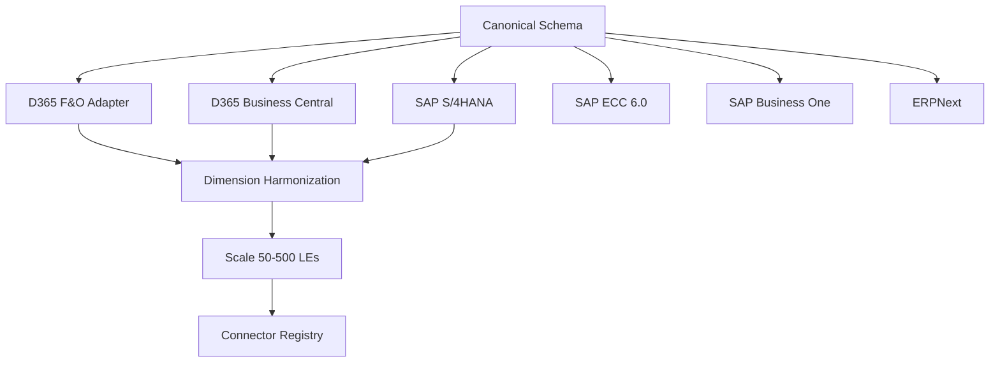

# Konsolidat — Roadmap

*Last updated: 2026-06-10*

## Status Summary

| Area | Status |
|---|---|
| Data pipeline (Bronze → Silver → Gold) | **Done** — 77 dbt models, 144 tests |
| Consolidation (FX, IC elimination, CTA, NCI) | **Done** — IFRS/GAAP compliant |
| Hierarchy, equity method, acquisition/disposal | **Done** |
| Allocations (multi-step cascade, reciprocal, tiered) | **Done** — dynamic N-step engine |
| Budget write-back | **Done** — EPMSAVE() from Excel + Frappe API |
| Scenario management | **Done** — budget/forecast/whatif via API |
| Variance analysis | **Done** — actual vs budget with favorable logic |
| Excel VBA integration | **Done** — =EPM() + 5 functions, ODBC + REST |
| Frappe app (konsol) | **Done** — DocTypes, ClickHouse sync, background jobs |
| Docs site (MkDocs Material) | **Done** — konsolid.at, 40+ pages |
| Custom domain | **Done** — konsolid.at on GitHub Pages |
| One-click deploy | **Done** — `git clone && ./deploy.sh`, 9 Docker services |
| Multi-ERP canonical staging | **Done** — 7 canonical models, UNION ALL adapters |
| Multi-ERP connectors (SAP, D365 BC, ERPNext) | **Not started** |
| FastAPI / Streamlit / Dagster | **Retired** — replaced by Frappe konsol app |
| Dynamic schema (dimensions, measures, facts) | **Not started** |
| Security / Entra ID SSO | **Not started** |
| Excel Online Add-in (Office.js) | **Done** — Task pane add-in, pipeline orchestration, Frappe session auth |
| Cash flow statement | **Not started** |
| Multi-GAAP | **Not started** |
| Rolling forecasts | **Not started** |
| Consolidation enhancements (goodwill CTA, NCI in combos, disposal recycling) | **Not started** |
| Allocation enhancements (circular, reciprocal) | **Not started** |
| Planning enhancements (driver-based, recurring journals) | **Not started** |
| Reporting enhancements (waterfall, trend, commentary) | **Not started** |

---

## Phase 1: One-Click Deploy ~~(~3 days)~~ DONE

Full docker-compose stack + single deploy script. Completed in PRs #7 and #9.

- [x] 9 Docker services: Frappe backend/worker/scheduler, MariaDB, Redis (cache + queue), ClickHouse, Cube.js, Caddy
- [x] 2 one-shot init containers: configurator (site setup), dbt_init (seed + build)
- [x] `deploy.sh` — generates secrets, clones konsol, runs compose up, health checks
- [x] Caddy reverse proxy with auto-SSL
- [x] Static assets via gunicorn SharedDataMiddleware (PR #9)
- [x] Initial Setup Guide documentation
- [x] Subcommands: `./deploy.sh backup`, `restore`, `status`, `logs`, `down`

---

## Phase 2: Dynamic Schema — Dimensions, Measures & Facts (~5 days)

Make the data model fully registry-driven from Frappe. Adding a dimension, measure, or fact table should be a UI operation in Frappe Desk, not a code change across 6 files.

### Current state (hardcoded)

| Concept | What it is | Example | Where hardcoded |
|---|---|---|---|
| **Dimension** | Attribute to slice by | Cost Center, Department, Project | ClickHouse columns, API params, Budget Input doctype, dbt macros |
| **Measure** | Numeric value to aggregate | period_net_amount, opening_balance, ytd_amount | dbt macros, API column mapping, Excel function `measure` param |
| **Fact** | Transactional grain / source table | GL Journal Entries, Budget Input, Allocation Results | dbt models, ClickHouse staging tables, Airbyte sync config |

### 2.1 Dimension Registry (1 day)

- [ ] Frappe `Dimension` doctype becomes authoritative — on save, auto-generates:
  - ClickHouse `ALTER TABLE ADD COLUMN` for all staging/reporting tables
  - Entry in `dbt_project.yml` `vars.dimensions` (or dbt vars override)
  - Budget Input doctype field (dynamic via Frappe custom fields API)
- [ ] Validation: dimension name must be `dim_*`, unique, no reserved words
- [ ] Source mapping per ERP: D365 JSON path, SAP field name, ERPNext fieldname
- [ ] Allocation engine uses `allocation_role` from dimension config, not hardcoded column names

### 2.2 Measure Registry (1 day)

- [ ] Frappe `Measure` doctype: `name`, `column_name`, `aggregation` (sum/avg/last), `label`, `favorable_direction` (debit/credit)
- [ ] On save, auto-generates:
  - dbt `vars.measures` entries (drives `{{ measure_select() }}` macros)
  - ClickHouse columns on gold tables
  - API response includes only active measures
- [ ] Default measures pre-seeded: `period_net_amount`, `opening_balance`, `closing_balance`, `ytd_amount`, `debit_amount`, `credit_amount`
- [ ] Custom measures: e.g. `headcount`, `revenue_per_sqm` — derived via SQL expression field on the doctype

### 2.3 Fact Registry (1.5 days)

- [ ] Frappe `Fact Table` doctype: `name`, `source_type` (ERP GL / Budget / Statistical / Sub-ledger), `grain` description, `refresh_frequency`
- [ ] Core facts (pre-seeded, always present):
  - **GL Journal Entries** — debits/credits by account/period/entity (the universal financial fact)
  - **Budget Input** — budget submissions per cell
  - **Allocation Results** — derived output from allocation engine
- [ ] Statistical facts (customer-configurable):
  - **Headcount** — employees per cost center per period (for allocation drivers)
  - **Area (sqm)** — square metres per cost center (for facilities allocation)
  - **Revenue by Product** — for revenue-based allocation
- [ ] Sub-ledger facts (for detailed reporting):
  - **Accounts Payable** — invoice-level detail for cash flow
  - **Fixed Assets** — asset register for depreciation / investing cash flow
  - **Accounts Receivable** — aging for working capital analysis
- [ ] Each Fact Table defines: required dimensions, required measures, ClickHouse table name, dbt model name
- [ ] On save: generates ClickHouse staging table DDL + dbt source definition
- [ ] Statistical facts replace the current `allocation_drivers` seed with a proper queryable fact table

### 2.4 API Generalisation (1 day)

- [ ] Replace hardcoded `cost_center`, `department` params with generic `dimensions` dict
- [ ] `=EPM("USMF", 2024, "Q1", "401100", dimensions={"cost_center": "CC001", "project": "P01"})`
- [ ] `measure` parameter validates against active Measure registry
- [ ] New `fact` parameter: defaults to GL, but can query budget or statistical facts
- [ ] Backward-compatible: old named params still work, mapped internally
- [ ] ClickHouse query builder reads active dimensions/measures/facts from registry

### 2.5 Source Layer Abstraction (0.5 days)

- [ ] dbt macro `{{ dim_extract_from_source() }}` reads dimension list and generates extraction SQL per ERP
- [ ] D365: auto-extract from `LedgerDimensionValuesJson` by `source_column` name
- [ ] SAP/ERPNext: each connector provides its own dimension mapping (see Phase 3)
- [ ] Fact-specific source macros: GL extraction vs. budget extraction vs. statistical extraction

---

## Phase 3: Multi-ERP Support (~8 weeks)

Konsolidat's silver/gold layers are already ERP-agnostic. The staging layer is D365 F&O-specific. This phase introduces a canonical staging interface that all ERP adapters write to, enabling SAP (S/4HANA, ECC, B1), D365 Business Central, and ERPNext consolidation.

> **Note:** D365 F&O and D365 Business Central are completely different products (different APIs, entity models, dimension systems). BC needs its own connector.

### Work Breakdown

| Task | Effort | Status |
|------|--------|--------|
| Canonical Staging Schema & Adapter Interface | 2 days | **Done** (PR #10) |
| D365 F&O Adapter Refactor | 1 day | Not started |
| D365 Business Central Connector | 3 days | Not started |
| SAP S/4HANA Connector | 3 days | Not started |
| SAP ECC 6.0 Connector | 3 days | Not started |
| SAP Business One Connector | 2 days | Not started |
| ERPNext Connector | 2 days | Not started |
| Dimension Harmonization | 3 days | Not started |
| Scale Architecture (50–500 LEs) | 5 days | Not started |
| Connector Registry (Frappe) | 2 days | Not started |

### Dependency Graph



### Connector Details

| PRD | Connector | API | GL Source Entity | Airbyte Source |
|-----|-----------|-----|------------------|----------------|
| 31 | D365 F&O (refactor) | OData v2 | `GeneralJournalAccountEntryBiEntities` | Existing |
| 32 | D365 Business Central | REST v2.0 / OData v4 | `generalLedgerEntries` | Airbyte BC connector |
| 33 | SAP S/4HANA | OData v4 (CDS views) | `I_JournalEntry`, `I_GLAccountLineItem` | Airbyte SAP OData |
| 34 | SAP ECC 6.0 | RFC/BAPI or IDoc | BSEG + BKPF tables | Airbyte SAP (RFC) |
| 35 | SAP Business One | Service Layer REST | `JournalEntries` (JDT1) | Airbyte HTTP |
| 36 | ERPNext | Frappe REST API | `GL Entry` doctype | Airbyte ERPNext or direct Frappe API |

### Architecture

```
Raw ERP Data (Airbyte / direct API)
    ↓
Per-ERP Adapters (models/staging/<erp>/)
    ↓
Canonical Staging (models/staging/canonical/) ← UNION ALL from adapters
    ↓
Bronze → Silver → Gold (unchanged, ERP-agnostic)
```

### Scale Architecture

For deployments with 50–500 legal entities across multiple ERPs:

- **Partitioned canonical staging** — partition by `erp_source` for parallel processing
- **Incremental extraction** — Airbyte CDC for high-volume ERPs (SAP, D365)
- **ClickHouse cluster** — sharded by entity_id for horizontal scale
- **Parallel dbt builds** — per-ERP adapter builds can run concurrently
- **Monitoring** — per-connector health dashboard in Frappe

---

## Phase 4: Security & Entra ID SSO (~2 days)

### 4.1 Entra ID Integration (1 day)

- [ ] Register Konsol in Microsoft Entra ID (OAuth2 / OpenID Connect)
- [ ] Map Entra ID groups to Frappe roles (Reader, Planner, Controller, Admin)
- [ ] Test SSO login flow

### 4.2 Reverse Proxy & TLS (0.5 days)

- [ ] Caddy in docker-compose: auto-cert TLS, CORS for Excel Online
- [ ] Rate limiting: 100 req/min per user

### 4.3 ClickHouse Network Isolation (0.5 days)

- [ ] ClickHouse on Docker internal network only (no host port bindings in production)
- [ ] Verify: no ClickHouse ports reachable from public internet

---

## Phase 5: Excel Online Add-in ~~(~3 days)~~ DONE

Task pane add-in built and deployed. Source: `excel-addin/`, served from Frappe `public/excel-addin/`.

- [x] Office.js Task Pane app (manifest.xml, taskpane.html/js/css, icons)
- [x] Frappe session-based authentication (login/logout via cookie)
- [x] Pipeline orchestration: trigger Extract + dbt Build, poll status (5s interval)
- [x] Status display: Queued/Extracting/Transforming/Success/Failed badges
- [x] Deployed to Frappe static assets, sideloadable via manifest.xml
- [x] Documentation: README + user guide + architecture diagram

**Not included** (by design — VBA handles data):
- No custom functions (=EPM() stays in VBA for desktop, Office.js for pipeline control)
- No MSAL/OAuth (uses Frappe session cookies instead)

---

## Phase 6: Analytical Gaps (~2 weeks)

### 6.1 Cash Flow Statement (2–3 days)

- [ ] `gold_cash_flow_indirect.sql` — derive from balance sheet delta method
- [ ] Categories: Operating, Investing, Financing
- [ ] Account mapping seed: `cash_flow_categories.csv`
- [ ] Consolidated cash flow (after FX translation)
- [ ] Tests: operating + investing + financing = net change in cash

### 6.2 Multi-GAAP / Dual Reporting (1 week)

- [ ] `reporting_standard` dimension (LOCAL_GAAP, IFRS)
- [ ] Separate adjustment rules per standard
- [ ] Gold models produce one output per standard
- [ ] Tests: each standard balances independently

### 6.3 Rolling Forecasts (2–3 days)

- [ ] 12-month forward window, shifts monthly
- [ ] Actual for closed periods + forecast for open periods
- [ ] Scenario type `rolling`

### 6.4 Budget Cell Locking (1–2 days)

- [ ] Optimistic locking: check `modified` timestamp on `budget_cell_save()` — reject if stale
- [ ] Conflict response with latest value so Excel can prompt user
- [ ] Optional pessimistic locking: `Budget Lock` doctype with auto-expiry (5 min)
- [ ] VBA retry logic on conflict (refresh cell, re-prompt)

### 6.5 Multi-Step Budget Approval Chain (0.5 day)

- [ ] Extend `budget_input_workflow.json`: Draft → Submitted → Dept Manager Approved → Controller Approved → CFO Approved
- [ ] Each transition gated by a separate Frappe role
- [ ] Use Frappe `docstatus = 1` (Submit) on final approval to permanently lock document
- [ ] Email notifications on workflow state changes (Frappe Notification doctype)

### 6.6 Consolidation Enhancements (1–2 weeks)

- [ ] Historical (temporal) rate for equity line items — IAS 21 equity translation at acquisition-date rates
- [ ] Remeasurement vs translation distinction (separate functional currency handling)
- [ ] Goodwill CTA — CTA on goodwill arising from acquisition accounting
- [ ] Recycling CTA to P&L on disposal of a foreign operation
- [ ] NCI in business combinations — goodwill allocation to NCI (full vs partial goodwill methods)
- [ ] Changes in ownership without loss of control — equity transactions between parent and NCI

### 6.7 Allocation Enhancements (3–5 days)

- [ ] Circular (iterative) allocations — convergence-based solving for reciprocal cost pools
- [ ] Reciprocal allocation method — simultaneous equations approach (alternative to iteration)

### 6.8 Planning Enhancements (1 week)

- [ ] Driver-based planning — revenue × price × volume decomposition
- [ ] Phasing templates at account-group level (apply seasonal patterns by account type)
- [ ] Recurring journal templates — auto-generate topside journals on schedule
- [ ] Topside journal approval workflow (separate from budget approval)

### 6.9 Reporting Enhancements (3–5 days)

- [ ] Waterfall / bridge analysis — price, volume, mix decomposition of variances
- [ ] Trend analysis — period-over-period and rolling averages
- [ ] Commentary / annotation on variances — attach narrative to variance cells

---

## Phase 7: Production Hardening (~3 days)

- [ ] ClickHouse backup automation (scheduled snapshots to Azure Blob / S3)
- [ ] Monitoring: ClickHouse query latency + Frappe response times (Prometheus + Grafana)
- [ ] Alerting: email/Slack on pipeline failure or dbt test failure
- [ ] Load testing: simulate 50 concurrent Excel users
- [ ] Runbook: monthly close process
- [ ] Disaster recovery procedure

---

## Effort Summary

| Phase | Effort | Dependencies |
|---|---|---|
| **Phase 1:** One-click deploy | ~3 days | None |
| **Phase 2:** Dynamic schema (dimensions, measures, facts) | ~5 days | None |
| **Phase 3:** Multi-ERP (6 connectors + scale) | ~8 weeks | Phase 2 (dimension abstraction) |
| **Phase 4:** Security & SSO | ~2 days | Phase 1 |
| **Phase 5:** Excel Online Add-in | ~~3 days~~ **Done** | — |
| **Phase 6:** Analytical gaps, consolidation/allocation/planning/reporting enhancements | ~6 weeks | Phase 2 (dimensions) |
| **Phase 7:** Production hardening | ~3 days | Phase 1 |
| **Total** | **~7 weeks** | |

Phases 1 and 2 can run in parallel. Phase 3 depends on Phase 2 (schema abstraction). Phases 4–7 can overlap.
