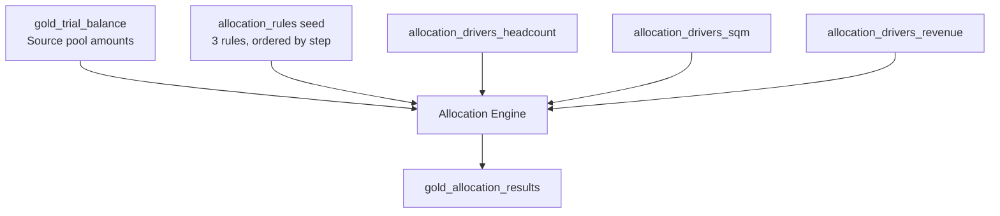

# Allocation Guide

Open EPM supports driver-based cost allocation with multi-step cascading. Costs are distributed from source cost centers to targets based on measurable drivers (headcount, square meters, revenue).

## Overview



## Allocation Rules

Defined in `seeds/allocation_rules.csv`:

| Rule ID | Name | Step | Source Account | Source CC | Driver | Target Account |
|---------|------|------|---------------|-----------|--------|---------------|
| `ALLOC_001` | IT Cost Allocation | 1 | 7100 | IT | headcount | 7100 |
| `ALLOC_002` | Facility Cost Allocation | 2 | 7200 | FACILITY | sqm | 7200 |
| `ALLOC_003` | Management Fee Allocation | 3 | 7300 | MGMT | revenue | 7300 |

### Rule Fields

| Field | Description |
|-------|-------------|
| `allocation_rule_id` | Unique rule identifier |
| `rule_name` | Human-readable name |
| `step_order` | Execution order (1, 2, 3) — later steps see cascaded amounts |
| `source_account` | GL account to allocate from |
| `source_cost_center` | Cost center holding the pool |
| `driver_type` | Driver name: `headcount`, `sqm`, or `revenue` |
| `target_account` | GL account to allocate to |

## Driver Data

Three driver seed files, all with the same schema:

| Column | Type | Description |
|--------|------|-------------|
| `data_area_id` | String | Legal entity |
| `cost_center` | String | Receiving cost center |
| `driver_value` | Decimal | Driver quantity (e.g., headcount = 25) |
| `fiscal_year` | UInt16 | Year |
| `fiscal_period` | UInt8 | Period |

**Driver weight** is computed as:

```
driver_weight = driver_value / SUM(driver_value)
                OVER (PARTITION BY data_area_id, fiscal_year, fiscal_period)
```

The source cost center is **excluded** from receiving allocations (no self-allocation).

Revenue drivers filter out `driver_value ≤ 0` to avoid division issues.

## Multi-Step Cascade

The allocation engine runs three steps sequentially. Each step can see amounts allocated by prior steps.

### Step 1: IT Cost Allocation (Headcount)

```
Pool = SUM(period_net_amount) FROM gold_trial_balance
       WHERE main_account = '7100' AND cost_center = 'IT'

Allocated = pool × driver_weight (headcount)
Target: Each non-IT cost center gets 7100 amounts proportional to headcount
```

### Step 2: Facility Cost Allocation (Square Meters)

```
Pool = SUM(period_net_amount) FROM gold_trial_balance
       WHERE main_account = '7200' AND cost_center = 'FACILITY'
     + Any Step 1 allocations that landed in FACILITY cost center

Allocated = pool × driver_weight (sqm)
```

**Cascade**: If Step 1 allocated IT costs to FACILITY, those amounts flow into Step 2's pool.

### Step 3: Management Fee Allocation (Revenue)

```
Pool = SUM(period_net_amount) FROM gold_trial_balance
       WHERE main_account = '7300' AND cost_center = 'MGMT'
     + Any Step 1 + Step 2 allocations that landed in MGMT cost center

Allocated = pool × driver_weight (revenue)
```

### Worked Example

Suppose for USMF, 2024, period 5:

**Step 1 — IT Costs ($100,000)**:
| Cost Center | Headcount | Weight | Allocated |
|------------|-----------|--------|-----------|
| SALES | 50 | 50/80 = 62.5% | $62,500 |
| FACILITY | 10 | 10/80 = 12.5% | $12,500 |
| MGMT | 20 | 20/80 = 25.0% | $25,000 |

**Step 2 — Facility Costs ($80,000 original + $12,500 cascade = $92,500)**:
| Cost Center | SQM | Weight | Allocated |
|------------|-----|--------|-----------|
| SALES | 500 | 500/800 = 62.5% | $57,813 |
| IT | 100 | 100/800 = 12.5% | $11,563 |
| MGMT | 200 | 200/800 = 25.0% | $23,125 |

**Step 3 — Management Fees ($50,000 original + $25,000 + $23,125 cascade = $98,125)**:
| Cost Center | Revenue | Weight | Allocated |
|------------|---------|--------|-----------|
| SALES | $2M | 2M/2.5M = 80% | $78,500 |
| IT | $0.5M | 0.5M/2.5M = 20% | $19,625 |

## Output: gold_allocation_results

Each row represents one allocation line:

| Column | Description |
|--------|-------------|
| `allocation_rule_id` | Which rule (ALLOC_001, etc.) |
| `step_order` | Step number (1, 2, 3) |
| `data_area_id` | Entity |
| `fiscal_year` / `fiscal_period` | Period |
| `source_account` / `source_cost_center` | Where the cost came from |
| `target_cost_center` / `target_account` | Where it was allocated to |
| `driver_type` | Driver used |
| `pool_amount` | Total pool for this step |
| `driver_weight` | Recipient's share (0–1) |
| `allocated_amount` | Amount allocated to this target |

## Tests

| Test | Assertion |
|------|-----------|
| `assert_each_step_sums_to_pool` | `\|pool_amount − SUM(allocated_amount)\| ≤ 0.01` per step |
| `assert_no_self_allocation` | Source cost center never appears as target |

## Adding a New Allocation Rule

1. Add a row to `seeds/allocation_rules.csv` with the next `step_order`
2. Create a driver seed CSV (or reuse an existing driver)
3. Update the `allocation_engine_multistep()` macro in `macros/allocation_engine_multistep.sql` to add the new step
4. Run `dbt seed && dbt build`

See [Extending dbt Models](../developer-guide/extending-dbt-models.md) for the full workflow.

## Next Steps

- [Consolidation Guide](consolidation-guide.md) — Multi-entity consolidation
- [Budgeting Guide](budgeting-guide.md) — Budget spreading
- [Macro Reference](../developer-guide/macro-reference.md) — Allocation engine macro details
