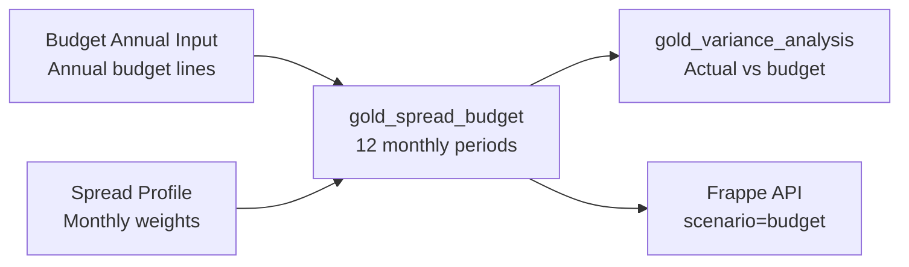

# Budgeting Guide

Konsolidat supports annual budget input with configurable spread profiles that distribute amounts across 12 fiscal periods.

!!! tip "Budget Layers — Collaborative Budgeting"
    Konsolidat supports **additive budget layers** (base, challenge, management, board) where each stakeholder contributes adjustments tracked separately. The effective budget is always the sum of all layers. See the **[Budget Layers Guide](budget-layers.md)** for a full worked example showing how layers are entered in Frappe, synced to ClickHouse, and retrieved via `=K.EPM()`.

## Budget Data Flow



## Annual Budget Input

Annual budget lines are **Budget Annual Input** records in konsol, written through to `epm_gold.budget_annual_input` (app-entered budgets flow through Budget Cycle → Budget Sheet → Budget Line instead — see the [Budget Layers Guide](budget-layers.md)). Example lines:

| scenario_id | data_area_id | fiscal_year | main_account | dim_cost_center | dim_department | annual_amount | spread_profile_id |
|---|---|---|---|---|---|---|---|
| BUDGET_2025 | USMF | 2025 | 6100 | SALES | SALES | 1,200,000 | EVEN |
| BUDGET_2025 | USMF | 2025 | 6200 | MARKETING | MARKETING | 600,000 | SEASONAL_RETAIL |
| BUDGET_2025 | USMF | 2025 | 7100 | IT | IT | 360,000 | EVEN |
| BUDGET_2025 | USMF | 2025 | 4100 | SALES | SALES | 2,400,000 | SEASONAL_RETAIL |

| Column | Description |
|--------|-------------|
| `scenario_id` | Budget scenario identifier (e.g., `BUDGET_2025`) |
| `data_area_id` | Legal entity |
| `fiscal_year` | Budget year |
| `main_account` | GL account |
| `dim_cost_center` | Cost center |
| `dim_department` | Department |
| `annual_amount` | Total annual budget amount |
| `spread_profile_id` | How to distribute across months |
| `submitted_by` | Who submitted the budget |

## Spread Profiles

Spread profiles define how annual amounts are distributed across 12 months. They are **Spread Profile** records in konsol (`epm_gold.spread_profiles`). For example:

### EVEN (Equal Monthly Spread)

All 12 months receive equal weight (1.0 each).

| Period | 1 | 2 | 3 | 4 | 5 | 6 | 7 | 8 | 9 | 10 | 11 | 12 |
|--------|---|---|---|---|---|---|---|---|---|----|----|-----|
| Weight | 1.0 | 1.0 | 1.0 | 1.0 | 1.0 | 1.0 | 1.0 | 1.0 | 1.0 | 1.0 | 1.0 | 1.0 |

**Example**: $1,200,000 annual → $100,000/month

### SEASONAL_RETAIL (Retail Seasonal Pattern)

Higher weights for holiday months (Q4 peak):

| Period | 1 | 2 | 3 | 4 | 5 | 6 | 7 | 8 | 9 | 10 | 11 | 12 |
|--------|---|---|---|---|---|---|---|---|---|----|----|-----|
| Weight | 0.6 | 0.5 | 0.7 | 0.8 | 0.9 | 1.0 | 0.8 | 0.9 | 1.0 | 1.3 | 1.8 | 2.5 |

**Example**: $600,000 annual with SEASONAL_RETAIL:
- Period 2 (lowest): $600,000 × 0.5/12.8 = $23,438
- Period 12 (highest): $600,000 × 2.5/12.8 = $117,188

### Spread Formula

```
period_weight = weight / SUM(all 12 weights for the profile)
period_amount = annual_amount × period_weight
```

The weights are **normalized** so they always sum to the annual total regardless of the raw weight values.

## Scenarios

Budget data is tagged with a scenario, a **Scenario** record in konsol (`epm_gold.scenario_definitions`). For example:

| Scenario ID | Name | Type | Active |
|------------|------|------|--------|
| `ACTUAL` | Actuals | actual | Yes |
| `BUDGET` | Budget 2024 | budget | Yes |
| `FORECAST` | Forecast Q3 | forecast | Yes |
| `WHATIF_01` | What-If Scenario 1 | whatif | No |

The `gold_scenario_trial_balance` model unions all active scenarios into a single table for cross-scenario analysis.

## Querying Budget Data

### From Excel

```
=K.EPM_BUDGET("USMF", 2025, 5, "6100")
```

This returns the period 5 budget amount for account 6100. Equivalent to:

```
=K.EPM("USMF", 2025, 5, "6100", "period_amount", "budget")
```

### Available Budget Measures

| Measure | Description |
|---------|-------------|
| `period_amount` | Budget for the specific period (default for EPM_BUDGET) |
| `annual_amount` | Total annual budget |

### Period Ranges Work Too

```
=K.EPM_BUDGET("USMF", 2025, "Q1", "6100")     ' Sum of periods 1+2+3
=K.EPM_BUDGET("USMF", 2025, "FY", "6100")     ' Full year (= annual_amount)
```

## Adding a New Budget

1. Create the **Scenario** in konsol
2. Optionally create a new **Spread Profile**
3. Enter **Budget Annual Input** lines with the new `scenario_id` (or use Budget Cycle and Budget Sheet; see the [Budget Layers Guide](budget-layers.md))
4. Run `dbt build`

## Adding a Custom Spread Profile

Create 12 **Spread Profile** records, one per fiscal period, with the same `profile_id`:

| profile_id | profile_name | fiscal_period | weight |
|---|---|---|---|
| FRONT_LOADED | Front-Loaded | 1 | 2.0 |
| FRONT_LOADED | Front-Loaded | 2 | 1.8 |
| FRONT_LOADED | Front-Loaded | 3 | 1.5 |
| … | … | … | … |
| FRONT_LOADED | Front-Loaded | 12 | 0.5 |

The weights don't need to sum to 12.0 — they're normalized during the spread calculation.

## Tests

| Test | Assertion |
|------|-----------|
| `assert_spread_sums_to_annual` | `\|annual_amount − SUM(period_amount)\| ≤ 0.01` |
| `assert_spread_has_12_periods` | Each budget line produces exactly 12 period rows |

## Next Steps

- **[Budget Layers Guide](budget-layers.md)** — Collaborative layered budgeting with workflow and approval
- [Variance Analysis Guide](variance-analysis-guide.md) — Actual vs budget comparison
- [Excel Formulas Guide](excel-formulas-guide.md) — Budget formulas in Excel
- [Configuration Data](../data-dictionary/seeds-reference.md) — Where each kind of reference data lives in konsol
