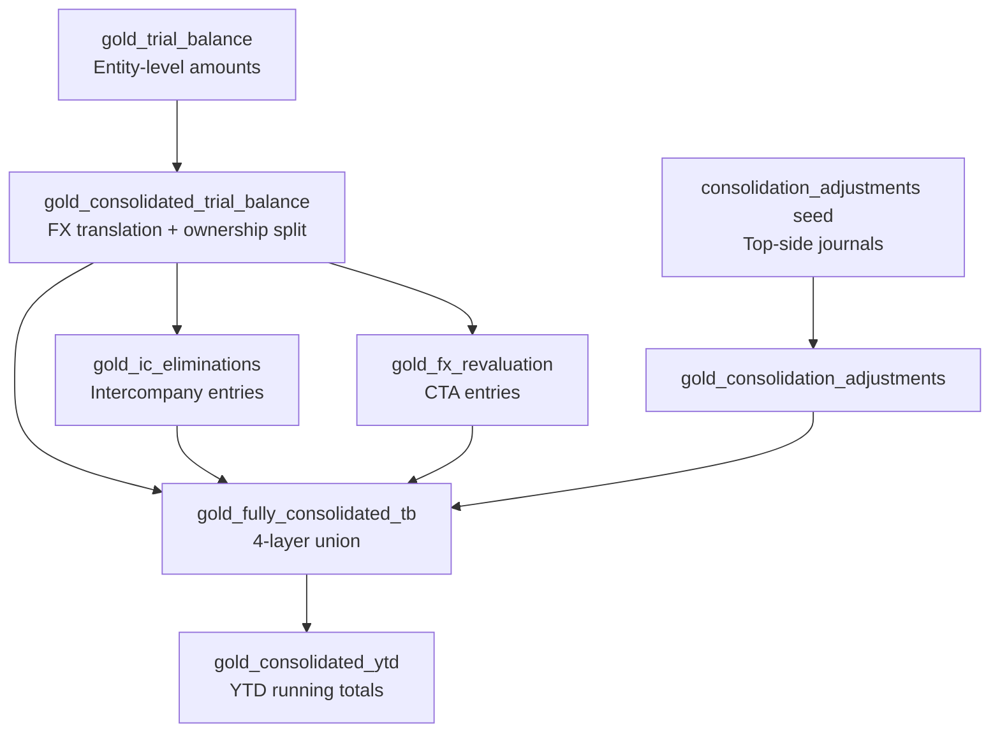
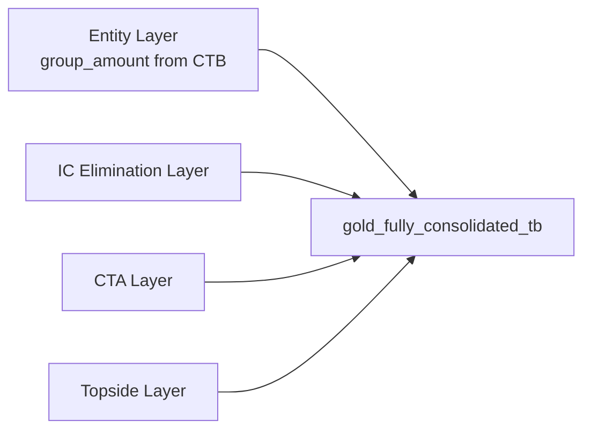

# Consolidation Guide

Open EPM consolidates financial data from multiple legal entities into a single group report. The process includes currency translation, intercompany elimination, CTA calculation, and top-side adjustments.

## Overview



## Consolidation Groups

Defined in the `consolidation_groups` seed CSV:

```csv
consolidation_group,data_area_id,entity_name,ownership_pct,reporting_currency,consolidation_method
GROUP_CORP,USMF,Contoso US,100,USD,full
GROUP_CORP,DEMF,Contoso DE,100,USD,full
GROUP_CORP,GBMF,Contoso UK,80,USD,full
GROUP_CORP,JPMF,Contoso JP,51,USD,full
```

| Field | Description |
|-------|-------------|
| `consolidation_group` | Group identifier (e.g., `GROUP_CORP`) |
| `data_area_id` | Legal entity code from D365 |
| `ownership_pct` | Parent's ownership (0–100) |
| `reporting_currency` | Group reporting currency |
| `consolidation_method` | Currently: `full` |

## Currency Translation

### Rate Selection Rules

| Account Type | Rate Used | Rationale |
|-------------|-----------|-----------|
| Balance Sheet (Asset, Liability) | **Closing rate** | BS at period-end value |
| P&L (Revenue, Expense) | **Average rate** | P&L at period average |
| Equity | **Closing rate** | Simplified; historical rate for full IAS 21 |

The rate is looked up from `silver_exchange_rates` using the `convert_currency()` macro with a fallback chain:
1. Exact match on `from_currency`, `to_currency`, `valid_from ≤ date ≤ valid_to`
2. Latest available rate before the period
3. Default to `1.0` (same-currency assumption)

### Translation Formulas

```
translated_amount = local_amount × translation_rate
group_amount      = translated_amount × ownership_pct
nci_amount        = translated_amount × (1 − ownership_pct)
```

**Example**: GBMF (UK entity, 80% owned) reports GBP 100,000 revenue, closing rate 1.27 USD/GBP:

```
translated_amount = 100,000 × 1.27 = 127,000 USD
group_amount      = 127,000 × 0.80 = 101,600 USD
nci_amount        = 127,000 × 0.20 =  25,400 USD
```

### Tests

| Test | Assertion |
|------|-----------|
| `assert_translated_amount_formula` | `\|translated − (local × rate)\| ≤ 0.01` |
| `assert_group_amount_formula` | `\|group − (translated × ownership)\| ≤ 0.01` |
| `assert_nci_plus_group_equals_translated` | `\|translated − (group + nci)\| ≤ 0.01` |
| `assert_nci_zero_for_full_ownership` | NCI = 0 when ownership = 100% |
| `assert_bs_uses_closing_rate` | BS accounts use closing rate |
| `assert_pnl_uses_average_rate` | P&L accounts use average rate |

## Intercompany Elimination

### IC Elimination Rules

Defined in the `ic_elimination_rules` seed:

```csv
rule_id,rule_name,debit_account,credit_account,debit_entity_pattern,credit_entity_pattern,description
IC_001,IC Receivable/Payable,1300,2100,*,*,Eliminate IC receivables against payables
IC_002,IC Revenue/COGS,4000,5000,*,*,Eliminate IC revenue against COGS
IC_003,IC Dividend,8100,3200,*,*,Eliminate IC dividends
```

The elimination engine:
1. For each rule, finds matching debit/credit account balances across entities in the same group
2. Calculates the elimination amount as the lesser of the two IC balances
3. Posts offsetting entries to zero out the intercompany position

### Test

`assert_ic_elimination_nets_zero` — for each group/year/period, `sum(debit_elimination + credit_elimination)` must be ≤ 0.01.

## Currency Translation Adjustment (CTA)

CTA arises because P&L is translated at the average rate but the balance sheet at the closing rate. The difference is posted as an equity adjustment.

```
cta_amount = sum(local_amount × (closing_rate − average_rate) × ownership_pct)
```

### Tests

| Test | Assertion |
|------|-----------|
| `assert_cta_not_zero_when_rates_differ` | CTA is non-zero when closing ≠ average rate |
| `assert_cta_zero_for_same_currency` | CTA = 0 when entity currency = reporting currency |

## Top-Side Adjustments

Manual journal entries posted at the group level for adjustments that don't originate from entity GL (e.g., goodwill, purchase price allocation, fair value adjustments).

Defined in the `consolidation_adjustments` seed:

| Field | Type | Description |
|-------|------|-------------|
| `consolidation_group` | String | Group |
| `adjustment_type` | String | Type of adjustment |
| `journal_id` | String | Unique journal ID |
| `data_area_id` | String | Entity (or group-level) |
| `fiscal_year` | UInt16 | Year |
| `fiscal_period` | UInt8 | Period |
| `main_account` | String | Account |
| `debit_amount` | Decimal(18,2) | Debit |
| `credit_amount` | Decimal(18,2) | Credit |
| `description` | String | Narrative |

**Test**: `assert_topside_journal_balanced` — each journal must balance (total debits = total credits).

## Fully Consolidated Trial Balance (4-Layer Union)



The `gold_fully_consolidated_tb` model unions four layers:

| `adjustment_type` | Source | Amount |
|-------------------|--------|--------|
| `entity` | `gold_consolidated_trial_balance` | `group_amount` |
| `ic_elimination` | `gold_ic_eliminations` | `elimination_amount` |
| `cta` | `gold_fx_revaluation` | `cta_amount` |
| (topside type) | `gold_consolidation_adjustments` | `net_amount` |

**Test**: `assert_fctb_entity_layer_ties` — entity layer sums tie to `gold_consolidated_trial_balance.group_amount`.

## Reporting with EPM()

Consolidated data is available via the gold models. For entity-level reporting:

```
=EPM("USMF", 2024, "FY", "401100")
```

For consolidated reports, query the fully consolidated models directly via SQL or build summary reports that reference the consolidation gold tables.

## Next Steps

- [Allocation Guide](allocation-guide.md) — Cost allocation after consolidation
- [Budgeting Guide](budgeting-guide.md) — Budget input and spreading
- [Data Dictionary: Gold Models](../data-dictionary/gold-models.md) — Full column reference
