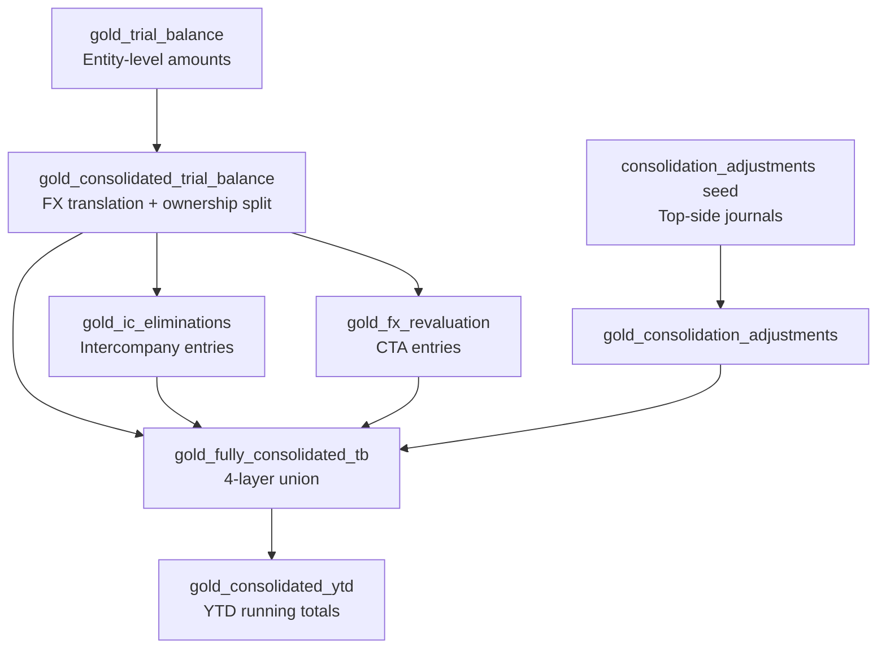
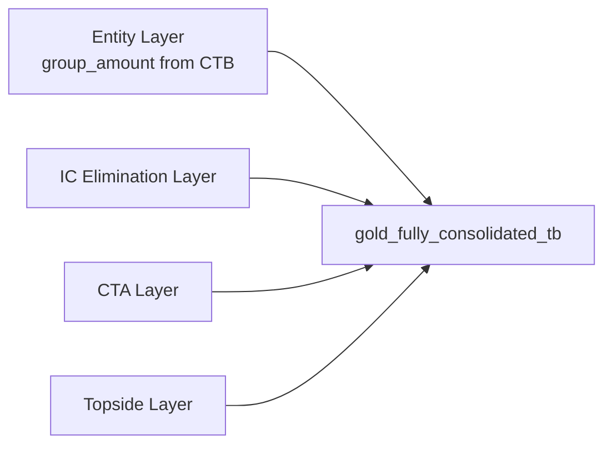

# Consolidation Guide

Konsolidat consolidates financial data from multiple legal entities into a single group report. The process includes currency translation, intercompany elimination, CTA calculation, and top-side adjustments.

## Overview



## Consolidation Groups

Defined in the `consolidation_groups` seed CSV:

```csv
consolidation_group,data_area_id,entity_name,ownership_pct,reporting_currency,consolidation_method
GROUP_CORP,USMF,Contoso US,100,USD,full
GROUP_CORP,DEMF,Contoso DE,100,USD,full
GROUP_CORP,GBMF,Contoso UK,80,USD,full
GROUP_CORP,JPMF,Contoso JP,51,USD,full
```

| Field | Description |
|-------|-------------|
| `consolidation_group` | Group identifier (e.g., `GROUP_CORP`) |
| `data_area_id` | Legal entity code from D365 |
| `ownership_pct` | Parent's ownership (0–100) |
| `reporting_currency` | Group reporting currency |
| `consolidation_method` | Currently: `full` |

## Currency Translation

### Rate Selection Rules

| Account Type | Rate Used | Rationale |
|-------------|-----------|-----------|
| Balance Sheet (Asset, Liability) | **Closing rate** | BS at period-end value |
| P&L (Revenue, Expense) | **Average rate** | P&L at period average |
| Equity | **Historical rate** (when defined), else closing rate | IAS 21: equity is frozen at the rate on the date it was contributed — see [Historical Equity Rates](#historical-equity-rates-ias-21) |

The rate is looked up from `silver_exchange_rates` using the `convert_currency()` macro with a fallback chain:
1. Exact match on `from_currency`, `to_currency`, `valid_from ≤ date ≤ valid_to`
2. Latest available rate before the period
3. Default to `1.0` (same-currency assumption)

### Translation Formulas

```
translated_amount = local_amount × translation_rate
group_amount      = translated_amount × ownership_pct
nci_amount        = translated_amount × (1 − ownership_pct)
```

**Example**: GBMF (UK entity, 80% owned) reports GBP 100,000 revenue, closing rate 1.27 USD/GBP:

```
translated_amount = 100,000 × 1.27 = 127,000 USD
group_amount      = 127,000 × 0.80 = 101,600 USD
nci_amount        = 127,000 × 0.20 =  25,400 USD
```

### Historical Equity Rates (IAS 21)

Equity accounts (share capital, share premium, pre-acquisition reserves) must **not** move with exchange rates. Under IAS 21 they are frozen at the **historical rate** — the FX rate on the date the equity was originally contributed or acquired. Translating them at the closing rate instead would make share capital appear to grow or shrink purely from currency movement, even though no shareholder put in or withdrew anything.

Konsolidat stores these frozen rates in the **Historical Equity Rate** doctype. Each record locks one rate for one equity account of one entity in one group. During translation, `gold_consolidated_trial_balance` applies it ahead of the closing rate:

```
when accounting_currency = reporting_currency  → 1.0
when is_equity = 1 and a historical rate exists → historical rate   ← Historical Equity Rate
when is_balance_sheet                           → closing rate
when is_pnl                                      → average rate
```

#### Worked example

GBMF (the UK subsidiary, 80% owned) was incorporated on **15 Jan 2020** with **GBP 1,000,000** of share capital, when the rate was **1.40 USD/GBP**. The group reports in **USD**. By **31 Dec 2024** the closing rate has fallen to **1.27 USD/GBP**, but the share capital on GBMF's books is still GBP 1,000,000 — nobody issued or bought back shares.

| Rate | Value | Applies to |
|------|-------|-----------|
| Historical (15 Jan 2020) | **1.40** | equity ← this doctype |
| Closing (31 Dec 2024) | 1.27 | assets & liabilities |
| Average (FY2024) | 1.28 | P&L |

Translating the GBP 1,000,000 of share capital:

```
✅ Historical rate:  1,000,000 × 1.40 = 1,400,000 USD   (frozen, correct under IAS 21)
❌ Closing rate:     1,000,000 × 1.27 = 1,270,000 USD   (wrong — implies capital "shrank" 130,000)
```

The **USD 130,000** difference is not lost — it flows into the **Currency Translation Adjustment** (CTA / FCTR) in equity, isolating pure FX movement instead of distorting share capital. The usual ownership split then applies to the historically-translated amount (`group_amount = 1,400,000 × 0.80 = 1,120,000 USD`; `nci_amount = 280,000 USD`).

#### Entering a historical rate

Create a **Historical Equity Rate** record (Consolidation module) and **submit** it:

| Field | Example | Meaning |
|-------|---------|---------|
| `consolidation_group` | `GROUP_CORP` | Group the rate applies to |
| `data_area_id` | `GBMF` | Entity whose equity is being frozen |
| `main_account` | `3000` | The equity account (e.g. Share Capital) |
| `rate_date` | `2020-01-15` | Date the equity was contributed/acquired |
| `historical_rate` | `1.40` | FX rate on that date |

On submit, the rate syncs to `epm_staging.historical_equity_rates` and is picked up on the next `gold_consolidated_trial_balance` build. If no historical rate is defined for an equity account, translation falls back to the closing rate.

### Tests

| Test | Assertion |
|------|-----------|
| `assert_translated_amount_formula` | `\|translated − (local × rate)\| ≤ 0.01` |
| `assert_group_amount_formula` | `\|group − (translated × ownership)\| ≤ 0.01` |
| `assert_nci_plus_group_equals_translated` | `\|translated − (group + nci)\| ≤ 0.01` |
| `assert_nci_zero_for_full_ownership` | NCI = 0 when ownership = 100% |
| `assert_bs_uses_closing_rate` | BS accounts use closing rate |
| `assert_pnl_uses_average_rate` | P&L accounts use average rate |

## Intercompany Elimination

### IC Elimination Rules

Defined in the `ic_elimination_rules` seed:

```csv
rule_id,rule_name,debit_account,credit_account,debit_entity_pattern,credit_entity_pattern,description
IC_001,IC Receivable/Payable,1300,2100,*,*,Eliminate IC receivables against payables
IC_002,IC Revenue/COGS,4000,5000,*,*,Eliminate IC revenue against COGS
IC_003,IC Dividend,8100,3200,*,*,Eliminate IC dividends
```

The elimination engine:
1. For each rule, finds matching debit/credit account balances across entities in the same group
2. Calculates the elimination amount as the lesser of the two IC balances
3. Posts offsetting entries to zero out the intercompany position

### Test

`assert_ic_elimination_nets_zero` — for each group/year/period, `sum(debit_elimination + credit_elimination)` must be ≤ 0.01.

## Currency Translation Adjustment (CTA)

Each entity's *local* trial balance is balanced (signed debit − credit sums to zero). But once account classes are translated at **different rates** — balance sheet at closing, P&L at average, equity at historical — the translated balances no longer sum to zero. CTA is the **residual plug** that restores balance, posted to equity (FCTR), so that `Σ(translated group amount) + CTA = 0` for each entity/period by construction (IAS 21).

It is computed in `gold_fx_revaluation` as the negative of the translated group-share residual — **not** a single-component formula:

```
cta_amount = − Σ group_amount        (per entity / period, across all accounts)
where  group_amount = local_amount × translation_rate × ownership_pct
```

!!! note "Replaces the old P&L-only approximation"
    An earlier version approximated CTA as `Σ(local × (closing − average) × ownership)`. That captured only the P&L timing component — the closing/average spread is ~0.00006 — and never captured the balance-sheet retranslation difference, so the consolidated TB did not balance for multi-currency groups (#66). The residual-plug definition above is correct for all rate differences.

### What drives CTA

CTA absorbs the *combined* effect of every input that translates an account at something other than a single uniform rate. The configurable drivers are:

| Driver | Configured in | Effect on CTA |
|--------|---------------|---------------|
| Closing vs average rate | `silver_exchange_rates` (from D365) | BS/P&L timing difference |
| Equity historical rate | **Historical Equity Rate** doctype | freezes equity → differs from closing |
| Ownership % / method (temporal) | **Ownership Period** doctype | CTA is on the **group share**, so ownership scales it |
| Reporting currency, base ownership | **Consolidation Group** | a same-currency entity translates at 1.0 → CTA = 0 |
| Effective ownership (multi-level) | **Reporting Hierarchy** | rolls up indirect ownership feeding the group share |

The NCI share of the translation difference does **not** go to CTA — it rides with `nci_amount` and is handled by the NCI schedule.

### Tests

| Test | Assertion |
|------|-----------|
| `assert_cta_not_zero_when_rates_differ` | CTA is non-zero when closing ≠ average rate |
| `assert_cta_zero_for_same_currency` | CTA = 0 when entity currency = reporting currency |

## Top-Side Adjustments

Manual journal entries posted at the group level for adjustments that don't originate from entity GL (e.g., goodwill, purchase price allocation, fair value adjustments).

Defined in the `consolidation_adjustments` seed:

| Field | Type | Description |
|-------|------|-------------|
| `consolidation_group` | String | Group |
| `adjustment_type` | String | Type of adjustment |
| `journal_id` | String | Unique journal ID |
| `data_area_id` | String | Entity (or group-level) |
| `fiscal_year` | UInt16 | Year |
| `fiscal_period` | UInt8 | Period |
| `main_account` | String | Account |
| `debit_amount` | Decimal(18,2) | Debit |
| `credit_amount` | Decimal(18,2) | Credit |
| `description` | String | Narrative |

**Test**: `assert_topside_journal_balanced` — each journal must balance (total debits = total credits).

## Fully Consolidated Trial Balance (4-Layer Union)



The `gold_fully_consolidated_tb` model unions four layers:

| `adjustment_type` | Source | Amount |
|-------------------|--------|--------|
| `entity` | `gold_consolidated_trial_balance` | `group_amount` |
| `ic_elimination` | `gold_ic_eliminations` | `elimination_amount` |
| `cta` | `gold_fx_revaluation` | `cta_amount` |
| (topside type) | `gold_consolidation_adjustments` | `net_amount` |

**Test**: `assert_fctb_entity_layer_ties` — entity layer sums tie to `gold_consolidated_trial_balance.group_amount`.

## Cash Flow Statement (Indirect Method)

The platform derives the third primary statement from balance-sheet account
movements — no separate cash-flow ledger is required.

**Entity level** — `gold_cash_flow_indirect`:

- Every non-cash BS account's `period_movement` (from `gold_bs_movement`) is
  classified into Operating / Investing / Financing via the
  `cash_flow_categories` seed and converted to a cash effect:
  `cash_flow_amount = period_movement × sign`.
- Because balances are stored as positive magnitudes, the cash direction is set
  explicitly per account in the seed's `sign` column: credit-natured accounts
  (liabilities, equity, contra-assets like accumulated depreciation) are `+1`;
  debit-natured accounts (assets, contra-equity like dividends declared) are
  `-1` — an asset increase is a cash outflow.
- Net income is **not** pulled separately from the P&L; the retained-earnings
  movement already carries period net income on the balance sheet, so it is the
  Operating "Net Income" line. Dividends declared go to Financing.

**Group level** — `gold_consolidated_cash_flow`:

- Built after FX translation from `gold_fully_consolidated_tb`, so group totals
  reflect translated (closing-rate) amounts and differ from the simple sum of
  entity local-currency cash flows.
- Each consolidation layer's amount (entity, IC elimination, CTA, topside, …) is
  folded into the underlying account and categorized identically. CTA is the
  plug that keeps the translated balance sheet in balance, so the statement
  still ties to the change in translated cash.

### Categorizing accounts

Edit `seeds/cash_flow_categories.csv` and re-run `dbt seed` to map a new GL
account. The relationships test on `gold_bs_movement.main_account` fails the
build if any balance-sheet account is left uncategorized.

### Tests

- `assert_cf_categories_equal_net_change` — entity: `Σ(O + I + F) = Σ period_movement of is_cash accounts`, per entity/period, within ±0.01.
- `assert_consolidated_cf_reconciles` — group: same identity across all layers, per group/period.
- `accepted_values` on `cf_category` ∈ {Operating, Investing, Financing}.

Both reconciliations hold only when the (consolidated) balance sheet balances
each period; a failure points at unbalanced source data, not the model.

## Reporting with EPM()

Consolidated data is available via the gold models. For entity-level reporting:

```
=EPM("USMF", 2024, "FY", "401100")
```

For consolidated reports, query the fully consolidated models directly via SQL or build summary reports that reference the consolidation gold tables.

## Next Steps

- [Allocation Guide](allocation-guide.md) — Cost allocation after consolidation
- [Budgeting Guide](budgeting-guide.md) — Budget input and spreading
- [Data Dictionary: Gold Models](../data-dictionary/gold-models.md) — Full column reference
