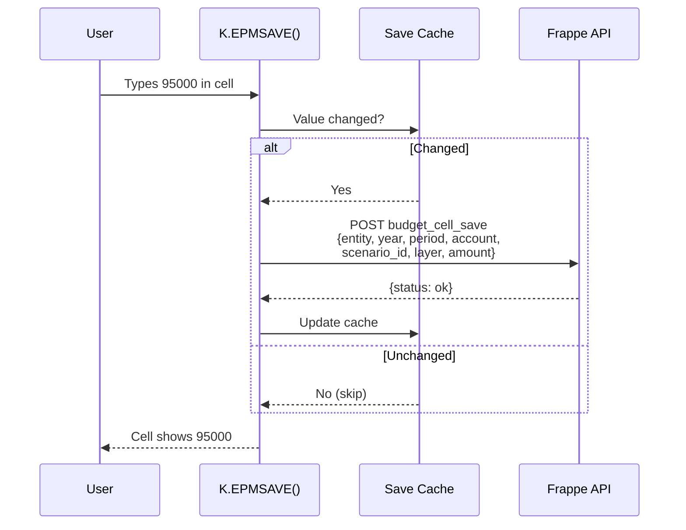
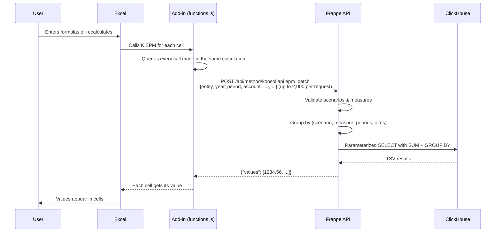

# Excel Formulas Guide

The konsol Excel add-in turns Excel into a live reporting and budgeting client. Its worksheet functions live in the `K` namespace: reading (`K.EPM`, `K.EPM_BUDGET`, `K.EPM_VARIANCE`, `K.EPM_DEBIT`, `K.EPM_CREDIT`, `K.CF`) and writing (`K.EPMSAVE`). Excel calculates them like any other function; the add-in collects every `K.` call in one calculation and sends them to the server together.

## Setup

1. Install the add-in: see [Excel Task Pane Guide → Installation](excel-taskpane-guide.md#installation).
2. Open the **Konsolidat** task pane and sign in with your Frappe credentials.
3. In any cell, type `=K.EPM("USMF", 2024, 5, "401100")`.

The functions work in desktop Excel and Excel on the web. Until you sign in, `K.` cells show `#N/A` with the message "Not logged in — open the Konsolidat task pane and sign in."

## Formula Functions

### Read vs Write

| Function | Direction | When It Fires |
|----------|-----------|---------------|
| `K.EPM()`, `K.EPM_BUDGET()`, `K.EPM_VARIANCE()`, `K.EPM_DEBIT()`, `K.EPM_CREDIT()`, `K.CF()` | **Read** | When Excel calculates the cell: on entry, when an input changes, or on a full recalculation (Ctrl+Alt+F9) |
| `K.EPMSAVE()` | **Write** | Saves to the server when Excel calculates the cell (skips unchanged values) |

### Read Functions

The five `K.EPM` read functions share the same parameter pattern. They differ only in the default `measure` and `scenario`.

### K.EPM() — General Purpose

```
=K.EPM(entity, fiscal_year, fiscal_period, account, [measure], [scenario], [cost_center], [department], [scenario_id], [hierarchy], [node], [layer])
```

| Parameter | Type | Required | Default | Description |
|-----------|------|----------|---------|-------------|
| `entity` | String | Yes | — | Legal entity code (e.g., `"USMF"`) |
| `fiscal_year` | Number | Yes | — | Fiscal year (e.g., `2024`) |
| `fiscal_period` | String/Number | Yes | — | Period: `1`–`12`, `"Q1"`–`"Q4"`, `"H1"`, `"H2"`, `"FY"` |
| `account` | String | Yes | — | Main account code (e.g., `"401100"`) |
| `measure` | String | No | `"period_net_amount"` | Which value to return (see [Measures](#measures)) |
| `scenario` | String | No | `"actuals"` | Data scenario (see [Scenarios](#scenarios)) |
| `cost_center` | String | No | `""` | Filter by cost center |
| `department` | String | No | `""` | Filter by department |
| `scenario_id` | String | No | `""` | Filter to a specific scenario ID (e.g., `"BUDGET_2025"`). See [Scenario ID Filtering](#scenario-id-filtering). |
| `hierarchy`, `node` | String | No | `""` | Read a reporting-hierarchy node instead of a single entity |
| `layer` | String | No | `""` | Budget layer: `"base"`, `"challenge"`, `"management"`, `"board"` |

**Examples:**

```
=K.EPM("USMF", 2024, 5, "401100")
=K.EPM("USMF", 2024, "Q1", "401100", "ytd_net_amount")
=K.EPM("USMF", 2024, "FY", "401100", "period_net_amount", "actuals", "SALES")
=K.EPM("USMF", 2025, 5, "6100", "period_amount", "budget", "", "", "BUDGET_2025")
```

### K.EPM_BUDGET() — Budget Values

```
=K.EPM_BUDGET(entity, fiscal_year, fiscal_period, account, [cost_center], [department], [scenario_id], [hierarchy], [node], [layer])
```

Shorthand for `=K.EPM(..., "period_amount", "budget", ...)`.

### K.EPM_VARIANCE() — Actual vs Budget Variance

```
=K.EPM_VARIANCE(entity, fiscal_year, fiscal_period, account, [cost_center], [department], [scenario_id], [hierarchy], [node])
```

Shorthand for `=K.EPM(..., "variance_abs", "variance", ...)`.

### K.EPM_DEBIT() — Period Debits

```
=K.EPM_DEBIT(entity, fiscal_year, fiscal_period, account, [cost_center], [department], [hierarchy], [node])
```

Shorthand for `=K.EPM(..., "period_debit", "actuals", ...)`.

### K.EPM_CREDIT() — Period Credits

```
=K.EPM_CREDIT(entity, fiscal_year, fiscal_period, account, [cost_center], [department], [hierarchy], [node])
```

Shorthand for `=K.EPM(..., "period_credit", "actuals", ...)`.

### K.CF() — Consolidated Cash Flow

```
=K.CF(group, fiscal_year, fiscal_period, line)
```

Reads one line of the consolidated cash-flow statement for a consolidation group, e.g. `=K.CF("GROUP_CORP", 2024, 6, "Change in Inventory")`.

### Write Function

### K.EPMSAVE() — Budget Write-Back

```
=K.EPMSAVE(amount, entity, fiscal_year, fiscal_period, account, scenario_id, layer, [cost_center], [department], [hierarchy], [node])
```

| Parameter | Type | Required | Default | Description |
|-----------|------|----------|---------|-------------|
| `amount` | Number | Yes | — | The value to save (number or cell reference) |
| `entity` | String | Yes | — | Legal entity code (e.g., `"USMF"`) |
| `fiscal_year` | Number | Yes | — | Fiscal year (e.g., `2025`) |
| `fiscal_period` | Number | Yes | — | Single period `1`–`12` (no ranges — one cell per period) |
| `account` | String | Yes | — | Main account code (e.g., `"6100"`) |
| `scenario_id` | String | Yes | — | Scenario instance (e.g., `"BUDGET_2025"`) |
| `layer` | String | Yes | — | Budget layer: `"base"`, `"challenge"`, `"management"`, `"board"` |
| `cost_center` | String | No | `""` | Cost center dimension |
| `department` | String | No | `""` | Department dimension |

**The cell displays the amount.** The write to the server happens in the background.

**Examples:**

```
=K.EPMSAVE(100000, "USMF", 2025, 1, "6100", "BUDGET_2025", "base")
=K.EPMSAVE(-5000, "USMF", 2025, 1, "6100", "BUDGET_2025", "challenge")
=K.EPMSAVE(B5, $A$1, $A$2, C$3, $A5, $A$4, "base")
```

#### How K.EPMSAVE Works

1. Excel calculates the cell → it displays the amount (pass-through)
2. The add-in checks whether the value changed since the last save (skip-unchanged cache)
3. If changed → `POST /api/method/konsol.api.budget_cell_save` with the parameters
4. Server sets that period on the matching Budget Line in the (cycle × entity × layer) Budget Sheet — creating the sheet, and an Open Budget Cycle, if new
5. The data stays in Frappe only until the Budget Cycle is **locked** — locking syncs all its sheets to ClickHouse



#### Budget Layers

Layers are **additive** — the effective budget is always the sum across all layers for a given period. Each layer represents a different stakeholder's contribution:

| Layer | Typical Use |
|:------|:------------|
| `base` | Department's original submission |
| `challenge` | Finance team adjustments (e.g., 5% cut) |
| `management` | Executive overrides (e.g., Q3 launch funding) |
| `board` | Board-level final adjustments |

Each layer is role-gated: editing a layer's Budget Sheet requires its owning role — `base` → Budget Submitter, `challenge` → Budget Controller, `management` → Budget Manager, `board` → Budget Approver (System Manager can edit all).

See the **[Budget Layers Guide](budget-layers.md)** for a full worked example showing how layers build up across 12 periods.

#### Building a Budget Template

| | A | B | C | D | E |
|---|---|---|---|---|---|
| 1 | **Scenario:** | BUDGET_2025 | **Year:** | 2025 | |
| 2 | **Layer:** | base | | | |
| 3 | **Account** | **P1** | **P2** | **P3** | **...** |
| 4 | 6100 | `=K.EPMSAVE(100000,$B$1,$D$1,B$3,$A4,$B$2,"base")` | `=K.EPMSAVE(100000,$B$1,$D$1,C$3,$A4,$B$2,"base")` | ... | |
| 5 | 6200 | `=K.EPMSAVE(50000,$B$1,$D$1,B$3,$A5,$B$2,"base")` | `=K.EPMSAVE(50000,$B$1,$D$1,C$3,$A5,$B$2,"base")` | ... | |

Tips:

- Use **absolute references** for scenario (`$B$1`), year (`$D$1`), and layer (`$B$2`)
- Use **mixed references** for period (`B$3`, `C$3`) and account (`$A4`, `$A5`) so formulas copy correctly when dragged
- To change the amount, just edit the first argument — K.EPMSAVE saves the new value when Excel recalculates
- To enter challenge adjustments, change `$B$2` to `"challenge"` and type your deltas

#### Read + Write Side by Side

A common pattern: read the current approved budget on one row, write your adjustments on the next:

| | A | B | C | D |
|---|---|---|---|---|
| 1 | **Scenario:** | BUDGET_2025 | **Year:** | 2025 |
| 2 | **Account** | **P1** | **P2** | **P3** |
| 3 | 6100 Approved | `=K.EPM_BUDGET("USMF",2025,1,"6100")` | `=K.EPM_BUDGET(...)` | `=K.EPM_BUDGET(...)` |
| 4 | 6100 Challenge | `=K.EPMSAVE(-5000,"USMF",2025,1,"6100","BUDGET_2025","challenge")` | `=K.EPMSAVE(...)` | `=K.EPMSAVE(...)` |
| 5 | 6100 Effective | `=B3+B4` | `=C3+C4` | `=D3+D4` |

- Row 3: reads the current approved budget
- Row 4: writes your challenge layer adjustments (saves on recalculation)
- Row 5: formula shows the effective budget (base + challenge)

#### What Happens After Save

K.EPMSAVE writes into Budget Sheets under an **Open** Budget Cycle. To make them live:

1. Open Frappe Desk → Budget Sheet list and review the entries (one sheet per entity × layer)
2. Lock the **Budget Cycle** for the scenario × year (Lists → EPM → Budget Cycle)
3. On lock: ClickHouse sync fires → dbt rebuild → `K.EPM` formulas return the updated values on the next full recalculation (Ctrl+Alt+F9)

## Measures

Each scenario exposes a specific set of measures. Using a measure not allowed for the scenario returns an error.

### Actuals Measures

| Measure | Description |
|---------|-------------|
| `period_debit` | Sum of debit amounts for the period |
| `period_credit` | Sum of credit amounts for the period |
| `period_net_amount` | Sum of accounting currency amount (debit − credit) |
| `transaction_count` | Number of GL entries |
| `ytd_net_amount` | Year-to-date cumulative net amount |

### Budget Measures

| Measure | Description |
|---------|-------------|
| `period_amount` | Budget amount for the specific period (spread from annual) |
| `annual_amount` | Total annual budget amount |

### Variance Measures

| Measure | Description |
|---------|-------------|
| `actual_amount` | Actual amount (from trial balance) |
| `budget_amount` | Budget amount (from spread budget) |
| `variance_abs` | `actual_amount − budget_amount` |
| `variance_pct` | Variance as a percentage of budget |
| `variance_favorable` | `1` if favorable, `0` if unfavorable (revenue: actual > budget; expense: actual < budget) |

## Scenarios

| Scenario | Source Table | Description |
|----------|-------------|-------------|
| `actuals` | `gold_trial_balance` | Posted GL data |
| `budget` | `gold_spread_budget` | Budget amounts spread across periods |
| `variance` | `gold_variance_analysis` | Computed actual-vs-budget comparison |

## Period Ranges

Instead of a single month number, you can pass period range codes. The API sums across the constituent months.

| Code | Months Included |
|------|----------------|
| `1`–`12` | Single month |
| `"Q1"` | Months 1, 2, 3 |
| `"Q2"` | Months 4, 5, 6 |
| `"Q3"` | Months 7, 8, 9 |
| `"Q4"` | Months 10, 11, 12 |
| `"H1"` | Months 1–6 |
| `"H2"` | Months 7–12 |
| `"FY"` | Months 1–12 (full year) |

**Example:** `=K.EPM("USMF", 2024, "Q1", "401100")` returns the sum of periods 1+2+3.

## Scenario ID Filtering

The `scenario_id` parameter lets you target a specific scenario instance (e.g., `BUDGET_2025`, `FORECAST_Q3_2025`) within tables that support it. This is useful for:

- **Multiple budget versions**: Compare BUDGET_2025 vs BUDGET_2025_V2
- **What-if analysis**: Query a what-if scenario alongside the approved budget
- **Forecast vs budget**: Compare FORECAST_Q3_2025 with BUDGET_2025

When `scenario_id` is omitted or empty, the query returns the sum across **all** scenario IDs.

**Currently supported tables**: `gold_spread_budget` (scenario = `budget`)

| Formula | What It Returns |
|:--------|:----------------|
| `=K.EPM_BUDGET("USMF", 2025, 5, "6100")` | Sum of ALL budget scenarios for P5 |
| `=K.EPM_BUDGET("USMF", 2025, 5, "6100", "", "", "BUDGET_2025")` | Only BUDGET_2025 for P5 |
| `=K.EPM_BUDGET("USMF", 2025, "Q1", "6100", "", "", "BUDGET_2025")` | BUDGET_2025 Q1 total |

## Building a Report

### Basic P&L Report

| | A | B | C | D |
|---|---|---|---|---|
| 1 | **Entity:** | USMF | **Year:** | 2024 |
| 2 | **Account** | **Jan** | **Feb** | **Mar** |
| 3 | Revenue (401100) | `=K.EPM($B$1,$D$1,1,$A3)` | `=K.EPM($B$1,$D$1,2,$A3)` | `=K.EPM($B$1,$D$1,3,$A3)` |
| 4 | COGS (501100) | `=K.EPM($B$1,$D$1,1,$A4)` | `=K.EPM($B$1,$D$1,2,$A4)` | `=K.EPM($B$1,$D$1,3,$A4)` |
| 5 | **Gross Profit** | `=B3+B4` | `=C3+C4` | `=D3+D4` |

Tips:
- Use **absolute references** (`$B$1`) for entity/year cells so formulas copy correctly
- Use **relative row references** for account codes so you can drag formulas down
- Period numbers in the column headers can be cell references too

### Budget vs Actual Report

| | A | B | C | D |
|---|---|---|---|---|
| 1 | **Entity:** | USMF | **Year:** | 2025 |
| 2 | **Account** | **Actual** | **Budget** | **Variance** |
| 3 | Revenue (401100) | `=K.EPM($B$1,$D$1,"FY",$A3)` | `=K.EPM_BUDGET($B$1,$D$1,"FY",$A3)` | `=K.EPM_VARIANCE($B$1,$D$1,"FY",$A3)` |

### Multi-Entity Comparison

Use different entity codes in each column:

```
=K.EPM("USMF", 2024, "FY", "401100")    Column B: US entity
=K.EPM("DEMF", 2024, "FY", "401100")    Column C: Germany entity
=K.EPM("GBMF", 2024, "FY", "401100")    Column D: UK entity
```

## How Batching Works (Technical)



A sheet with 500 `K.EPM` cells calculated together costs one HTTP request, not 500.

## Troubleshooting

| Symptom | Cause | Fix |
|---------|-------|-----|
| `#N/A` "Not logged in" | No session | Open the Konsolidat task pane and sign in |
| `#NAME?` error | The add-in is not loaded | Install or reload the add-in (Insert → My Add-ins) |
| Cell shows `0` | No data for that combination | Check entity, year, period, account and measure; a missing combination returns `0` |
| `#VALUE!` error | Invalid parameter (e.g. an unknown measure or year) | Check the parameter types and values; the cell's error message names the problem |
| Values don't update after a data load | Excel has not recalculated | Press **Ctrl+Alt+F9** to recalculate every formula |
| `ClickHouse connection failed` | ClickHouse is down | Check `docker ps` for a healthy container |
| K.EPMSAVE not saving | Not signed in | Sign in via the task pane; K.EPMSAVE skips when there is no session |
| Budget not visible in K.EPM_BUDGET | Cycle not locked yet | Budget Sheets sync to ClickHouse when their Budget Cycle is locked — lock it in Frappe Desk first |

## Next Steps

- [Budget Layers Guide](budget-layers.md) — Full worked example of 4-layer collaborative budgeting
- [Budgeting Guide](budgeting-guide.md) — Spread profiles, scenarios, budget data flow
- [Report Catalog](report-catalog.md) — Pre-built report patterns for all 22 gold models
- [Excel Task Pane Guide](excel-taskpane-guide.md) — Installing the add-in and pipeline control from Excel
- [API Reference](../api-reference/api-overview.md) — Raw API documentation
- [Troubleshooting](../troubleshooting/troubleshooting.md) — Full diagnostic guide
