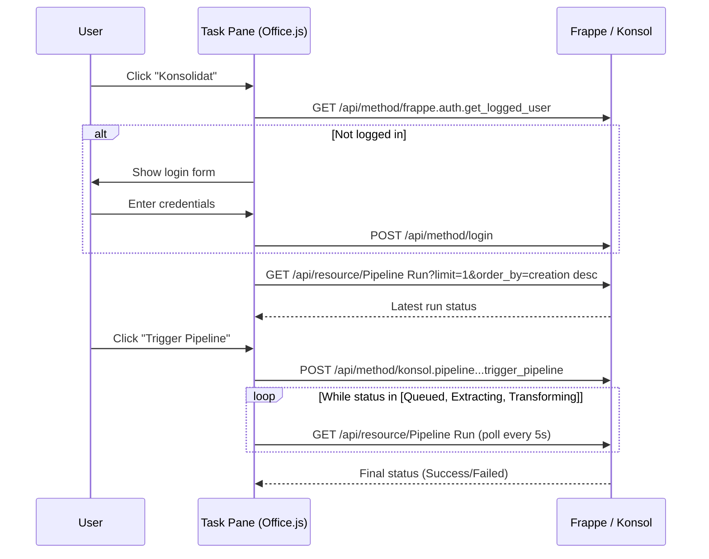

# Excel Task Pane Guide

The Konsolidat task pane is an Office.js add-in that provides pipeline orchestration directly from Excel — login, monitor sync status, and trigger data refreshes without leaving your workbook.

## Overview

The task pane appears as a sidebar panel in Excel, connected to your Frappe/Konsol server. It lets you:

- **Log in** with Frappe credentials
- **View** the latest pipeline run status (Queued, Extracting, Transforming, Success, Failed)
- **Trigger** a new pipeline run (Airbyte sync + dbt build)
- **Monitor** progress with auto-polling

## Installation

### Sideloading for Development

1. Locate `excel-addin/manifest.xml` in the Konsolidat repository
2. In Excel: **Insert → My Add-ins → Upload My Add-in**
3. Select the manifest file
4. The "Konsolidat" button appears on the **Home** tab

### Manifest Details

| Property | Value |
|----------|-------|
| Add-in ID | `a1b2c3d4-e5f6-7890-abcd-ef1234567890` |
| Version | `1.1.0.0` |
| Type | TaskPaneApp |
| Source URL | `http://localhost:8069/assets/konsol/excel-addin/index.html` |
| Permission | ReadWriteDocument |

The task pane assets are served from Frappe's static assets directory.

### Production Deployment

For production, update `manifest.xml`:
1. Change the source URL to your production Frappe server
2. Add your production domain to `AppDomains`
3. Deploy via Microsoft 365 Admin Center or SharePoint App Catalog

## Using the Task Pane

### Login

1. Click "Konsolidat" on the Home ribbon tab
2. Enter your Frappe email and password
3. Click **Login**

The task pane uses Frappe's session authentication (same credentials as Frappe Desk).

### View Pipeline Status

After login, the status card shows the latest Pipeline Run:
- **Status**: Queued, Extracting, Transforming, Success, or Failed
- **Created**: Timestamp of the run
- **Rows Synced**: Number of records from Airbyte
- **dbt Result**: Build outcome (pass/fail)

### Trigger a Pipeline Run

Click **Trigger Pipeline** to start a new run. This:
1. Creates a Pipeline Run record in Frappe
2. Triggers Airbyte sync (D365 → ClickHouse)
3. Runs `dbt build` after sync completes
4. Updates the status card

The task pane auto-polls every 5 seconds while the pipeline is running (status = Queued, Extracting, or Transforming).

### Logout

Click the **Logout** button to end your Frappe session.

## Architecture

## API Endpoints Used

| Method | Endpoint | Purpose |
|--------|----------|---------|
| POST | `/api/method/login` | Authenticate |
| GET | `/api/method/frappe.auth.get_logged_user` | Check session |
| POST | `/api/method/logout` | End session |
| GET | `/api/resource/Pipeline Run` | Fetch latest run status |
| POST | `/api/method/konsol.pipeline.doctype.pipeline_run.pipeline_run.trigger_pipeline` | Start new run |

## Troubleshooting

| Symptom | Cause | Fix |
|---------|-------|-----|
| Task pane is blank | Frappe not running at manifest URL | Start Frappe on `http://localhost:8069` |
| Login fails | Wrong credentials or CORS issue | Check credentials; verify browser console for errors |
| "Trigger Pipeline" no response | Pipeline Run doctype missing | Run `bench migrate` |
| Status stuck on "Queued" | Background workers not running | Ensure `bench start` includes the worker process |
| Task pane not appearing in ribbon | Manifest not loaded | Re-sideload the manifest via Insert → My Add-ins |

## Relationship to VBA Module

The task pane and VBA module serve different purposes:

| Feature | VBA Module | Task Pane |
|---------|-----------|-----------|
| Query financial data | Yes (`=EPM()` formulas) | No |
| Refresh values | Yes (Ctrl+Shift+R) | No |
| Trigger pipeline | No | Yes |
| Monitor sync status | No | Yes |
| Login required | Yes (EPM_Login) | Yes (task pane login) |
| Session | Separate (XMLHTTP cookies) | Separate (browser cookies) |

Use both together: the task pane to trigger and monitor data refreshes, the VBA module to query the results.

## Next Steps

- [Excel VBA Guide](excel-vba-guide.md) — Formula functions and macros
- [Setup Guide](../getting-started/setup-guide.md) — Full installation including add-in
- [Operations Runbook](../admin-guide/operations-runbook.md) — Pipeline procedures
