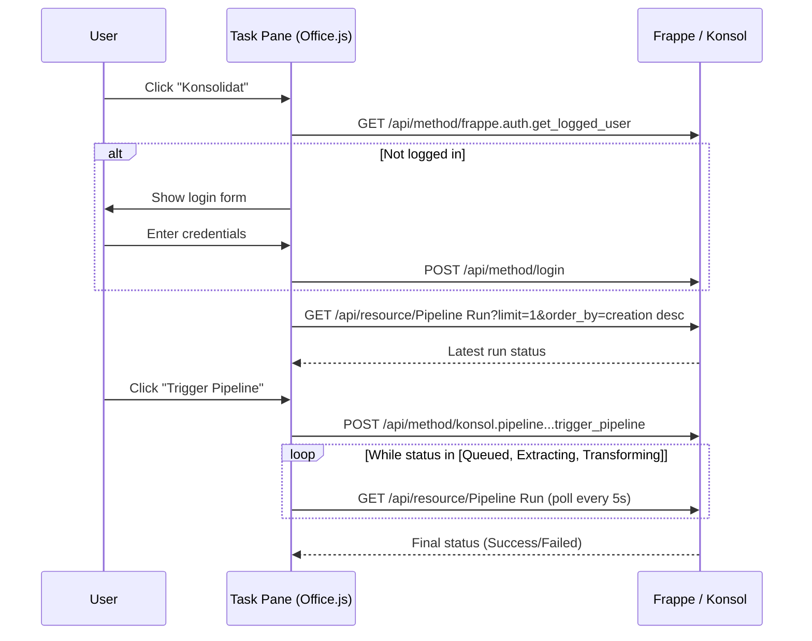

# Excel Task Pane Guide

The konsol Excel add-in adds the `K.` worksheet functions (see the [Excel Formulas Guide](excel-formulas-guide.md)) and a Konsolidat task pane for pipeline orchestration directly from Excel — sign in, monitor sync status, and trigger data refreshes without leaving your workbook.

## Overview

The task pane appears as a sidebar panel in Excel, connected to your Frappe/Konsol server. It lets you:

- **Log in** with Frappe credentials
- **View** the latest pipeline run status (Queued, Extracting, Transforming, Success, Failed)
- **Trigger** a new pipeline run (Airbyte sync + dbt build)
- **Monitor** progress with auto-polling

## Installation

### Sideloading for Development

1. Take `konsol/public/excel-addin/manifest.xml` from the konsol repository. It points at the demo server, `https://demo.konsolidat.com`: replace every occurrence with your Frappe URL (e.g. `http://localhost:8069`), because the worksheet functions call the server the add-in was loaded from (the `SourceLocation`, the `Url` and `Image` resources, and `AppDomains`)
2. In Excel, use **Upload My Add-in** (under **My Add-ins**) and select the manifest
3. The "Konsolidat" button appears on the **Home** tab

### Manifest Details

| Property | Value |
|----------|-------|
| Add-in ID | `c3d7e9f1-2a4b-5c6d-8e0f-1a2b3c4d5e6f` |
| Version | `2.0.0.0` |
| Type | TaskPaneApp |
| Source URL | `https://demo.konsolidat.com/assets/konsol/excel-addin/index.html` (replace with your server) |
| Custom functions | Namespace `K`, shared runtime |
| Permission | ReadWriteDocument |

The task pane assets are served from Frappe's static assets directory.

### Production Deployment

For production, update `manifest.xml`:
1. Replace every `https://demo.konsolidat.com` URL with your production Frappe server: the `SourceLocation`, the `bt:Url` and `bt:Image` resources, and the icon and support URLs. The add-in's runtime and its worksheet functions load from those URLs, not only from `SourceLocation`
2. Replace the demo domain in `AppDomains` with your production domain
3. Deploy via Microsoft 365 Admin Center or SharePoint App Catalog

## Using the Task Pane

### Login

1. Click "Konsolidat" on the Home ribbon tab
2. Enter your Frappe email and password
3. Click **Login**

The task pane uses Frappe's session authentication (same credentials as Frappe Desk).

### View Pipeline Status

After login, the status card shows the latest Pipeline Run:
- **Status**: Queued, Extracting, Transforming, Success, or Failed
- **Created**: Timestamp of the run
- **Rows Synced**: Number of records from Airbyte
- **dbt Result**: Build outcome (pass/fail)

### Trigger a Pipeline Run

Click **Trigger Pipeline** to start a new run. This:
1. Creates a Pipeline Run record in Frappe
2. Triggers Airbyte sync (D365 → ClickHouse)
3. Runs `dbt build` after sync completes
4. Updates the status card

The task pane auto-polls every 5 seconds while the pipeline is running (status = Queued, Extracting, or Transforming).

### Logout

Click the **Logout** button to end your Frappe session.

## Architecture

## API Endpoints Used

| Method | Endpoint | Purpose |
|--------|----------|---------|
| POST | `/api/method/login` | Authenticate |
| GET | `/api/method/frappe.auth.get_logged_user` | Check session |
| POST | `/api/method/logout` | End session |
| GET | `/api/resource/Pipeline Run` | Fetch latest run status |
| POST | `/api/method/konsol.pipeline.doctype.pipeline_run.pipeline_run.trigger_pipeline` | Start new run |

## Troubleshooting

| Symptom | Cause | Fix |
|---------|-------|-----|
| Task pane is blank | Frappe not reachable at the manifest's URL | Check the URLs in the manifest point at your running Frappe server |
| Login fails | Wrong credentials or CORS issue | Check credentials; verify browser console for errors |
| "Trigger Pipeline" no response | Pipeline Run doctype missing | Run `bench migrate` |
| Status stuck on "Queued" | Background workers not running | Ensure `bench start` includes the worker process |
| Task pane not appearing in ribbon | Manifest not loaded | Upload the manifest again (My Add-ins → Upload My Add-in) |

## Formulas

The same add-in provides the `K.` worksheet functions (`=K.EPM()`, `=K.EPMSAVE()` and the rest). Signing in on the task pane also signs in the formulas. See the [Excel Formulas Guide](excel-formulas-guide.md).

## Next Steps

- [Excel Formulas Guide](excel-formulas-guide.md) — Formula functions
- [Setup Guide](../getting-started/setup-guide.md) — Full installation including add-in
- [Operations Runbook](../admin-guide/operations-runbook.md) — Pipeline procedures
