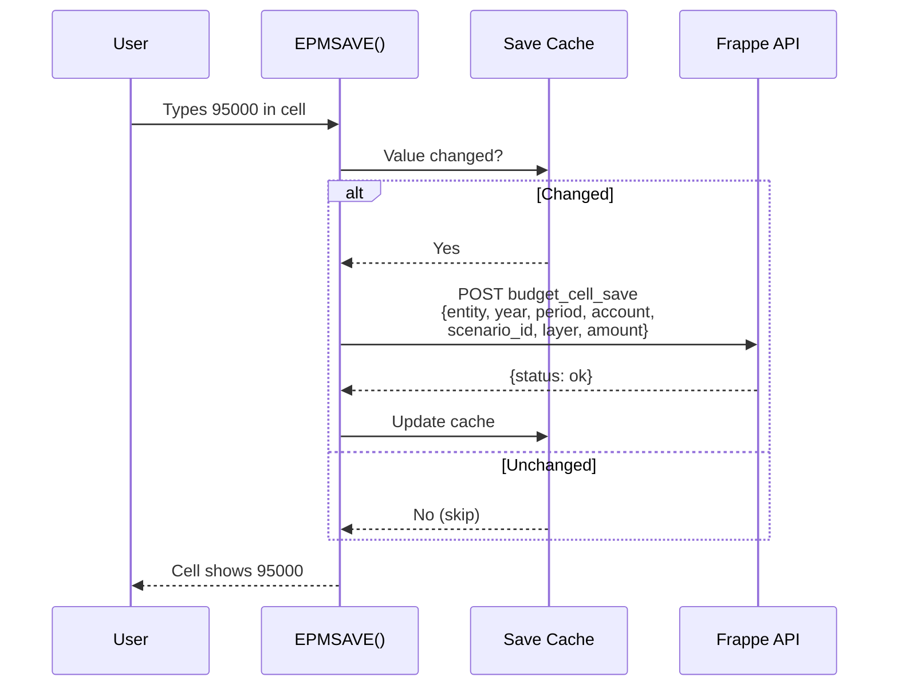
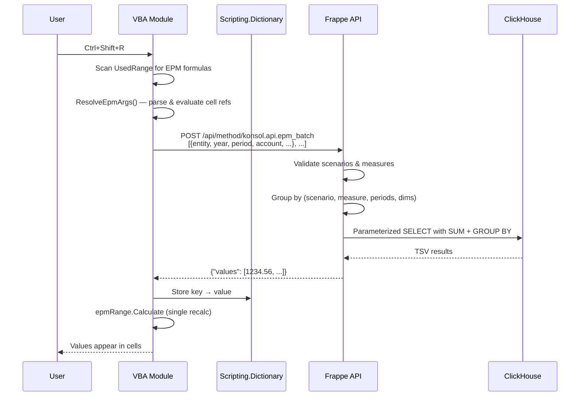

# Excel VBA Guide

The Open EPM VBA module turns Excel into a live reporting and budgeting client. Six worksheet functions cover reading (`EPM`, `EPM_BUDGET`, `EPM_VARIANCE`, `EPM_DEBIT`, `EPM_CREDIT`) and writing (`EPMSAVE`). A batch refresh mechanism fetches all read values in a single HTTP round-trip. Budget writes happen immediately on recalc.

## Setup

1. Import `excel/OpenEPM.bas` into your workbook (Alt+F11 → File → Import)
2. Add VBA references: `Microsoft Scripting Runtime`, `Microsoft XML, v6.0`
3. Save as `.xlsm`
4. Run `EPM_SetServer` to configure the Frappe URL
5. Run `EPM_Login` to authenticate

See [Setup Guide](../getting-started/setup-guide.md) for full installation steps.

## Formula Functions

### Read vs Write

| Function | Direction | When It Fires |
|----------|-----------|---------------|
| `EPM()`, `EPM_BUDGET()`, `EPM_VARIANCE()`, `EPM_DEBIT()`, `EPM_CREDIT()` | **Read** | Returns cached value; refresh with Ctrl+Shift+R |
| `EPMSAVE()` | **Write** | Saves to server immediately on recalc (skips if unchanged) |

### Read Functions

All five read functions share the same parameter pattern. They differ only in the default `measure` and `scenario`.

### EPM() — General Purpose

```
=EPM(entity, fiscal_year, fiscal_period, account, [measure], [scenario], [cost_center], [department], [scenario_id])
```

| Parameter | Type | Required | Default | Description |
|-----------|------|----------|---------|-------------|
| `entity` | String | Yes | — | Legal entity code (e.g., `"USMF"`) |
| `fiscal_year` | Number | Yes | — | Fiscal year (e.g., `2024`) |
| `fiscal_period` | String/Number | Yes | — | Period: `1`–`12`, `"Q1"`–`"Q4"`, `"H1"`, `"H2"`, `"FY"` |
| `account` | String | Yes | — | Main account code (e.g., `"401100"`) |
| `measure` | String | No | `"period_net_amount"` | Which value to return (see [Measures](#measures)) |
| `scenario` | String | No | `"actuals"` | Data scenario (see [Scenarios](#scenarios)) |
| `cost_center` | String | No | `""` | Filter by cost center |
| `department` | String | No | `""` | Filter by department |
| `scenario_id` | String | No | `""` | Filter to a specific scenario ID (e.g., `"BUDGET_2025"`). See [Scenario ID Filtering](#scenario-id-filtering). |

**Examples:**

```
=EPM("USMF", 2024, 5, "401100")
=EPM("USMF", 2024, "Q1", "401100", "ytd_net_amount")
=EPM("USMF", 2024, "FY", "401100", "period_net_amount", "actuals", "SALES")
=EPM("USMF", 2025, 5, "6100", "period_amount", "budget", "", "", "BUDGET_2025")
```

### EPM_BUDGET() — Budget Values

```
=EPM_BUDGET(entity, fiscal_year, fiscal_period, account, [cost_center], [department], [scenario_id])
```

Shorthand for `=EPM(..., "period_amount", "budget", ...)`.

### EPM_VARIANCE() — Actual vs Budget Variance

```
=EPM_VARIANCE(entity, fiscal_year, fiscal_period, account, [cost_center], [department], [scenario_id])
```

Shorthand for `=EPM(..., "variance_abs", "variance", ...)`.

### EPM_DEBIT() — Period Debits

```
=EPM_DEBIT(entity, fiscal_year, fiscal_period, account, [cost_center], [department])
```

Shorthand for `=EPM(..., "period_debit", "actuals", ...)`.

### EPM_CREDIT() — Period Credits

```
=EPM_CREDIT(entity, fiscal_year, fiscal_period, account, [cost_center], [department])
```

Shorthand for `=EPM(..., "period_credit", "actuals", ...)`.

### Write Function

### EPMSAVE() — Budget Write-Back

```
=EPMSAVE(amount, entity, fiscal_year, fiscal_period, account, scenario_id, layer, [cost_center], [department])
```

| Parameter | Type | Required | Default | Description |
|-----------|------|----------|---------|-------------|
| `amount` | Number | Yes | — | The value to save (number or cell reference) |
| `entity` | String | Yes | — | Legal entity code (e.g., `"USMF"`) |
| `fiscal_year` | Number | Yes | — | Fiscal year (e.g., `2025`) |
| `fiscal_period` | Number | Yes | — | Single period `1`–`12` (no ranges — one cell per period) |
| `account` | String | Yes | — | Main account code (e.g., `"6100"`) |
| `scenario_id` | String | Yes | — | Scenario instance (e.g., `"BUDGET_2025"`) |
| `layer` | String | Yes | — | Budget layer: `"base"`, `"challenge"`, `"management"`, `"board"` |
| `cost_center` | String | No | `""` | Cost center dimension |
| `department` | String | No | `""` | Department dimension |

**The cell displays the amount.** The write to the server happens silently in the background.

**Examples:**

```
=EPMSAVE(100000, "USMF", 2025, 1, "6100", "BUDGET_2025", "base")
=EPMSAVE(-5000, "USMF", 2025, 1, "6100", "BUDGET_2025", "challenge")
=EPMSAVE(B5, $A$1, $A$2, C$3, $A5, $A$4, "base")     ' cell references
```

#### How EPMSAVE Works

1. Formula evaluates → cell displays the amount (pass-through)
2. VBA checks if the value changed since last save (skip-unchanged cache)
3. If changed → `POST /api/method/konsol.api.budget_cell_save` with the parameters
4. Server upserts a single period+layer row in the Budget Input doc (creates the doc if new)
5. Budget Input doc stays in **Draft** until approved via Frappe workflow



#### Budget Layers

Layers are **additive** — the effective budget is always the sum across all layers for a given period. Each layer represents a different stakeholder's contribution:

| Layer | Typical Use |
|:------|:------------|
| `base` | Department's original submission |
| `challenge` | Finance team adjustments (e.g., 5% cut) |
| `management` | Executive overrides (e.g., Q3 launch funding) |
| `board` | Board-level final adjustments |

Any authorized user can write to any layer — the `layer` parameter is data, not security. Access to the budget module is controlled by Frappe's standard role permissions.

See the **[Budget Layers Guide](budget-layers.md)** for a full worked example showing how layers build up across 12 periods.

#### Building a Budget Template

| | A | B | C | D | E |
|---|---|---|---|---|---|
| 1 | **Scenario:** | BUDGET_2025 | **Year:** | 2025 | |
| 2 | **Layer:** | base | | | |
| 3 | **Account** | **P1** | **P2** | **P3** | **...** |
| 4 | 6100 | `=EPMSAVE(100000,$B$1,$D$1,B$3,$A4,$B$2,"base")` | `=EPMSAVE(100000,$B$1,$D$1,C$3,$A4,$B$2,"base")` | ... | |
| 5 | 6200 | `=EPMSAVE(50000,$B$1,$D$1,B$3,$A5,$B$2,"base")` | `=EPMSAVE(50000,$B$1,$D$1,C$3,$A5,$B$2,"base")` | ... | |

Tips:

- Use **absolute references** for scenario (`$B$1`), year (`$D$1`), and layer (`$B$2`)
- Use **mixed references** for period (`B$3`, `C$3`) and account (`$A4`, `$A5`) so formulas copy correctly when dragged
- To change the amount, just edit the first argument — EPMSAVE fires on recalc and saves the new value
- To enter challenge adjustments, change `$B$2` to `"challenge"` and type your deltas

#### Read + Write Side by Side

A common pattern: read the current approved budget on one row, write your adjustments on the next:

| | A | B | C | D |
|---|---|---|---|---|
| 1 | **Scenario:** | BUDGET_2025 | **Year:** | 2025 |
| 2 | **Account** | **P1** | **P2** | **P3** |
| 3 | 6100 Approved | `=EPM_BUDGET("USMF",2025,1,"6100")` | `=EPM_BUDGET(...)` | `=EPM_BUDGET(...)` |
| 4 | 6100 Challenge | `=EPMSAVE(-5000,"USMF",2025,1,"6100","BUDGET_2025","challenge")` | `=EPMSAVE(...)` | `=EPMSAVE(...)` |
| 5 | 6100 Effective | `=B3+B4` | `=C3+C4` | `=D3+D4` |

- Row 3: reads current approved budget (Ctrl+Shift+R to refresh)
- Row 4: writes your challenge layer adjustments (saves immediately)
- Row 5: formula shows the effective budget (base + challenge)

#### What Happens After Save

EPMSAVE creates Budget Input docs in **Draft** state. To make them live:

1. Open Frappe Desk → Budget Input list
2. Review the entries
3. Click **Submit for Review** → **Approve**
4. On approval: ClickHouse sync fires → dbt rebuild → EPM() formulas return updated values on next Ctrl+Shift+R

## Measures

Each scenario exposes a specific set of measures. Using a measure not allowed for the scenario returns an error.

### Actuals Measures

| Measure | Description |
|---------|-------------|
| `period_debit` | Sum of debit amounts for the period |
| `period_credit` | Sum of credit amounts for the period |
| `period_net_amount` | Sum of accounting currency amount (debit − credit) |
| `transaction_count` | Number of GL entries |
| `ytd_debit` | Year-to-date cumulative debit |
| `ytd_credit` | Year-to-date cumulative credit |
| `ytd_net_amount` | Year-to-date cumulative net amount |

### Budget Measures

| Measure | Description |
|---------|-------------|
| `period_amount` | Budget amount for the specific period (spread from annual) |
| `annual_amount` | Total annual budget amount |

### Variance Measures

| Measure | Description |
|---------|-------------|
| `actual_amount` | Actual amount (from trial balance) |
| `budget_amount` | Budget amount (from spread budget) |
| `variance_abs` | `actual_amount − budget_amount` |
| `variance_pct` | Variance as a percentage of budget |
| `variance_favorable` | `1` if favorable, `0` if unfavorable (revenue: actual > budget; expense: actual < budget) |

## Scenarios

| Scenario | Source Table | Description |
|----------|-------------|-------------|
| `actuals` | `gold_trial_balance` | Posted GL data |
| `budget` | `gold_spread_budget` | Budget amounts spread across periods |
| `variance` | `gold_variance_analysis` | Computed actual-vs-budget comparison |

## Period Ranges

Instead of a single month number, you can pass period range codes. The API sums across the constituent months.

| Code | Months Included |
|------|----------------|
| `1`–`12` | Single month |
| `"Q1"` | Months 1, 2, 3 |
| `"Q2"` | Months 4, 5, 6 |
| `"Q3"` | Months 7, 8, 9 |
| `"Q4"` | Months 10, 11, 12 |
| `"H1"` | Months 1–6 |
| `"H2"` | Months 7–12 |
| `"FY"` | Months 1–12 (full year) |

**Example:** `=EPM("USMF", 2024, "Q1", "401100")` returns the sum of periods 1+2+3.

## Scenario ID Filtering

The `scenario_id` parameter lets you target a specific scenario instance (e.g., `BUDGET_2025`, `FORECAST_Q3_2025`) within tables that support it. This is useful for:

- **Multiple budget versions**: Compare BUDGET_2025 vs BUDGET_2025_V2
- **What-if analysis**: Query a what-if scenario alongside the approved budget
- **Forecast vs budget**: Compare FORECAST_Q3_2025 with BUDGET_2025

When `scenario_id` is omitted or empty, the query returns the sum across **all** scenario IDs — which is the default behavior and matches how EPM() has always worked.

**Currently supported tables**: `gold_spread_budget` (scenario = `budget`)

| Formula | What It Returns |
|:--------|:----------------|
| `=EPM_BUDGET("USMF", 2025, 5, "6100")` | Sum of ALL budget scenarios for P5 |
| `=EPM_BUDGET("USMF", 2025, 5, "6100", "", "", "BUDGET_2025")` | Only BUDGET_2025 for P5 |
| `=EPM_BUDGET("USMF", 2025, "Q1", "6100", "", "", "BUDGET_2025")` | BUDGET_2025 Q1 total |

## Macros

### EPM_Refresh (Ctrl+Shift+R)

Refreshes the **active sheet**:
1. Scans all cells for EPM-family formulas
2. Extracts parameters (resolves cell references like `$B$5`)
3. Sends a single batch POST to `/api/method/konsol.api.epm_batch`
4. Populates the in-memory cache
5. Triggers a single `Calculate` on the EPM range

### EPM_RefreshAll

Refreshes **all sheets** in the workbook. Shows progress on the status bar: `"Open EPM: Sheet 3/12 — Income Statement"`.

### EPM_Login

Prompts for Frappe username and password. Authenticates via `POST /api/method/login` and stores the session cookie for subsequent API calls. Auto-triggered by refresh if not logged in.

### EPM_ClearCache

Clears the in-memory value cache. Use when you want to force a full re-fetch on next refresh.

### EPM_SetServer

Prompts for the Frappe API URL and saves it as a Custom Document Property (`EPM_API_URL`) in the workbook. Persists across sessions.

### EPM_ToggleLog

Enables/disables debug logging to a hidden `_EPM_Log` sheet. Columns: Timestamp, Level, Message.

### EPM_Debug

Runs a diagnostic sequence:
1. Tests cache initialization
2. Tests HTTP connectivity
3. Calls health endpoint (`konsol.api.health`)
4. Scans active sheet for EPM formulas
5. Sends a test batch query (USMF / 2024 / period 5 / account 401100)

## Building a Report

### Basic P&L Report

| | A | B | C | D |
|---|---|---|---|---|
| 1 | **Entity:** | USMF | **Year:** | 2024 |
| 2 | **Account** | **Jan** | **Feb** | **Mar** |
| 3 | Revenue (401100) | `=EPM($B$1,$D$1,1,$A3)` | `=EPM($B$1,$D$1,2,$A3)` | `=EPM($B$1,$D$1,3,$A3)` |
| 4 | COGS (501100) | `=EPM($B$1,$D$1,1,$A4)` | `=EPM($B$1,$D$1,2,$A4)` | `=EPM($B$1,$D$1,3,$A4)` |
| 5 | **Gross Profit** | `=B3+B4` | `=C3+C4` | `=D3+D4` |

Tips:
- Use **absolute references** (`$B$1`) for entity/year cells so formulas copy correctly
- Use **relative row references** for account codes so you can drag formulas down
- Period numbers in the column headers can be cell references too

### Budget vs Actual Report

| | A | B | C | D |
|---|---|---|---|---|
| 1 | **Entity:** | USMF | **Year:** | 2025 |
| 2 | **Account** | **Actual** | **Budget** | **Variance** |
| 3 | Revenue (401100) | `=EPM($B$1,$D$1,"FY",$A3)` | `=EPM_BUDGET($B$1,$D$1,"FY",$A3)` | `=EPM_VARIANCE($B$1,$D$1,"FY",$A3)` |

### Multi-Entity Comparison

Use different entity codes in each column:

```
=EPM("USMF", 2024, "FY", "401100")    ' Column B: US entity
=EPM("DEMF", 2024, "FY", "401100")    ' Column C: Germany entity
=EPM("GBMF", 2024, "FY", "401100")    ' Column D: UK entity
```

## How Refresh Works (Technical)



The batch mechanism means 500 EPM cells = 1 HTTP request, not 500.

## Troubleshooting

| Symptom | Cause | Fix |
|---------|-------|-----|
| All cells show `0` | Not refreshed | Press Ctrl+Shift+R |
| `#VALUE!` error | Wrong parameter types | Check entity is string, year is number |
| `401` / `403` on refresh | Session expired | Run EPM_Login again |
| Slow refresh | Too many unique queries | Group similar periods; use period ranges (Q1, FY) |
| Values don't update | Stale cache | Run EPM_ClearCache, then Ctrl+Shift+R |
| `ClickHouse connection failed` | ClickHouse is down | Check `docker ps` for healthy container |
| EPMSAVE not saving | Not logged in | Run EPM_Login first — EPMSAVE skips if no session |
| EPMSAVE saving duplicates | Value unchanged but re-saving | Check save cache — run EPM_ToggleLog to verify skip behavior |
| Budget not visible in EPM_BUDGET | Not approved yet | Budget Input docs start as Draft — approve in Frappe Desk first |

## Next Steps

- [Budget Layers Guide](budget-layers.md) — Full worked example of 4-layer collaborative budgeting
- [Budgeting Guide](budgeting-guide.md) — Spread profiles, scenarios, budget data flow
- [Report Catalog](report-catalog.md) — Pre-built report patterns for all 22 gold models
- [Excel Task Pane Guide](excel-taskpane-guide.md) — Pipeline control from Excel
- [API Reference](../api-reference/api-overview.md) — Raw API documentation
- [Troubleshooting](../troubleshooting/troubleshooting.md) — Full diagnostic guide
