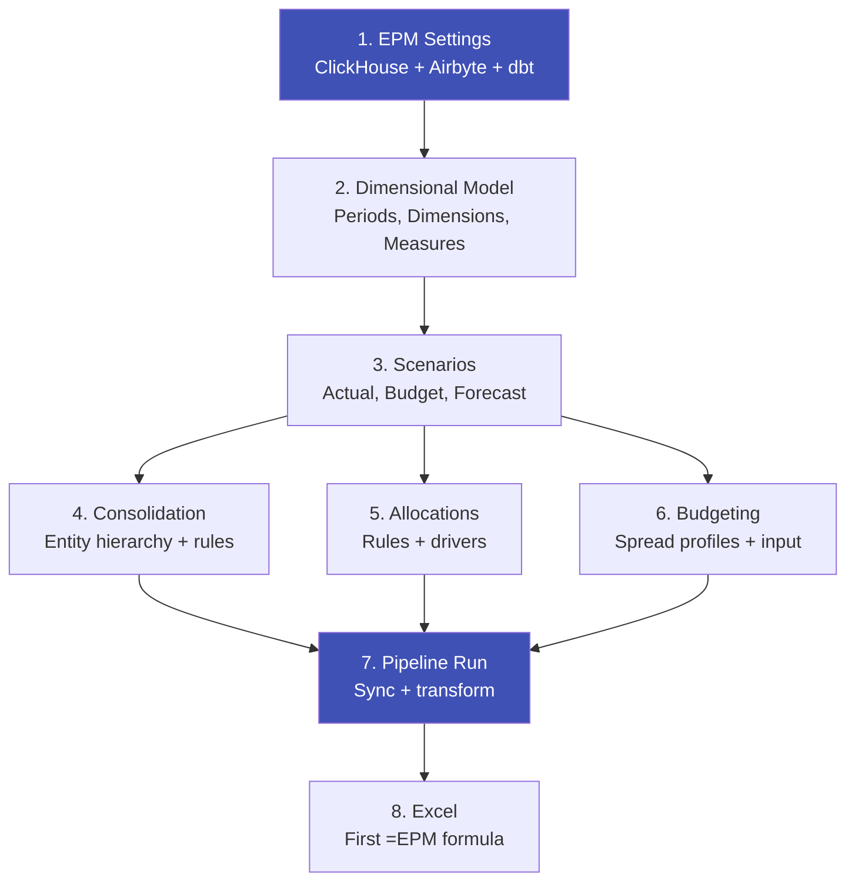
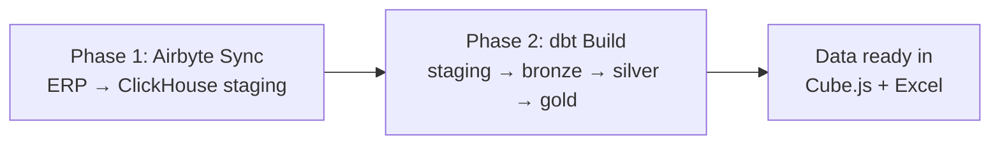

# Initial Setup Guide

After deployment, Konsolidat needs configuration before it can process financial data. This guide walks through each step — from connecting infrastructure to entering your first budget line.

## Configuration Flow



Steps 4–6 are independent — configure only what you need.

---

## Step 1: EPM Settings

**Frappe Desk → Setup → EPM Settings**

This is the foundation — all connections to infrastructure are configured here.

### ClickHouse Connection

| Field | Value | Notes |
|-------|-------|-------|
| ClickHouse Host | `clickhouse` | Docker service name. Use `localhost` for bare-metal installs |
| ClickHouse Port | `8123` | HTTP API port |
| ClickHouse User | `default` | From `.credentials` file |
| ClickHouse Password | *(from deploy)* | From `.credentials` file |

Verify the connection after saving:

```bash
curl -sf "http://localhost:8123/?query=SHOW+DATABASES" \
  -u "default:YOUR_PASSWORD"
```

You should see `epm_staging`, `epm_bronze`, `epm_silver`, `epm_gold` in the output.

### Airbyte Connection (optional)

Only needed if you're syncing live data from D365, SAP, or ERPNext. Skip this if you're using seed/demo data.

| Field | Value | Notes |
|-------|-------|-------|
| Airbyte API URL | `http://localhost:8000` | Default Airbyte API |
| Connection ID | *(from Airbyte UI)* | UUID of your source → ClickHouse connection |
| Client ID | *(from Airbyte)* | OAuth credentials for API access |
| Client Secret | *(from Airbyte)* | OAuth credentials for API access |

See [Setting up Airbyte](#setting-up-airbyte) below for how to get these values.

### dbt Configuration

| Field | Value | Notes |
|-------|-------|-------|
| dbt Project Path | `/home/frappe/dbt_project` | Docker default. Adjust for bare-metal |

---

## Step 2: Dimensional Model

Define the structure of your financial reporting. Do these in order — later items reference earlier ones.

### Fiscal Periods

**Lists → EPM → Fiscal Period**

Create 14 periods for a standard fiscal year:

| Period | Label | Quarter | Half | Purpose |
|--------|-------|---------|------|---------|
| 0 | OPN | OPN | OPN | Opening balances |
| 1 | P1 | Q1 | H1 | January |
| 2 | P2 | Q1 | H1 | February |
| 3 | P3 | Q1 | H1 | March |
| 4 | P4 | Q2 | H1 | April |
| 5 | P5 | Q2 | H1 | May |
| 6 | P6 | Q2 | H1 | June |
| 7 | P7 | Q3 | H2 | July |
| 8 | P8 | Q3 | H2 | August |
| 9 | P9 | Q3 | H2 | September |
| 10 | P10 | Q4 | H2 | October |
| 11 | P11 | Q4 | H2 | November |
| 12 | P12 | Q4 | H2 | December |
| 13 | CLS | CLS | CLS | Closing adjustments |

### Dimensions

**Lists → EPM → Dimension**

Dimensions define the axes of your financial cube. Create one for each reporting dimension you need:

| Dimension Name | Source Column | Label | In Budget | Allocation Role |
|---------------|---------------|-------|-----------|-----------------|
| `dim_cost_center` | `CostCenter` | Cost Center | Yes | `cost_center` |
| `dim_department` | `Department` | Department | Yes | — |
| `dim_business_unit` | `BusinessUnit` | Business Unit | No | — |

- **Source Column** maps to the OData field name in your ERP
- **In Budget** includes this dimension in budget entry forms
- **Allocation Role** links the dimension to cost allocation drivers

### Measures

**Lists → EPM → Measure**

Measures define the aggregations available in Excel and the API:

| Measure Name | Expression | Label | Cube Type |
|-------------|-----------|-------|-----------|
| `period_net_amount` | `sum(accounting_currency_amount)` | Net Amount | sum |
| `period_debit` | `sum(debit_amount)` | Debit | sum |
| `period_credit` | `sum(credit_amount)` | Credit | sum |
| `ytd_net_amount` | `sum(accounting_currency_amount)` | YTD Net | sum |
| `transaction_count` | `count(*)` | Transactions | count |

These become available as the `measure` parameter in `=EPM()` formulas and the API.

---

## Step 3: Scenarios

**Lists → EPM → Scenario**

Scenarios tag data by its purpose — actual vs. budget vs. forecast:

| Scenario ID | Name | Type | Active |
|------------|------|------|--------|
| `actual_2024` | Actual 2024 | actual | Yes |
| `budget_2025` | Budget 2025 | budget | Yes |
| `forecast_2025` | Forecast 2025 | forecast | Yes |

Scenario type determines how the data flows through the pipeline. Actuals come from ERP sync, budgets from manual input.

---

## Step 4: Consolidation (multi-entity only)

Skip this section if you have a single legal entity.

### Entity Hierarchy

**Lists → Consolidation → Consolidation Group**

Build a tree of legal entities with ownership and consolidation method:

```
HOLDING (is_group=true, ownership=100%)
├── USMF (data_area_id=USMF, ownership=100%, method=full)
├── EMEA (is_group=true)
│   ├── FR01 (data_area_id=FRAX, ownership=100%, method=full)
│   └── DE01 (data_area_id=DEAX, ownership=75%, method=full)
└── APAC (is_group=true)
    └── JP01 (data_area_id=JPAX, ownership=51%, method=full)
```

| Field | Description |
|-------|-------------|
| `data_area_id` | Legal entity code from your ERP |
| `ownership_pct` | Parent's ownership percentage (0–100) |
| `reporting_currency` | Group reporting currency (e.g., USD) |
| `consolidation_method` | `full`, `proportional`, or `equity` |
| `goodwill_method` | `partial` (NCI at proportional NA) or `full` (NCI at fair value) |

### IC Elimination Rules

**Lists → Consolidation → IC Elimination Rule**

Define rules to eliminate intercompany balances and unrealized profit:

| Rule ID | Type | Debit Account | Credit Account | Notes |
|---------|------|--------------|----------------|-------|
| `IC-AR-AP-01` | balance | 210200 (AP) | 112000 (AR) | Eliminates IC receivables/payables |
| `IC-INV-01` | unrealized_profit | 312000 | 114500 | Eliminates IC inventory margin (25%) |

For unrealized profit rules, set `margin_pct` to the intercompany gross margin percentage.

### Ownership Periods (step acquisitions)

**Lists → Consolidation → Ownership Period**

Track ownership changes over time — needed for step acquisitions and disposals:

| Entity | Effective Date | Ownership | Method | Event |
|--------|---------------|-----------|--------|-------|
| DE01 | 2024-01-01 | 50% | equity | Initial stake |
| DE01 | 2024-07-01 | 75% | full | Step acquisition |

See the [Consolidation Guide](consolidation-guide.md) for formulas, translation rules, and worked examples.

---

## Step 5: Cost Allocation (optional)

### Allocation Rules

**Lists → Allocation → Allocation Rule**

Define cost pools and how they're distributed. Rules execute in `step_order`:

| Step | Rule | Source | Driver | Method |
|------|------|--------|--------|--------|
| 1 | IT Cost Allocation | Account 7100, CC: IT | headcount | step_down |
| 2 | Facility Allocation | Account 7200, CC: FACILITY | sqm | step_down |
| 3 | Management Fees | Account 7300, CC: MGMT | revenue | step_down |

Driver types: `headcount`, `revenue`, `sqm`, `composite`, `conditional`, `tiered`.

### Allocation Drivers

**Lists → Allocation → Allocation Driver**

Populate driver values for each entity, cost center, and period:

| Entity | Cost Center | Driver Type | Value | Year | Period |
|--------|------------|-------------|-------|------|--------|
| USMF | SALES | headcount | 50 | 2024 | 5 |
| USMF | MARKETING | headcount | 25 | 2024 | 5 |
| USMF | SALES | sqm | 2000 | 2024 | 5 |

See the [Allocation Guide](allocation-guide.md) for cascade logic, reciprocal allocation, and composite drivers.

---

## Step 6: Budgeting (optional)

### Spread Profiles

**Lists → EPM → Spread Profile**

Define how annual amounts distribute across 12 months:

| Profile | Pattern | Example |
|---------|---------|---------|
| `EVEN` | Equal weights (1.0 each) | $1.2M annual → $100K/month |
| `SEASONAL_RETAIL` | Q4-heavy (0.5–2.5) | $600K annual → $23K low / $117K peak |

### Budget Sheets

**Lists → EPM → Budget Sheet**

Budget data lives in the chain **Budget Cycle → Budget Sheet → Budget Line**: one cycle per scenario × fiscal year, one sheet per entity × layer, one wide line per account + dimensions with 12 monthly period columns.

1. A **Budget Cycle** is auto-created Open on first save (or create one under Lists → EPM → Budget Cycle)
2. Enter monthly amounts on a sheet's **Budget Lines** — or write cells straight from Excel with `EPMSAVE()`
3. Each sheet carries one **Layer** (base, challenge, management, board) for collaborative budgeting
4. **Lock the cycle** when input is final — locking syncs all sheets to ClickHouse

See the [Budgeting Guide](budgeting-guide.md) and [Budget Layers](budget-layers.md) for details.

---

## Step 7: Connect Your ERP via Airbyte {: #setting-up-airbyte }

Airbyte syncs live data from your ERP into ClickHouse. It runs as a separate service.

### Install Airbyte

```bash
curl -fsSL https://get.airbyte.com | bash
abctl local install
```

Open the Airbyte UI at [http://localhost:8000](http://localhost:8000).

### Configure Source

=== "D365 Finance & Operations"

    1. **Sources → Add Source → Microsoft Dynamics 365 F&O (OData)**
    2. Enter your Azure AD credentials:

    | Field | Where to find it |
    |-------|-----------------|
    | Environment URL | `https://your-env.operations.dynamics.com` |
    | Tenant ID | Azure Portal → Azure AD → Properties |
    | Client ID | Azure Portal → App Registrations → your app |
    | Client Secret | Azure Portal → App Registrations → Certificates & secrets |

    3. Select streams: `GeneralJournalAccountEntries`, `MainAccounts`, `LedgerParameters`, `ExchangeRates`, `FiscalCalendars`

=== "SAP"

    Use the SAP OData or SAP HANA connector. Map GL journal entries to the same staging schema.

=== "ERPNext"

    Use the ERPNext API connector. Map GL Entry and Account doctypes.

### Configure Destination

1. **Destinations → Add Destination → ClickHouse**
2. Connection details:

| Field | Value |
|-------|-------|
| Host | `localhost` |
| Port | `8123` |
| Database | `epm_staging` |
| User | from `.credentials` |
| Password | from `.credentials` |

### Create Connection

1. **Connections → New Connection**
2. Wire your source → ClickHouse destination
3. Set sync mode to **Incremental (Append)**
4. Run a test sync
5. **Copy the Connection ID** from the URL bar (UUID format) and paste it into **EPM Settings → Airbyte Connection ID**

---

## Step 8: Run the Pipeline

**Lists → Pipeline → Pipeline Run → New → Submit**

The pipeline executes two phases:



Monitor progress in the Pipeline Run document — status updates automatically:

| Status | What's happening |
|--------|-----------------|
| Queued | Waiting for background worker |
| Extracting | Airbyte is syncing ERP data to staging |
| Transforming | dbt is building bronze → silver → gold models |
| Completed | Data is ready to query |
| Failed | Check the error log field for details |

After the first successful run, your data is available in:

- **Excel**: `=EPM("USMF", 2024, 5, "401100", "period_net_amount")`
- **Cube.js**: [https://localhost:4443](https://localhost:4443) (query playground)
- **API**: `GET /api/method/konsol.api.epm_value?entity=USMF&year=2024&period=5&account=401100&measure=period_net_amount`

---

## Quick Reference: Configuration Checklist

| # | Step | Location | Required | Time |
|---|------|----------|----------|------|
| 1 | EPM Settings | Setup → EPM Settings | Yes | 2 min |
| 2 | Fiscal Periods | Lists → EPM → Fiscal Period | Yes | 5 min |
| 3 | Dimensions | Lists → EPM → Dimension | Yes | 5 min |
| 4 | Measures | Lists → EPM → Measure | Yes | 5 min |
| 5 | Scenarios | Lists → EPM → Scenario | Yes | 2 min |
| 6 | Consolidation Groups | Lists → Consolidation → Consolidation Group | Multi-entity only | 10 min |
| 7 | IC Elimination Rules | Lists → Consolidation → IC Elimination Rule | Multi-entity only | 5 min |
| 8 | Allocation Rules | Lists → Allocation → Allocation Rule | If allocating costs | 10 min |
| 9 | Allocation Drivers | Lists → Allocation → Allocation Driver | If allocating costs | 10 min |
| 10 | Spread Profiles | Lists → EPM → Spread Profile | If budgeting | 5 min |
| 11 | Budget Sheets | Lists → EPM → Budget Sheet | If budgeting | varies |
| 12 | Airbyte Connection | Airbyte UI + EPM Settings | For live ERP data | 15 min |
| 13 | Pipeline Run | Lists → Pipeline → Pipeline Run | Yes | 5 min |

## Next Steps

- [Excel VBA Add-in](excel-vba-guide.md) — install the Excel add-in and write your first `=EPM()` formula
- [Consolidation Guide](consolidation-guide.md) — currency translation, IC elimination, and CTA calculation
- [Allocation Guide](allocation-guide.md) — multi-step cost allocation with driver cascading
- [Budgeting Guide](budgeting-guide.md) — spread profiles, budget layers, and variance analysis
- [API Reference](../api-reference/api-overview.md) — all available endpoints for programmatic access
