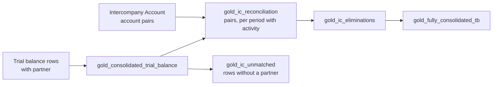

# Intercompany Guide

When one group entity sells to, lends to or charges another, both book the transaction. In the consolidated statements those balances must disappear: the group cannot owe itself money or sell to itself. Konsolidat pairs each entity's intercompany balance with its partner's, eliminates what matches, and shows you what doesn't.

This page is for group accountants who set up and review intercompany matching.

## How it works in one paragraph

You flag the intercompany accounts in the group chart and say which account the partner books the other side on. Each trial balance row on such an account names its **partner**: the other group entity the balance is held with. Consolidation pairs *USMF's receivable from GBMF* with *GBMF's payable to USMF*, compares them in the group's currency, eliminates the matched amount and moves any difference to the group's intercompany-difference account, labelled with its cause.



## Setting up

### 1. Flag the intercompany accounts

Open **Intercompany Account** (Consolidation module) and create one record per pair of accounts.

| Field | Example | Meaning |
|-------|---------|---------|
| Main Account | `1300` | A group chart account that holds balances with other group entities, e.g. Intercompany receivables |
| Counterpart Account | `2100` | The account the **partner** books the other side on, e.g. Intercompany payables. Leave blank when both sides use the same account (a shared intercompany current account) |
| Status | `Published` | Draft, Published or Inactive. Only a Published account is intercompany |
| Description | | Free text |

Typical pairs:

| Main Account | Counterpart Account | Pair |
|--------------|---------------------|------|
| `1300` Intercompany receivables | `2100` Intercompany payables | Balance sheet |
| `4000` Intercompany revenue | `5000` Intercompany cost of sales | P&L |
| `1350` Intercompany loans | *(blank)* | Balance sheet, both sides on one account |

A pair is symmetric: flagging `1300` with counterpart `2100` makes both accounts intercompany. You don't need a second record the other way round.

A Group Accountant (EPM Analyst) can create drafts. Publishing a record, or editing one that is Published, needs the Close Lead (EPM Admin) or a System Manager. To publish, set **Status** to `Published` and save. konsol then checks that:

- both accounts are in the group chart;
- neither account is any group's **Intercompany Difference Account** (its postings would be eliminated in turn).

On every save, whatever the status (except Inactive), konsol also refuses an account that another Draft or Published record pairs differently. Each account belongs to exactly one pair, or one side could be eliminated twice. Make the other record Inactive first.

Published records are written through to the warehouse (`epm_staging.intercompany_accounts`) and apply from the next consolidation build. Saving does not start a build.

!!! note "IC Elimination Rule"
    Balance eliminations no longer come from **IC Elimination Rule**. A rule of type `balance` saves with a warning and eliminates nothing. Rules of type `unrealized_profit`, with **IC Balance** documents for the intercompany inventory, still eliminate unrealised profit as before.

### 2. Set the group's difference account and tolerance

Open the group's node in the **Consolidation Group** tree. Under **Settings**:

| Field | Example | Meaning |
|-------|---------|---------|
| Intercompany Difference Account | `1999` | A group chart account where this group books what is left when a pair's two sides don't match. It cannot be an Intercompany Account. Blank: only the matched amount is eliminated, and the difference stays on the intercompany accounts |
| Intercompany Difference Tolerance | `100` | A **booking** difference up to this amount (at 100%, in the group's reporting currency) is within tolerance; above it, over tolerance. Differences caused by exchange rates never count against it |

These settings belong on a group node that carries no entity, the same node that holds the group's Reporting Currency. konsol refuses them on an entity's row. Each group reads its own node's settings: a sub-group does not inherit its parent's.

### 3. Put the partner on trial balance rows

Every trial balance row can carry `partner_data_area_id`: the entity code of the **other** group entity the balance is held with. It is optional on every row, and nothing guesses it.

**Single trial balance (Trial Balance Submission).** The **Trial Balance CSV** takes an optional fifth column:

```csv
main_account,debit,credit,description,partner_data_area_id
1100,5000,0,Cash,
1300,1000,0,Receivable from GBMF,GBMF
4000,0,1000,Revenue from GBMF,GBMF
4100,0,5000,External revenue,
```

`partner`, `partner_entity`, `partner_id` and `counterparty` are accepted as the column name too. Put one row per account **and** partner: a receivable from two partners is two rows. The partner must be an existing, non-group Entity and never the row's own entity.

**Bulk upload** (`/konsol-exec/uploads`). The same optional column follows the usual columns:

```csv
data_area_id,fiscal_year,fiscal_period,main_account,debit,credit,partner_data_area_id
USMF,2026,3,1300,1000,0,GBMF
USMF,2026,3,4000,0,1000,GBMF
GBMF,2026,3,2100,0,790,USMF
GBMF,2026,3,5000,790,0,USMF
```

Amounts are in each entity's own currency (GBMF's in GBP).

**A row on an intercompany account without a partner still loads.** The single upload shows the warning "Intercompany rows without a partner"; the bulk upload counts such rows on each entity-period. The row is never eliminated: it stays in the consolidated figures and is listed in `gold_ic_unmatched`.

**Connectors.** The D365 and ERPNext adapters do not map a partner yet, so every ledger line they bring in on an intercompany account lands in `gold_ic_unmatched`. Mapping the ERP's partner field is planned; until then, intercompany balances that must be eliminated need to come in through a trial balance upload with the partner filled in.

## How matching works

### Pairs

A **side** is an entity's balance on an intercompany account with one partner: (entity, partner, account). Its other side is what the partner books against it: (partner, entity, counterpart account). `gold_ic_reconciliation` has a row for a pair in each period in which either side booked something on it, plus the period the pair joins a group and the first period after it leaves. Both sides are on the row, whichever entity reported first.

A balance-sheet pair's row carries the balance to date. A period with no row means nothing moved, and the pair's latest earlier row still holds its position: an unresolved difference from period 1 is still open in period 5 even if periods 2 to 5 have no rows.

### What is compared

- **Both sides at 100%**, translated into the group's reporting currency (`translated_amount`), never at the ownership-weighted group share. A difference is then always a real mismatch, never an ownership effect.
- **Balance-sheet pairs** (receivables, payables, loans) compare the **balance to date**. **P&L pairs** (revenue, cost, royalties) compare the **period's movement**.

On each row:

| Column | Meaning |
|--------|---------|
| `balance_a`, `balance_b` | Each side at 100%, in group currency (signed: debit positive) |
| `matched_amount` | The smaller side, when the two sides offset; 0 when they don't (two debits match nothing) |
| `difference` | `balance_a + balance_b` |
| `difference_cause` | `none`, `booking` or `fx` |
| `match_status` | `matched`, `within_tolerance`, `over_tolerance` or `fx_difference` |

### Causes of a difference

| Cause | When |
|-------|------|
| `none` | The difference is under 0.005 |
| `fx` | The two entities have **different** functional currencies |
| `booking` | Same functional currency, and the local amounts don't net to zero: someone booked a different amount, or hasn't booked yet |
| `fx` | Same functional currency, and the local amounts **do** net to zero: the difference comes only from translation (the same amount translated at different periods' rates) |

Only a `booking` difference counts against the tolerance (`within_tolerance` or `over_tolerance`). An `fx` difference shows as `fx_difference` and never counts.

A trial balance carries no transaction currency or booking rate, so when the two entities' currencies differ Konsolidat cannot tell a booking error from a rate effect. **A booking error between entities in different currencies is labelled `fx`.** Review large `fx_difference` rows as well as the ones over tolerance.

### Eliminations

`gold_ic_eliminations` turns each pair into two-legged entries that each net to zero. It holds two views:

- **Group view** (`elimination_view = 'group'`): the one the consolidated trial balance (`gold_fully_consolidated_tb`) books. Each entity is held at the share the group owns.
- **NCI view** (`elimination_view = 'nci'`): the minority owners' share of the same balances. The consolidation report adds it to the group view for its 100% column.

| Entry (`elimination_kind`) | View | What it does |
|----------------------------|------|--------------|
| `matched` | group | Eliminates the matched amount from both sides, at the share both sides hold (the lower of the two) |
| `nci` | group | For the side the group holds more of, eliminates the rest of it and posts that portion to the NCI line, against the partly owned partner |
| `difference` | group | Moves what is left of each side to the group's difference account, labelled with the cause. Nothing when the group has no difference account |
| `matched`, `difference` | nci | The same eliminations for the minority's share of each side, against the NCI line |

In the consolidated trial balance, `nci` entries carry `adjustment_type` `ic_elimination_nci`; the others are `ic_elimination`. The NCI line nets to zero per group and period across the two views, so the 100% view eliminates both sides in full.

A balance-sheet pair's eliminations are computed to date, and each period posts the change since the previous period. A P&L pair posts its period's movement.

## Worked examples

All examples use group `GROUP_CORP`, reporting in USD, with accounts `1300` (receivable) ↔ `2100` (payable), `4000` (revenue) ↔ `5000` (cost of sales), and `1999` as the difference account. Amounts are signed: debit positive, credit negative.

### A matched balance with a minority

USMF (100% owned) has a receivable of USD 1,000 from GBMF. GBMF (80% owned) has a payable to USMF of GBP 787.40, which translates at 1.27 to USD −1,000. The sides match: difference 0, cause `none`.

| Line | Trial balance at 100% | Group view before | Group view eliminations | Group view after | NCI view before | NCI view eliminations | NCI view after | 100% view |
|------|------:|------:|------:|------:|------:|------:|------:|------:|
| USMF `1300` | +1,000 | +1,000 | −800 matched, −200 nci | 0 | 0 | 0 | 0 | 0 |
| GBMF `2100` | −1,000 | −800 | +800 matched | 0 | −200 | +200 matched | 0 | 0 |
| NCI line | | | +200 nci | +200 | | −200 matched | −200 | 0 |

The group view eliminates USMF's whole receivable and the 80% of GBMF's payable it holds, and the remaining 200 goes to the NCI line (attributed to GBMF, whose minority owns it). The NCI view eliminates the minority's −200 of the payable against the NCI line. Added together, every line is zero.

### A booking difference

USMF and USSI (both 100% owned, both in USD) are partners. At the end of period 3, USMF shows a receivable from USSI of USD 1,000; USSI shows a payable to USMF of USD −950.

| | Value |
|---|---|
| `matched_amount` | 950 |
| `difference` | 1,000 − 950 = **+50** |
| `difference_cause` | `booking` (same currency; local amounts don't net) |
| `match_status` with tolerance 100 | `within_tolerance` |
| `match_status` with tolerance 25 | `over_tolerance` |

Eliminations: `matched` takes −950 from USMF `1300` and +950 to USSI `2100`; `difference` takes the remaining −50 from USMF `1300` to `1999` (+50). After consolidation `1300` and `2100` are both 0 and `1999` shows the USD 50 someone needs to explain.

### A difference caused by exchange rates

DEMF (EUR, 100% owned) has a receivable from USMF of EUR 1,000, translated at the closing rate of 1.10 to USD 1,100. USMF booked the payable at the invoice-date rate: USD −1,080. The difference, +20, is `fx` because the two entities' currencies differ, and the status is `fx_difference`: it never counts against the tolerance. Konsolidat eliminates 1,080 and moves the 20 to `1999`, labelled `fx`.

### A timing difference between periods

USMF invoices USSI USD 500 on 31 January and books the receivable in period 1. USSI books the payable in period 2.

| Period | USMF `1300` to date | USSI `2100` to date | Matched | Difference | Posted that period |
|--------|------:|------:|------:|------:|------|
| P1 | +500 | 0 | 0 | +500 `booking` | `difference`: `1300` −500, `1999` +500 |
| P2 | +500 | −500 | 500 | 0 | `matched`: `1300` −500, `2100` +500; `difference` reversed: `1300` +500, `1999` −500 |

In P1 the receivable shows as a booking difference, over tolerance if the tolerance is under 500. In P2 the partner catches up, the difference entry reverses (keeping its `booking` label) and the pair is matched.

### A partner that reports quarterly

USSI submits trial balances only at quarter-ends. USMF charges USSI a USD 300 management fee every month (P&L pair `4000` ↔ `5000`). USSI books the quarter's USD 900 in period 3.

| Period | USMF `4000` | USSI `5000` | Difference | Cause |
|--------|------:|------:|------:|------|
| P1 | −300 | 0 | −300 | `booking` |
| P2 | −300 | 0 | −300 | `booking` |
| P3 | −300 | +900 | +600 | `booking` |

A member that submits nothing in a period counts as 0 for that period, so the fee shows as a booking difference in P1 and P2. Over the quarter the differences add up to zero. If you don't want to see this, the partner needs a monthly trial balance, or at least monthly rows on its intercompany accounts.

## Group membership

A pair is live in a group in a period when **both** entities line-consolidate into that group at the period's date: an ownership chain up to the group with every link open, and a method of full or proportional. This comes from the Ownership Periods, not from whether either entity submitted anything.

- **Joining.** The first period both entities are in the group (`pair_event = 'joined'`) compares a balance-sheet pair's balances at joining, including what either side booked with the partner before it joined.
- **Quiet periods.** A member that submits nothing counts as having moved 0. A balance-sheet pair compares against its unchanged balance; a P&L pair against 0. What the other side booked shows as a booking difference until the quiet side's trial balance arrives.
- **Leaving.** In the first period after a live pair stops being live, whatever the reason (the partner was disposed of, the sub-group holding it was sold, its stake moved to equity accounting), a `left` row sets both sides to 0 and reverses every elimination posted to date: the balance is no longer intragroup. This is decided per group, so the same pair can stay live in a sub-group.

## Where to see the results

| Where | What |
|-------|------|
| `epm_gold.gold_ic_reconciliation` | A row per pair for each period in which either side booked something (plus joining and leaving): both sides, matched amount, difference, cause, status, tolerance |
| `epm_gold.gold_ic_eliminations` | The elimination entries, both views |
| `epm_gold.gold_ic_unmatched` | Balances on intercompany accounts with no partner, per group, period, entity and account |
| `epm_gold.gold_trial_balance_by_partner` | The trial balance with one row per partner |
| `epm_gold.gold_fully_consolidated_tb` | The consolidated trial balance, with `ic_elimination` and `ic_elimination_nci` layers |
| Consolidation report | Adds the NCI view to the group view for its consolidated (100%) column |

Column details are in [Gold Models](../data-dictionary/gold-models.md#gold_ic_reconciliation).

To list the pairs to chase at the end of a period, take each pair's latest row up to that period. A balance-sheet pair's latest row is its position even when nothing moved since; a P&L pair counts only if it has a row in the period itself:

```sql
SELECT consolidation_group, entity_a, account_a, entity_b, account_b,
       max((fiscal_year, fiscal_period))                              AS last_period,
       argMax(basis, (fiscal_year, fiscal_period))                    AS last_basis,
       argMax(balance_a, (fiscal_year, fiscal_period))                AS last_balance_a,
       argMax(balance_b, (fiscal_year, fiscal_period))                AS last_balance_b,
       argMax(difference, (fiscal_year, fiscal_period))               AS last_difference,
       argMax(difference_cause, (fiscal_year, fiscal_period))         AS last_cause,
       argMax(match_status, (fiscal_year, fiscal_period))             AS last_status
FROM epm_gold.gold_ic_reconciliation
WHERE (fiscal_year, fiscal_period) <= (2026, 3)
GROUP BY consolidation_group, entity_a, account_a, entity_b, account_b
HAVING last_status IN ('over_tolerance', 'fx_difference')
   AND (last_basis = 'balance' OR last_period = (2026, 3))
ORDER BY abs(last_difference) DESC
```

The aliases are deliberately not the column names: in ClickHouse an alias that repeats a column read by another aggregate in the same query is refused.

konsol-exec does not have an intercompany reconciliation screen yet. The home's **Intercompany** stage counts **IC Balance** documents (the inventory balances used for unrealised profit), not pair differences, and an over-tolerance difference does not stop a period from closing. A reconciliation view and a tolerance sign-off are planned.

## Tests

| Test | Checks |
|------|--------|
| `assert_ic_elimination_nets_zero` | Each entry, the elimination layer of the consolidated trial balance, and each pair in the group view net to zero |
| `assert_ic_nci_line_nets_zero` | The NCI line nets to zero per group and period |
| `assert_ic_full_view_nets_zero` | In the 100% view, eliminated pairs net to zero |
| `assert_ic_elimination_within_balance` | No side is eliminated beyond its balance |
| `assert_ic_reconciliation_matched` | A pair marked `matched` has no difference |
| `assert_ic_pair_basis` | Pair values follow their basis (to date or movement) |
| `assert_ic_pair_left_is_reversed` | Everything is reversed when a pair leaves a group |
| `assert_ic_difference_cause` | Causes follow the rule above |
| `assert_ic_difference_not_from_ownership` | No difference comes from ownership percentages |
| `assert_ic_account_in_one_pair` | Each account belongs to one pair |
| `assert_ic_nci_leg_entity` | NCI-line legs are attributed to the right entity |
| `assert_ic_difference_account_in_chart` | Each group's difference account is in the group chart (warns) |

## Known limits

- **Pre-acquisition balances** (konsolidat #179). An acquired entity's balances from before it joined are outside its ownership window, so they never reach the consolidated trial balance. An intercompany balance that existed at acquisition shows as a booking difference from the joining period until the entity's trial balance for that period carries its opening balances.
- **Disposal derecognition** (konsolidat #180). A disposed entity's balances are not derecognised. The intercompany eliminations are reversed (the `left` row), but the rest of the disposal accounting is not complete.
- **The NCI line is a pseudo-account.** The minority's portion posts to the account `NCI` unless the dbt variable `ic_nci_account` maps it to a real chart account. Which account to use is your choice. The variable is not in `dbt_project.yml` by default (the `NCI` default comes from `macros/ic_helpers.sql`); add `ic_nci_account: <account>` to its `vars:` block.
- **Cross-currency booking errors are labelled `fx`**, because a trial balance carries no transaction currency.
- **Connector ledgers have no partner yet** (see [Put the partner on trial balance rows](#3-put-the-partner-on-trial-balance-rows)).
- **No reconciliation screen or tolerance sign-off** in konsol-exec yet.

## Next steps

- [Consolidation Guide](consolidation-guide.md): translation, ownership, CTA and the consolidated trial balance
- [Exchange Rates Guide](exchange-rates-guide.md): the rates that translate both sides of a pair
- [Gold Models](../data-dictionary/gold-models.md): column reference
