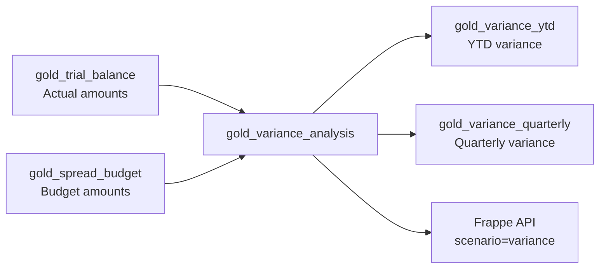

# Variance Analysis Guide

Konsolidat compares actual financial results against budget to produce variance measures with favorable/unfavorable classification.

## Variance Data Flow



## Variance Measures

Five measures are available through the `variance` scenario:

| Measure | Formula | Description |
|---------|---------|-------------|
| `actual_amount` | From `gold_trial_balance` | Actual period amount |
| `budget_amount` | From `gold_spread_budget` | Budget period amount |
| `variance_abs` | `actual_amount − budget_amount` | Absolute variance |
| `variance_pct` | `variance_abs / budget_amount` | Percentage variance |
| `variance_favorable` | See below | `1` if favorable, `0` if unfavorable |

## Favorable/Unfavorable Logic

The definition of "favorable" depends on the account type:

| Account Type | Favorable When | Rationale |
|-------------|---------------|-----------|
| **Revenue** | Actual > Budget | Higher revenue is good |
| **Expense** | Actual < Budget | Lower spending is good |

```
If account_type = 'Revenue':
    variance_favorable = 1 when actual_amount > budget_amount
If account_type = 'Expense':
    variance_favorable = 1 when actual_amount < budget_amount
```

### Tests

| Test | Assertion |
|------|-----------|
| `assert_favorable_revenue` | Revenue: favorable=1 when actual > budget |
| `assert_favorable_expense` | Expense: favorable=1 when actual < budget |
| `assert_variance_abs_formula` | `\|variance_abs − (actual − budget)\| ≤ 0.01` |

## Querying Variance Data

### From Excel

```
' Absolute variance (default for EPM_VARIANCE)
=EPM_VARIANCE("USMF", 2025, 5, "6100")

' Equivalent to:
=EPM("USMF", 2025, 5, "6100", "variance_abs", "variance")

' Other variance measures:
=EPM("USMF", 2025, 5, "6100", "actual_amount", "variance")
=EPM("USMF", 2025, 5, "6100", "budget_amount", "variance")
=EPM("USMF", 2025, 5, "6100", "variance_pct", "variance")
=EPM("USMF", 2025, 5, "6100", "variance_favorable", "variance")
```

### Period Ranges

Variance supports the same period range codes:

```
=EPM_VARIANCE("USMF", 2025, "Q1", "6100")    ' Q1 variance
=EPM_VARIANCE("USMF", 2025, "H1", "6100")    ' H1 variance
=EPM_VARIANCE("USMF", 2025, "FY", "6100")    ' Full year variance
```

### With Dimension Filters

```
=EPM_VARIANCE("USMF", 2025, "FY", "6100", "SALES", "SALES")
```

## YTD Variance

The `gold_variance_ytd` model provides cumulative year-to-date comparison:

| Column | Description |
|--------|-------------|
| `ytd_actual` | Cumulative actual through the period |
| `ytd_budget` | Cumulative budget through the period |

Useful for tracking whether the business is on track as the year progresses.

## Quarterly Variance

The `gold_variance_quarterly` model aggregates variance by quarter (Q1–Q4), useful for quarterly business reviews.

## Prior Year Comparison

Beyond budget variance, `gold_prior_year_comparison` provides year-over-year analysis:

| Column | Description |
|--------|-------------|
| `current_amount` | Current year period amount |
| `prior_year_amount` | Same period, prior year |
| `yoy_variance_abs` | `current_amount − prior_year_amount` |

## Building a Variance Report in Excel

| | A | B | C | D | E |
|---|---|---|---|---|---|
| 1 | **Entity:** | USMF | **Year:** | 2025 | |
| 2 | **Account** | **Actual** | **Budget** | **Variance** | **Fav?** |
| 3 | Revenue (4100) | `=EPM("USMF",2025,"FY","4100","actual_amount","variance")` | `=EPM("USMF",2025,"FY","4100","budget_amount","variance")` | `=EPM_VARIANCE("USMF",2025,"FY","4100")` | `=EPM("USMF",2025,"FY","4100","variance_favorable","variance")` |
| 4 | Expenses (6100) | ... | ... | ... | ... |

Use conditional formatting on column E: `1` = green (favorable), `0` = red (unfavorable).

## Next Steps

- [Budgeting Guide](budgeting-guide.md) — How budgets are input and spread
- [Report Catalog](report-catalog.md) — Pre-built report patterns
- [Excel VBA Guide](excel-vba-guide.md) — All formula functions
