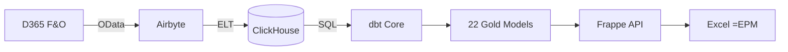

# Why Konsolidat?

> **The CFO's question**: "We spend $300K/year on consolidation software and my team still exports everything to Excel. Why?"

Konsolidat exists because financial consolidation shouldn't cost more than the finance team using it.

---

## The Problem

Corporate Performance Management is a $5B market dominated by five vendors — Tagetik, OneStream, Anaplan, Planful, Prophix — all charging $150K–$350K per year in license fees alone. Implementation adds another $50K–$350K. Three-year total cost: **$200K–$1.4M**.

For what?

- A consolidation engine your controller could describe on a whiteboard
- FX translation rules that haven't changed since IAS 21 was published in 1983
- Intercompany elimination that's just a matching algorithm
- Budget vs. actual variance that's subtraction

These are **solved problems**. The complexity isn't in the math — it's in the vendor lock-in.

Meanwhile, every finance team ends up in the same place: **exporting to Excel**. The $300K tool becomes a glorified data pipeline into a spreadsheet.

## The Insight

What if the spreadsheet *was* the interface?

```
=EPM("USMF", 2024, "Q1", "401100")
```

One formula. Entity, year, period, account. The value appears. No portal, no training, no "EPM workbench." Just Excel — the tool your finance team already knows, already trusts, already lives in 8 hours a day.

Behind that formula: a modern open-source data stack that's faster, cheaper, and more transparent than any commercial CPM.

## What You Get

### Full IFRS/GAAP Consolidation

Not a toy. Not a demo. A production consolidation engine with:

- **Multi-entity FX translation** — closing rate for balance sheet, average rate for P&L
- **CTA calculation** — automatic Currency Translation Adjustment as an equity plug
- **NCI split** — group vs. non-controlling interest based on ownership percentage
- **Intercompany elimination** — rule-based netting across 3 IC patterns
- **Top-side adjustments** — manual consolidation journals (goodwill, fair value, reclassifications)
- **4-layer fully consolidated trial balance** — entity + IC elimination + CTA + topside, unified

Every calculation is tested. 26 data quality assertions run on every build — not "trust us, it works," but `assert_nci_plus_group_equals_translated` with a 0.01 tolerance. The math is in the SQL. You can read it.

### Driver-Based Cost Allocations

Three-step cascading allocation engine:

1. IT costs distributed by **headcount**
2. Facility costs distributed by **square meters** (including IT costs that landed there)
3. Management fees distributed by **revenue** (including all prior cascaded amounts)

Each step sees amounts from prior steps. The allocation pool is verified: `assert_each_step_sums_to_pool`. No rounding black holes.

### Budgeting with Configurable Spread

Annual budgets automatically spread across 12 months using weighted profiles:

- **Even spread** — $1.2M becomes $100K/month
- **Seasonal retail** — peaks in November (1.8x) and December (2.5x), troughs in February (0.5x)
- **Custom profiles** — define any 12-weight pattern

The spread is verified: `assert_spread_sums_to_annual`. Your annual total is preserved to the penny.

### Variance Analysis That Thinks Like a Controller

Five measures, not just "actual minus budget":

| Measure | What It Tells You |
|---------|-------------------|
| `actual_amount` | What happened |
| `budget_amount` | What was planned |
| `variance_abs` | The gap |
| `variance_pct` | The gap in context |
| `variance_favorable` | Is this good or bad? |

The favorable logic is account-type aware: revenue up = good, expense down = good. Tested with `assert_favorable_revenue` and `assert_favorable_expense`.

### Excel-Native Reporting

Five worksheet functions cover every scenario:

```
=EPM("USMF", 2024, 5, "401100")                     Actuals
=EPM_BUDGET("USMF", 2025, "FY", "6100")             Budget
=EPM_VARIANCE("USMF", 2025, "Q1", "6100")           Variance
=EPM_DEBIT("USMF", 2024, 5, "1300")                 Debits
=EPM_CREDIT("USMF", 2024, 5, "1300")                Credits
```

**Ctrl+Shift+R** refreshes an entire sheet in one HTTP round-trip. 500 formulas = 1 API call. The VBA module batches everything.

Period ranges — `Q1`, `H1`, `FY` — aggregate automatically. No helper columns, no SUMIFS, no manual grouping.

---

## The Numbers

### 3-Year Total Cost of Ownership (~50 users)

| | Tagetik | OneStream | Anaplan | **Konsolidat** |
|---|---------|-----------|---------|----------------|
| License fees | $150K–300K | $240K–534K | $540K–1.05M | **$0** |
| Implementation | $50K–200K | $50K–200K | $150K–350K | **$10K–30K** |
| Infrastructure | Included | Included | Included | **$9K–24K** |
| **3-Year Total** | **$200K–500K** | **$300K–700K** | **$700K–1.4M** | **$20K–55K** |

That's not a rounding error. It's **90–97% savings**.

### What You Spend Instead

| Role | FTE | Annual Cost |
|------|-----|------------|
| Group Controller | Existing | $0 incremental |
| FP&A Analyst | Existing | $0 incremental |
| Data/Analytics Engineer | 0.3 FTE | ~$30K–50K |
| Infrastructure (ClickHouse + Frappe) | — | ~$3K–8K |

Total ongoing: **~$33K–58K/year** vs. $150K–350K/year for license fees alone.

---

## The Stack

No proprietary runtimes. No vendor SDK. No Java applets from 2008. Just tools your engineers already know:



| Component | Why This One |
|-----------|-------------|
| **ClickHouse** | Columnar OLAP — `SUM ... GROUP BY` in milliseconds, not seconds. Financial reporting is exactly this workload. |
| **dbt** | SQL transformations as code. Version-controlled, testable, reviewable. Your consolidation logic is in Git, not a vendor black box. |
| **Frappe** | Python web framework with built-in auth, roles, and REST API. No separate auth service, no API gateway, no token server. |
| **Airbyte** | Open-source ELT. D365 OData connector with `cross_company=true`. Full extraction in one sync. |
| **Excel + VBA** | The interface your finance team chose for themselves 30 years ago. We're not fighting it — we're powering it. |

Every component is replaceable. Don't like Frappe? The API is 200 lines of Python. Don't like Airbyte? Any tool that writes to ClickHouse works. Don't like VBA? The REST API is standard HTTP JSON.

---

## What's Tested

This isn't a prototype. 26 assertions validate every build:

| Category | Tests | What They Prove |
|----------|-------|----------------|
| **Consolidation math** | 8 | translated = local x rate, group + NCI = translated, BS uses closing rate, P&L uses average |
| **CTA integrity** | 2 | CTA non-zero when rates differ, CTA zero for same-currency entities |
| **IC elimination** | 1 | Eliminations net to zero per group per period |
| **Allocation completeness** | 2 | Each step sums to pool, no self-allocation |
| **Budget spreading** | 2 | 12 periods per line, spread sums to annual total |
| **Variance logic** | 3 | Formula correct, revenue favorable when up, expense favorable when down |
| **Trial balance** | 3 | Debits = credits, GL ties to TB, all accounts in chart |
| **YTD** | 1 | Period 12 YTD = full year total |
| **Journals** | 2 | Topside journals balanced, adjustment type always populated |
| **Entity tie-out** | 2 | FCTB entity layer ties to consolidated TB |

Run `dbt test` after any change. Green means the math is right. Red tells you exactly which row broke and why.

---

## Who It's For

**Best fit**: Private mid-market companies (2–50 entities) running D365 F&O who need consolidation, budgeting, and variance analysis — and don't want to spend $300K/year for the privilege.

**Not for**: Public companies requiring SOX-certified audit trails, or organizations with 500+ budget planners needing Anaplan-class write-back.

**The honest gaps** (all buildable):
- Cash flow statement (indirect method from BS deltas — ~3 days)
- Multi-GAAP dual reporting (reporting_standard dimension — ~1 week)
- Rolling forecasts (12-month sliding window — ~3 days)

These are on the [roadmap](reference/roadmap.md). The core consolidation, allocation, and variance engine is done.

---

## Get Started

```bash
git clone https://github.com/your-org/konsolidat.git
cd konsolidat && docker compose up -d
cd dbt_project && dbt build
# Import excel/OpenEPM.bas into Excel
# =EPM("USMF", 2024, 5, "401100") → Ctrl+Shift+R
```

**[Quickstart Guide](getting-started/quickstart.md)** — First `=EPM()` value in 15 minutes.

**[Full Setup Guide](getting-started/setup-guide.md)** — D365 integration, Frappe, production deployment.

**[Cost Comparison](evaluation/cost-comparison-vs-commercial.md)** — Feature-by-feature vs. Tagetik, OneStream, Anaplan, Planful, Prophix.

---

*Konsolidat is MIT-licensed. The code is the documentation. The SQL is the audit trail. The spreadsheet is the UI.*
